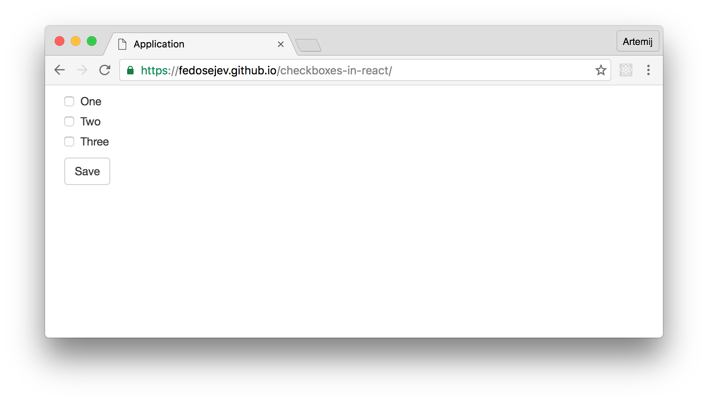
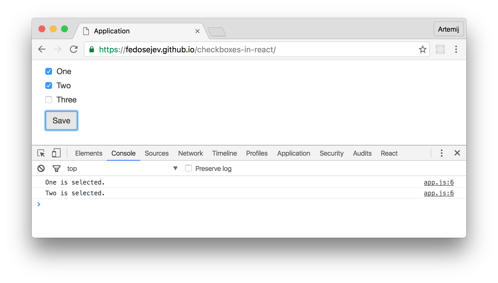

# Checkboxes in React.js

  <h4 class="alert-heading">Hold on!</h4>

  

    This tutorial covers React 15 and is now out of date.
  

  

    The good news is: <a href="/checkboxes-in-react-16/">Checkboxes in React 16</a> is available!
  

How do you use checkboxes in React.js? We've learnt about radio buttons in [this tutorial](http://react.tips/radio-buttons-in-reactjs/), but what about checkboxes - do you use them differently in React?

The short answer is: yes.

Let me demonstrate how to use checkboxes with the help of a simple React application:

<figure class="figure">
  
  <figcaption class="figure-caption">Figure 1. Our application.</figcaption>
</figure>

You can find the full source code in <a href="https://github.com/fedosejev/checkboxes-in-react">this GitHub repository</a>.

Our application is going to render a list of checkboxes with labels and a `Save` button. We can toggle checkboxes and click `Save` button. We will then see in the Developer Tools Console log messages that tell us which checkboxes were checked:

<figure class="figure">
  
  <figcaption class="figure-caption">Figure 2. Our application.</figcaption>
</figure>

Our application will be made of [two React components](https://github.com/fedosejev/checkboxes-in-react/tree/master/source/js/components):

1. `Application`
2. `Checkbox`

`Application` component is a container component - it encapsulates our entire React.js application, and renders three instances of `Checkbox` component and a `Save` button. `Application` component also logs into the Developer Tools Console which checkboxes were checked when users click the `Save` button.

`Checkbox` component renders a checkbox with a label.

Let's create our `Application` component first:

<figure class="figure">
<pre>
<code class="language-jsx">
import React, { Component } from 'react';
import Checkbox from './Checkbox';

const items = [
  'One',
  'Two',
  'Three',
];

class Application extends Component {
  componentWillMount = () => {
    this.selectedCheckboxes = new Set();
  }

  toggleCheckbox = label => {
    if (this.selectedCheckboxes.has(label)) {
      this.selectedCheckboxes.delete(label);
    } else {
      this.selectedCheckboxes.add(label);
    }
  }

  handleFormSubmit = formSubmitEvent => {
    formSubmitEvent.preventDefault();

    for (const checkbox of this.selectedCheckboxes) {
      console.log(checkbox, 'is selected.');
    }
  }

  createCheckbox = label => (
    <Checkbox
            label={label}
            handleCheckboxChange={this.toggleCheckbox}
            key={label}
        />
  )

  createCheckboxes = () => (
    items.map(this.createCheckbox)
  )

  render() {
    return (
      

        

          

            <form onSubmit={this.handleFormSubmit}>
              {this.createCheckboxes()}

              <button className="btn btn-default" type="submit">Save</button>
            </form>

          

        

      

    );
  }
}

export default Application;
</code>
</pre>
<figcaption class="figure-caption">Code snippet 1. Application.js</figcaption>
</figure>

First, let's focus on its `render` function:

<figure class="figure">
<pre>
<code class="language-jsx">
render() {
  return (
    

      

        

          <form onSubmit={this.handleFormSubmit}>
            {this.createCheckboxes()}

            <button className="btn btn-default" type="submit">Save</button>
          </form>

        

      

    

  );
}
</code>
</pre>
<figcaption class="figure-caption">Code snippet 2. Application.js</figcaption>
</figure>

We see three `div` elements with class names that you might recognize if you're familiar with [Bootstrap](http://getbootstrap.com). Bootstrap helps us create layout for our page.

Now let's focus on the `form` element:

<figure class="figure">
<pre>
<code class="language-jsx">
<form onSubmit={this.handleFormSubmit}>
  {this.createCheckboxes()}

  <button className="btn btn-default" type="submit">Save</button>
</form>
</code>
</pre>
<figcaption class="figure-caption">Code snippet 3. Application.js</figcaption>
</figure>

Inside of our `form` element we call `this.createCheckboxes` function that creates three instances of a `Checkbox` component. We'll see how exactly it does that in a moment. It's important to recognise that here we're creating our instances of a `Checkbox` component __dynamically__. If you're not familiar with this approach, then please read [this tutorial](http://react.tips/how-to-create-reactjs-components-dynamically/) first.

We then create a button element of type `submit` which will submit our form when user clicks on it, we're telling React to call `this.handleFormSubmit` function when this happens: `<form onSubmit={this.handleFormSubmit}>`.

Let's take a look at how exactly we're creating our instances of `Checkbox` component dynamically. Here is our `createCheckboxes` function:

<figure class="figure">
<pre>
<code class="language-jsx">
createCheckboxes = () => (
  items.map(this.createCheckbox)
)
</code>
</pre>
<figcaption class="figure-caption">Code snippet 4. Application.js</figcaption>
</figure>

It iterates over `items` array and calls `this.createCheckbox` function for each item in that array. Where is `items` array coming from and what is it for?

In our `Application.js` file before declaring our `Application` component, we create `items` constant that references an array of three items:

<figure class="figure">
<pre>
<code class="language-js">
const items = [
  'One',
  'Two',
  'Three',
];
</code>
</pre>
<figcaption class="figure-caption">Code snippet 5. Application.js</figcaption>
</figure>

`['One', 'Two', 'Three']` - these are labels for our checkboxes. This array represents data that will dictate how many checkboxes we need to render and what their labels will be. For the purpose of this tutorial, we declare this data in our React component file, but in a real world web application this data can be received from a server or imported from another file.

Now we know that `createCheckboxes` function calls `this.createCheckbox` function for each label in `items` array. `createCheckboxes` function also returns an array of three instances of `Checkbox` component. That's because we call `this.createCheckbox` three times and each time it creates and returns an individual 'Checkbox' component instance:

<figure class="figure">
<pre>
<code class="language-js">
createCheckbox = label => (
  <Checkbox
    label={label}
    handleCheckboxChange={this.toggleCheckbox}
    key={label}
  />
)
</code>
</pre>
<figcaption class="figure-caption">Code snippet 6. Application.js</figcaption>
</figure>

Each `Checkbox` component instance gets three properties:
1. `label` - the text that you see rendered next to a checkbox. This value is coming from our `items` array.
2. `handleCheckboxChange` - a reference to `this.toggleCheckbox` function. Every time user checks/unchecks a checkbox React calls `this.toggleCheckbox` function. We'll see what it does in a moment.
3. `key` - as you already know, each dynamically created React component instance needs a `key` property that React uses to uniquely identify that instance.

Now we understand how we create and render three checkboxes in our application. What happens when user checks/unchecks our checkbox? As you will see later - every time user change checkbox's state - our `this.toggleCheckbox` is called.

Let's take a look at that `toggleCheckbox` function:

<figure class="figure">
<pre>
<code class="language-js">
toggleCheckbox = label => {
  if (this.selectedCheckboxes.has(label)) {
    this.selectedCheckboxes.delete(label);
  } else {
    this.selectedCheckboxes.add(label);
  }
}
</code>
</pre>
<figcaption class="figure-caption">Code snippet 7. Application.js</figcaption>
</figure>

It gets a `label` parameter that represents which checkbox is being toggled. Now what exactly `toggleCheckbox` function does with a `label`?

It's a good time to zoom out for a second and talk about how our application works. There are a couple of questions we need to ask:

1. Each checkbox has two states: checked and unchecked. Which React component is responsible for managing that state?

2. How do we know which checkboxes are checked at any given moment in time?

We want to keep our application as simple as possible, so a simple answer for our first question is: let each `Checkbox` component instance maintain it's own state. Meaning: each `Checkbox` component instance is responsible for managing it's own state and knowing when it's checked or unchecked.

That's the key point: our `Application` component is not responsible for managing `Checkbox` component instance state and _hence_ it doesn't know anything about it. The advantage of this approach is that now our `Application` component can create as many instances of a `Checkbox` component as we need and it doesn't need to deal with managing the state of each `Checkbox` instance. In addition this solution makes our `Checkbox` component more reusable as it doesn't depend on a parent component.

This sounds fantastic, but coming back to our second question: how do we know which checkboxes are checked in our `Application` component? This question highlights the disadvantage of our approach, because as I've mentioned earlier, our `Application` component knows nothing about state of each instance of a `Checkbox` component.

Luckily, there is no need for our `Application` component to know the state of each instance of a `Checkbox` component at any given time. All it needs to know is: which checkboxes _are selected_ at any given time.

Should we store that information in `Application` component's state? Should we make our `Application` component stateful?

No. Remember in React you want to keep as little information in component's state as possible. And this should come naturally to you when you start thinking about it this way: does this information affects what my component is rendering? In other words, if that information changes - do I want React to rerender my component? If the answer is "no" - don't store it in component's state. If the answer is "yes", then that information represents your component's state and it should be stored in your component's state.

In the case of our `Application` component - when user checks or unchecks any checkbox that we render - do we need to rerender our `Application` component? The answer is clearly no. Therefore, we don't want to store a list of checked checkboxes in `Application` component's state.

Ok, if not in the component's state, then where? In a property that we can set on the component's class.

Let's set a property on the component's class that will store information about which checkboxes are checked. The next question that we should ask ourselves is: which data structure should I choose for storing that information?

What are the requirements for our perfect data structure?

1. We should be able to easily add and delete our elements.
2. All elements must be unique.
3. We should be able to easily find out if the element is already stored.

That sounds like a description of a data structure that you might know about: Set.

Sets are not supported in ES5 version of JavaScript, but luckily, we're using ES2015 version of JavaScript where Sets are supported.

Now we know that we want to create a new Set and assign it to `Application`'s component specification object.

The next question we need to answer is: when should we create our empty Set? That will depend on whether we want our Set to be created before or after the `Application` component is rendered.

The answer is: we want our Set to be created right before we mount our `Application` component:

<figure class="figure">
<pre>
<code class="language-js">
componentWillMount = () => {
  this.selectedCheckboxes = new Set();
}
</code>
</pre>
<figcaption class="figure-caption">Code snippet 8. Application.js</figcaption>
</figure>

If you're not familiar with `componentDidMount` method or any other React component lifecycle methods, then please read [this tutorial](http://react.tips/how-to-use-react-component-lifecycle-methods/) first.

`this.selectedCheckboxes = new Set();` creates a new `selectedCheckboxes` property on component specification object and assigns a new set to it.

Now we have an empty set created right before our `Application` component is rendered. Then, when user checks/unchecks our checkboxes React will call `toggleCheckbox` function:

<figure class="figure">
<pre>
<code class="language-js">
toggleCheckbox = label => {
  if (this.selectedCheckboxes.has(label)) {
    this.selectedCheckboxes.delete(label);
  } else {
    this.selectedCheckboxes.add(label);
  }
}
</code>
</pre>
<figcaption class="figure-caption">Code snippet 9. Application.js</figcaption>
</figure>

That function will reference our set and check if a specific checkbox label is in that set:

<figure class="figure">
<pre>
<code class="language-js">
if (this.selectedCheckboxes.has(label)) {}
</code>
</pre>
<figcaption class="figure-caption">Code snippet 10. Application.js</figcaption>
</figure>

If the label is already in our set then we delete from the set:

<figure class="figure">
<pre>
<code class="language-js">
this.selectedCheckboxes.delete(label);
</code>
</pre>
<figcaption class="figure-caption">Code snippet 11. Application.js</figcaption>
</figure>

Otherwise, we add it to our set:

<figure class="figure">
<pre>
<code class="language-js">
this.selectedCheckboxes.add(label);
</code>
</pre>
<figcaption class="figure-caption">Code snippet 12. Application.js</figcaption>
</figure>

And that's how our `Application` component is going to know which checkboxes are checked at any given moment in time. If the label in the set - it's checked; if not - it's unchecked.

What happens when the user clicks `Save` button? Our form is submitted and our `handleFormSubmit` function is called by React:

<figure class="figure">
<pre>
<code class="language-jsx">
<form onSubmit={this.handleFormSubmit}>...</form>
</code>
</pre>
<figcaption class="figure-caption">Code snippet 13. Application.js</figcaption>
</figure>

Let's take a look at `handleFormSubmit` function:

<figure class="figure">
<pre>
<code class="language-jsx">
handleFormSubmit = formSubmitEvent => {
  formSubmitEvent.preventDefault();

  for (const checkbox of this.selectedCheckboxes) {
    console.log(checkbox, 'is selected.');
  }
}
</code>
</pre>
<figcaption class="figure-caption">Code snippet 14. Application.js</figcaption>
</figure>

First it prevents the default behavior of a form's submit event:

<figure class="figure">
<pre>
<code class="language-js">
formSubmitEvent.preventDefault();
</code>
</pre>
<figcaption class="figure-caption">Code snippet 15. Application.js</figcaption>
</figure>

And then:

<figure class="figure">
<pre>
<code class="language-js">
for (const checkbox of this.selectedCheckboxes) {
  console.log(checkbox, 'is selected.');
}
</code>
</pre>
<figcaption class="figure-caption">Code snippet 16. Application.js</figcaption>
</figure>

It uses `for... of` statement to iterate through our `this.selectedCheckboxes` set and log every item from that set. Which effectively prints the label of every checked checkbox.

[`for... of` statement](https://developer.mozilla.org/en/docs/Web/JavaScript/Reference/Statements/for...of) is available to us in JavaScript version ES2015.

Now you know how what our `Application` component does and how it works.

Next let's take a look at our `Checkbox` component:

<figure class="figure">
<pre>
<code class="language-jsx">
import React, { Component, PropTypes } from 'react';

class Checkbox extends Component {
  state = {
    isChecked: false,
  }

  toggleCheckboxChange = () => {
    const { handleCheckboxChange, label } = this.props;

    this.setState(({ isChecked }) => (
      {
        isChecked: !isChecked,
      }
    ));

    handleCheckboxChange(label);
  }

  render() {
    const { label } = this.props;
    const { isChecked } = this.state;

    return (
      

        <label>
          <input
                            type="checkbox"
                            value={label}
                            checked={isChecked}
                            onChange={this.toggleCheckboxChange}
                        />

          {label}
        </label>
      

    );
  }
}

Checkbox.propTypes = {
  label: PropTypes.string.isRequired,
  handleCheckboxChange: PropTypes.func.isRequired,
};

export default Checkbox;
</code>
</pre>
<figcaption class="figure-caption">Code snippet 17. Checkbox.js</figcaption>
</figure>

Our `Checkbox` component is a stateful component because it needs to know whether a checkbox element should be rendered as checked or unchecked.

We'll use [class property](https://babeljs.io/docs/plugins/transform-class-properties/) `state` to set the initial state of our `Checkbox` component:

<figure class="figure">
<pre>
<code class="language-js">
state = {
  isChecked: false,
}
</code>
</pre>
<figcaption class="figure-caption">Code snippet 18. Checkbox.js</figcaption>
</figure>

The state of our component is represented by `isChecked` property. By the default its value is set to `false` because initially we want every checkbox to render as unchecked.

Let's see what our `Checkbox` component renders:

<figure class="figure">
<pre>
<code class="language-jsx">
render() {
  const { label } = this.props;
  const { isChecked } = this.state;

  return (
    

      <label>
        <input
                      type="checkbox"
                      value={label}
                      checked={isChecked}
                      onChange={this.toggleCheckboxChange}
                  />

        {label}
      </label>
    

  );
}
</code>
</pre>
<figcaption class="figure-caption">Code snippet 19. Checkbox.js</figcaption>
</figure>

It renders `div` element with a Bootstrap class name that we use for styling. Inside of it we have `label` element with two children: 1) `input` element and 2) label text.

The `input` element renders the checkbox. It has 4 properties:
1. `type` - the type of input: `checkbox` in our case.
2. `value` - the value of input: which is a label name passed as property from a parent `Application` component.
3. `checked` - whether it's checked or not. The value comes from component's state property `isChecked`.
4. `onChange` - `change` event handler: `this.toggleCheckboxChange` function will be called when user checks or unchecks a checkbox.

The label text is coming from a property `label` that is passed from a parent `Application` component. It will be either `One`, `Two` or `Three`.

Now if you read [this tutorial](http://react.tips/radio-buttons-in-reactjs/), you will recognise that our `input` element is a [controlled component](https://facebook.github.io/react/docs/forms.html#controlled-components) because we "control" the `value` property by providing our own value that comes from `this.props.label`. If you're not sure about the difference between controlled components and uncontrolled components, then I recommend you read [this tutorial](http://react.tips/radio-buttons-in-reactjs/).

What happens when the user toggles our checkbox? `this.toggleCheckboxChange` function is called:

<figure class="figure">
<pre>
<code class="language-js">
toggleCheckboxChange = () => {
  const { handleCheckboxChange, label } = this.props;

  this.setState(({ isChecked }) => (
    {
      isChecked: !isChecked,
    }
  ));

  handleCheckboxChange(label);
}
</code>
</pre>
<figcaption class="figure-caption">Code snippet 20. Checkbox.js</figcaption>
</figure>

It changes `Checkbox` component's state. It set's `isChecked`'s value to the opposite of it's current value __and__ it calls `handleCheckboxChange` function which is passed to `Checkbox` component as a property by it's parent `Application` component:

<figure class="figure">
<pre>
<code class="language-js">
const { handleCheckboxChange, label } = this.props;
// ...
handleCheckboxChange(label);
</code>
</pre>
<figcaption class="figure-caption">Code snippet 21. Checkbox.js</figcaption>
</figure>

This function call will trigger `toggleCheckbox` function in `Application` component that will add or delete the label name that we're passing as an argument via `this.props.label` from the set.

That's how our `Application` component will always know which checkboxes are selected at any given moment in time.

And now you know how to use checkboxes in React.js!

Notice that this solution works great for _our specific_ needs. If you have different requirements you might need to think of a different way of creating checkboxes. For example, how do you implement a button that checks all checkboxes? I'll leave it for you to figure it out as a challenge! And if you do figure it out - please [propose your tutorial](http://bit.ly/PublishMyTutorial) for this website!

Thank you for reading this React tutorial!

Please take a look at [the complete source code on GitHub](https://github.com/fedosejev/checkboxes-in-react) and [the live version](https://fedosejev.github.io/checkboxes-in-react/) of our app.

I hope you've enjoyed this tutorial and I would love to hear your feedback in the comments. You can get in touch with me via [Twitter](http://twitter.com/artemy) and [email](mailto:artemij@fedosejev.com).

[Artemij Fedosejev](http://artemij.com)

P.S. I've also written [React.js Essentials book](http://reactessentials.com) and [I teach people React.js and JavaScript](http://progressdots.com)!
