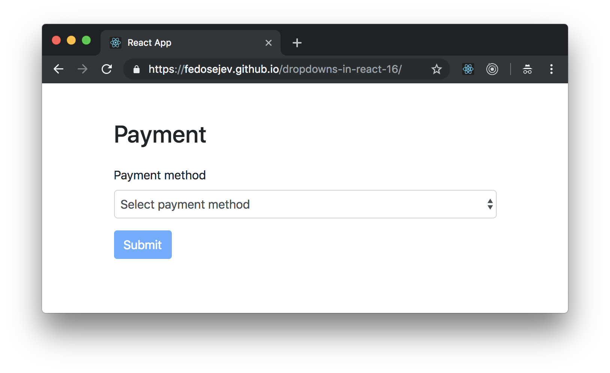
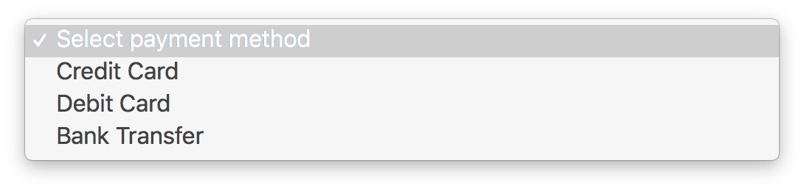
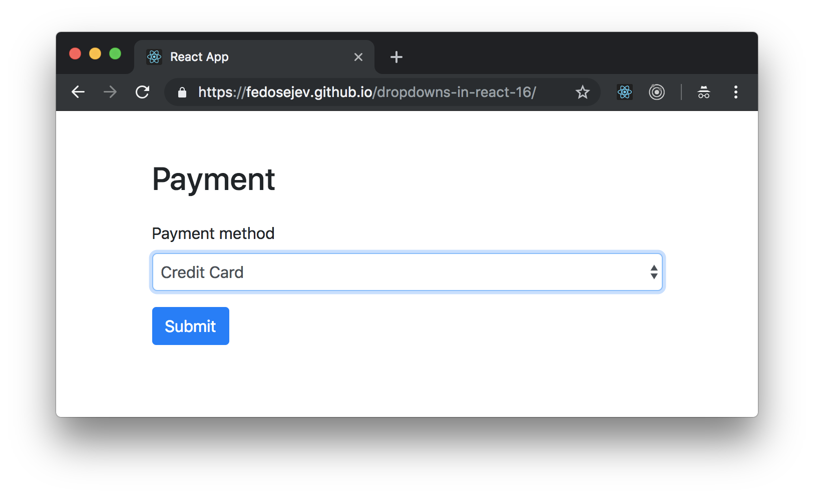
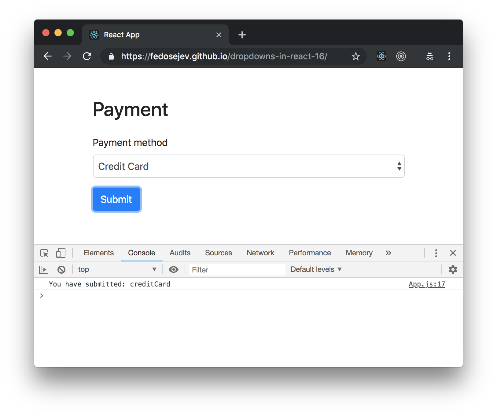
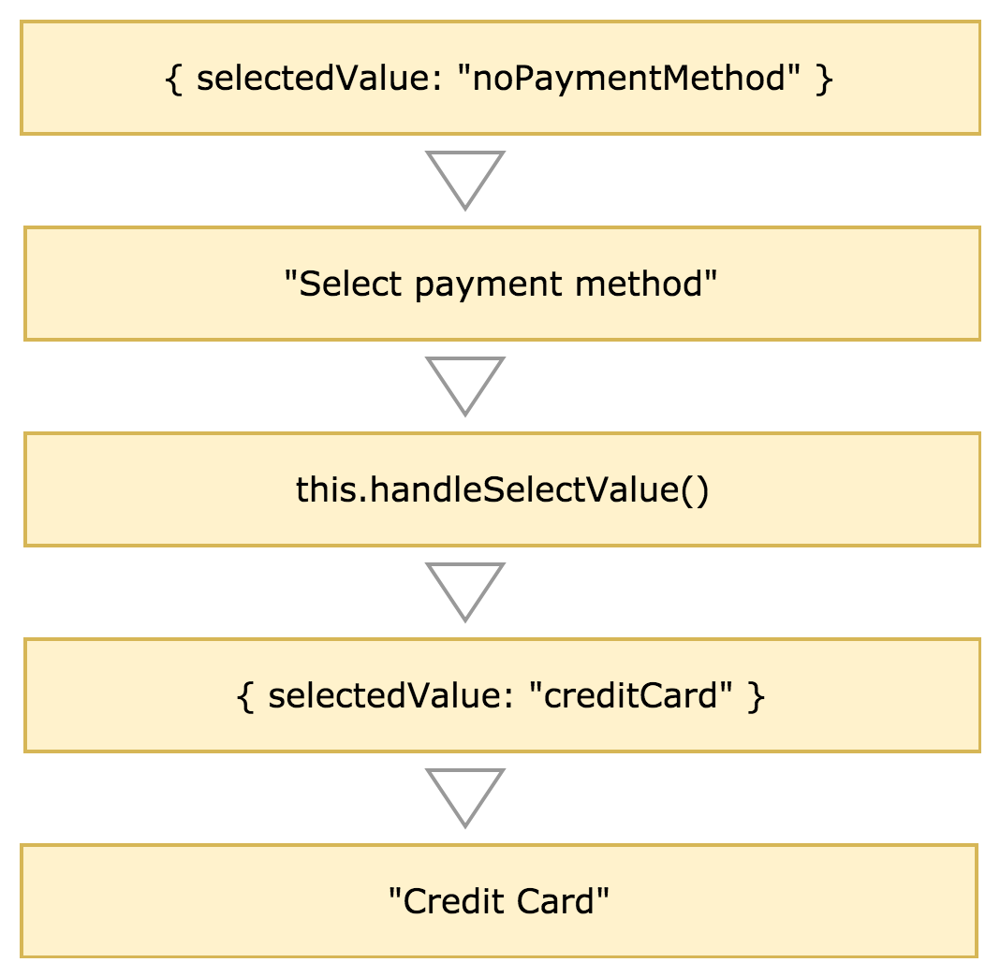

# Dropdowns In React 16

How do you use dropdowns in React 16?

Let's answer to this question with a simple example.

We're going to build a React app that creates a form with a payment methods dropdown:

<figure class="figure">
  
  <figcaption class="figure-caption">Figure 1. Our application.</figcaption>
</figure>

Initially, no payment method will be selected and the `Submit` button will be disabled - users can't submit a form without selecting a payment method first.

Users can click on the dropdown to select one of the payment methods:

<figure class="figure">
  
  <figcaption class="figure-caption">Figure 2. Our application.</figcaption>
</figure>

Once the payment method is selected, the `Submit` button is enabled and users can submit the form:

<figure class="figure">
  
  <figcaption class="figure-caption">Figure 3. Our application.</figcaption>
</figure>

When you click the `Submit` button, we'll log selected payment method in JavaScript console:

<figure class="figure">
  
  <figcaption class="figure-caption">Figure 4. Our application.</figcaption>
</figure>

You can find the full source code in <a href="https://github.com/fedosejev/dropdowns-in-react-16/">this GitHub repository</a>.

First let's create `App` component:

<figure class="figure">
<pre>
<code class="language-jsx">
import React, { Component } from "react";

class App extends Component {
  state = {
    selectedValue: "noPaymentMethod"
  };

  handleSelectValue = event => {
    this.setState({
      selectedValue: event.target.value
    });
  };

  handleFormSubmit = event => {
    event.preventDefault();

    console.log("You have submitted:", this.state.selectedValue);
  };

  render() {
    return (
      

        

          

            <h2 className="mb-4">Payment</h2>
            <form onSubmit={this.handleFormSubmit}>
              

                <label htmlFor="paymentMethod">Payment method</label>
                <select
                  value={this.state.selectedValue}
                  onChange={this.handleSelectValue}
                  className="form-control"
                  id="paymentMethod"
                >
                  <option value="noPaymentMethod">Select payment method</option>
                  <option value="creditCard">Credit Card</option>
                  <option value="debitCard">Debit Card</option>
                  <option value="bankTransfer">Bank Transfer</option>
                </select>
              

              <button
                type="submit"
                className="btn btn-primary"
                disabled={this.state.selectedValue === "noPaymentMethod"}
              >
                Submit
              </button>
            </form>
          

        

      

    );
  }
}

export default App;
</code>
</pre>
<figcaption class="figure-caption">Code snippet 1. App.js</figcaption>
</figure>

Our `App` component is a stateful component that renders form. Let's take a closer look at it's `render` method:

<figure class="figure">
<pre>
<code class="language-jsx">
render() {
  return (
    

      

        

          <h2 className="mb-4">Payment</h2>
          <form onSubmit={this.handleFormSubmit}>
            

              <label htmlFor="paymentMethod">Payment method</label>
              <select
                value={this.state.selectedValue}
                onChange={this.handleSelectValue}
                className="form-control"
                id="paymentMethod"
              >
                <option value="noPaymentMethod">Select payment method</option>
                <option value="creditCard">Credit Card</option>
                <option value="debitCard">Debit Card</option>
                <option value="bankTransfer">Bank Transfer</option>
              </select>
            

            <button
              type="submit"
              className="btn btn-primary"
              disabled={this.state.selectedValue === "noPaymentMethod"}
            >
              Submit
            </button>
          </form>
        

      

    

  );
}
</code>
</pre>
<figcaption class="figure-caption">Code snippet 2. App.js</figcaption>
</figure>

Our `App` component renders `form` with `label`, `select` and `button` elements. The `select` element creates our dropdown:

<figure class="figure">
<pre>
<code class="language-jsx">
<select
  value={this.state.selectedValue}
  onChange={this.handleSelectValue}
  className="form-control"
  id="paymentMethod"
>
  <option value="noPaymentMethod">Select payment method</option>
  <option value="creditCard">Credit Card</option>
  <option value="debitCard">Debit Card</option>
  <option value="bankTransfer">Bank Transfer</option>
</select>
</code>
</pre>
<figcaption class="figure-caption">Code snippet 3. App.js</figcaption>
</figure>

Our dropdown has four options:
1. Select payment method
2. Credit Card
3. Debit Card
4. Bank Transfer

Each option is created with `option` element that gets `value` prop.

At this point we should ask ourselves two questions:
1. Which option will be selected initially?
2. How can a user change selected option?

Let's answer these questions.

Each option in our dropdown represents a state. You can think of a `select` element as a stateful component. This state is hidden from us and we don't control it. We don't control and we don't know which option is selected. However, if we do need to know which option is selected, then we need to take control over the `select` element. If you have read my <a href="/radio-buttons-in-react-16/">Radio Buttons in React 16</a> tutorial, then you already know that React gives you an option to create form elements that are controlled by you - they're called <a href="https://reactjs.org/docs/forms.html#controlled-components" target="_blank">Controlled Compponents</a>.

To take control over our `select` element, we need to do two things.

First, we provide `value` prop to our `select` element. This prop tells React which `option` inside of our `select` to render. How does it know? Each `option` element has it's own `value` prop. If `select`'s `value` prop matches `option`'s value prop, then React will render that `option` element.

Second, we prodive `onChange` prop to our `select` element. The `onChange` prop takes a callback function that React will call every time user selects different option.

When we take control over our `select` element, we take control over it's state and now our `App` component will own that state and represent it with `selectedValue` property.

We set the initial state of `selectedValue` to `"noPaymentMethod"`:

<figure class="figure">
<pre>
<code class="language-jsx">
state = {
  selectedValue: "noPaymentMethod"
};
</code>
</pre>
<figcaption class="figure-caption">Code snippet 4. App.js</figcaption>
</figure>

Our `App` component also declares the `handleSelectValue` function that updates `selectedValue`:

<figure class="figure">
<pre>
<code class="language-jsx">
handleSelectValue = event => {
  this.setState({
    selectedValue: event.target.value
  });
};
</code>
</pre>
<figcaption class="figure-caption">Code snippet 5. App.js</figcaption>
</figure>

A new value for `selectedValue` state property comes from the `event` object that React will pass as a param when it calls the `handleSelectValue` callback function. The `event` object has `target` property that has `value` property - that's the value that we set for each `option` element:

<figure class="figure">
<pre>
<code class="language-jsx">
<option value="noPaymentMethod">Select payment method</option>
<option value="creditCard">Credit Card</option>
<option value="debitCard">Debit Card</option>
<option value="bankTransfer">Bank Transfer</option>
</code>
</pre>
<figcaption class="figure-caption">Code snippet 6. App.js</figcaption>
</figure>

We pass `this.state.selectedValue` to the `value` prop and `this.handleSelectValue` to the `onChange` prop of our `select` element:

<figure class="figure">
<pre>
<code class="language-jsx">
<select
  value={this.state.selectedValue}
  onChange={this.handleSelectValue}
  className="form-control"
  id="paymentMethod"
>
  ...
</select>
</code>
</pre>
<figcaption class="figure-caption">Code snippet 7. App.js</figcaption>
</figure>

The idea is that `select` element always gets it's value from our `App` component's state. Then user interacts with our dropdown and selects a different option. The `select` element calls `onChange` prop which will call our `App` component's `this.handleSelectValue` function. The `this.handleSelectValue` function will update `App` component's state and React will re-render `App` component - only this time it will render our `select` element with a different option selected.

<figure class="figure">
  
  <figcaption class="figure-caption">Figure 5. Option change diagram.</figcaption>
</figure>

Finally when user submits the form, we want to know which option they selected and log that option in a JavaScript console. For that we declare `handleFormSubmit` function:

<figure class="figure">
<pre>
<code class="language-jsx">
handleFormSubmit = event => {
  event.preventDefault();

  console.log("You have submitted:", this.state.selectedValue);
};
</code>
</pre>
<figcaption class="figure-caption">Code snippet 8.</figcaption>
</figure>

Then we pass `handleFormSubmit` function to the `onSubmit` prop of the `form` element:

<figure class="figure">
<pre>
<code class="language-jsx">
<form onSubmit={this.handleFormSubmit}>...</form>
</code>
</pre>
<figcaption class="figure-caption">Code snippet 8.</figcaption>
</figure>

And that's how you create dropdowns in React 16!

Thank you for your attention.

Please take a look at [the complete source code on GitHub](https://github.com/fedosejev/dropdowns-in-react-16/) and [the live version](http://fedosejev.github.io/dropdowns-in-react-16/) of our app.

I hope you've enjoyed this tutorial and I would love to hear your feedback in the comments. You can get in touch with me via [Twitter](http://twitter.com/artemy) and [email](mailto:artemij@fedosejev.com).

[Artemij Fedosejev](http://artemij.com)
