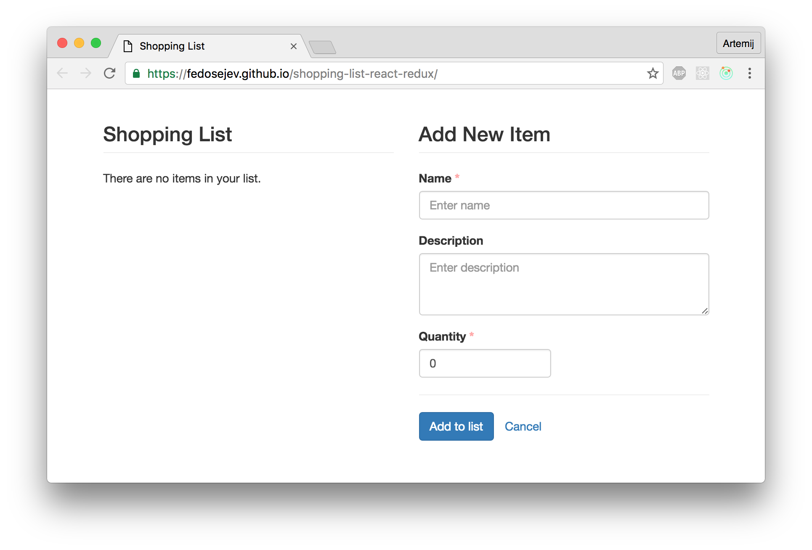

# From React.js To Flux To Redux

React.js evolution brought us Flux and Redux.

If you want to really understand what's the difference between building web apps with React only, or with React and Flux, or with React and Redux, then check the four examples that I've prepared for you.

They all implement exactly the same Shopping List app, but most importantly - they highlight the difference in _how_ you approach building web apps using different tools.

<figure class="figure">
  
  <figcaption class="figure-caption">Figure 1. Our Shopping List application.</figcaption>
</figure>

## Built React.js with JavaScript ES5

In this example, I am using only React.js without Flux or Redux to build the entire app. And I am using the good old JavaScript that all know and love (or hate?): version ECMAScript 5.

+ [Source code](https://github.com/fedosejev/shopping-list-react)
+ [Demo](http://fedosejev.github.io/shopping-list-react/)

This example is the best place for you to start if you're not familiar with Flux or Redux at all. It helps you to understand _why_ we need Flux or Redux. You will feel strange when storing application state (the shopping list itself) in React components, knowing that React _should_ only be responsible for knowing how to render the user interface.

## Built React.js with JavaScript ES2015

The industry uses a newer version of JavaScript today: ECMAScript 2015. It brings new syntax and React takes advantage of that syntax.

+ [Source code](https://github.com/fedosejev/shopping-list-react-es2015)
+ [Demo](http://fedosejev.github.io/shopping-list-react-es2015)

If you want to see how to transition from tradition ES5 syntax to newer ES2015 syntax in the context of React app, then this example is perfect for you. Feel free to compare it with the the previous one (ES5 version).

## Built React.js with Flux and JavaScript ES5

If React feels familiar to you and you can build simple apps with it then you most likely faced a problem of accessing application state from different React components. It's not a straight forward task! And it feels awkward, because we know that React is a UI library, and if we follow the separation of concerns principle, then it's clear to us that we shouldn't store application state in React components!

Where do we store it then? That's why you might need to introduce Flux architecture to your React application.

+ [Source code](https://github.com/fedosejev/shopping-list-react-flux)
+ [Demo](http://fedosejev.github.io/shopping-list-react-flux/)

This example is a perfect introduction to the Flux architecture, because you're building exactly the same app, but now you're clearly separating your UI logic from your application state logic.

## Built React.js with Redux and JavaScript ES2016

Flux is a great start for understanding how data flows in your React application. Redux takes it to the next level by building on top of ideas from Flux and introducing new important concepts that allow you to build really scalable and robust React apps.

+ [Source code](https://github.com/fedosejev/shopping-list-react-redux)
+ [Demo](https://fedosejev.github.io/shopping-list-react-redux/)

I hope you've enjoyed these examples and I would love to hear your feedback in the comments. You can get in touch with me via [Twitter](http://twitter.com/artemy) and [email](mailto:artemij@fedosejev.com).

[Artemij Fedosejev](http://artemij.com)

P.S. I've also written [React.js Essentials book](http://reactessentials.com) and [I teach people React.js and JavaScript](http://progressdots.com)!