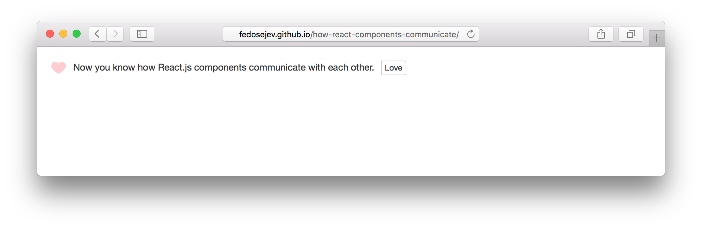

# How React.js Components Communicate

Can you wrap your head around how components in React.js communicate with each other?

Let me help you out.

In this tutorial, we're going to build this application:

<figure class="figure">
  
  <figcaption class="figure-caption">Figure 1. Our application.</figcaption>
</figure>

You can find the full source code in <a href="https://github.com/fedosejev/how-react-components-communicate">this GitHub repository</a>.

Our application is going to render a message with a `Love` button. When you clicks `Love` button our heart icon "turns on" and our button's text is changed to `Unlove`.

As you can see our application will need to render 2 different states: 1) when message is loved and 2) when message is unloved.

Our application will be made of 3 React.js components:
1. `MessageContainer`
2. `Message`
3. `Button`

Both `Message` and `Button` components are siblings and both are nested inside of `MessageContainer` component.

Can you tell which component will own the state for the whole application?

Let's think about it. When user interacts with the `Button` component, our `Message` component needs to react and render differently. How can we achieve this when `Button` and `Message` components are siblings?

The answer is: our `MessageContainer` will be in charge of maintaining our application's state. And since `MessageContainer` is a parent component for both `Message` and `Button` components - it can pass that state to them too.

When user interacts with the `Button` component, it will update `MessageContainer`'s state and re-render both `Message` and `Button` components.

Let's create `Message` component first:

<figure class="figure">
<pre>
<code class="language-jsx">
var React = require('react');

var Message = function statelessFunctionComponentClass(props) { /* ... */ };

module.exports = Message;
</code>
</pre>
<figcaption class="figure-caption">Code snippet 1. Message.jsx</figcaption>
</figure>

Wait, what is this `statelessFunctionComponentClass` function is doing here - where is `React.createClass`? That's how you create component class in React - by calling `React.createClass` function?

That's right, but in [version 0.14](https://facebook.github.io/react/blog/2015/10/07/react-v0.14.html#stateless-functional-components) React introduced a new way of [creating components using functions](https://facebook.github.io/react/blog/page2/#components-can-be-classes-or-functions). These components will be stateless components without any lifecycle methods and other boilerplate. Which means they can be optimised for speed.

Our `Message` component will be stateless and we don't need to access any component lifecycle methods, so the functional way of creating `Message` component is a perfect choice in this case.

Notice that we've named our function `statelessFunctionComponentClass` - this is just for signaling the fact that we're using a functional way of creating our component class.

`statelessFunctionComponentClass` function declares `props` parameter - this is a way for `Message` component to access properties passed to it by a parent component.

What is the purpose of our `Message` component? To render message text and an icon that represents whether the message is loved or not loved.

Let's implement that:

<figure class="figure">
<pre>
<code class="language-jsx">
var React = require('react');

var Message = function statelessFunctionComponentClass(props) {
  var iconImagePath = './images/';
  iconImagePath = iconImagePath + (props.isLoved ? 'loved.png' : 'not-loved.png');

  return (
    
      
      {props.text}
    
  );
};

module.exports = Message;
</code>
</pre>
<figcaption class="figure-caption">Code snippet 2. <a href="https://github.com/fedosejev/how-react-components-communicate/blob/master/source/js/components/Message.jsx" target="_blank">Message.jsx</a></figcaption>
</figure>

The first thing is to get a path string to an image file that visualizes whether the message is loved or not:

<figure class="figure">
<pre>
<code class="language-js">
var iconImagePath = './images/';
iconImagePath = iconImagePath + (props.isLoved ? 'loved.png' : 'not-loved.png');
</code>
</pre>
<figcaption class="figure-caption">Code snippet 3. Message.jsx</figcaption>
</figure>

We're declating new variable `iconImagePath` and assigning string `./images/` to it - that's the first part of our file path.

The second part depends on whether the message is loved or not. We're using [conditional operator](https://developer.mozilla.org/en-US/docs/Web/JavaScript/Reference/Operators/Conditional_Operator) in our expression:

<figure class="figure">
<pre>
<code class="language-js">
iconImagePath = iconImagePath + (props.isLoved ? 'loved.png' : 'not-loved.png');
</code>
</pre>
<figcaption class="figure-caption">Code snippet 4. Message.jsx</figcaption>
</figure>

Which is a short-hand for `if` statement:

<figure class="figure">
<pre>
<code class="language-js">
if (props.isLoved) {
  iconImagePath = iconImagePath + 'loved.png';
} else {
  iconImagePath = iconImagePath + 'not-loved.png';
}
</code>
</pre>
<figcaption class="figure-caption">Code snippet 5. Message.jsx</figcaption>
</figure>

Our image file path string depends on the value of `props.isLoved` which is passed to `Message` component from a parent `MessageContainer` component.

Finally our `statelessFunctionComponentClass` function returns JSX code that will be rendered when we render our `Message` component:

<figure class="figure">
<pre>
<code class="language-jsx">
return (
  
    
    {props.text}
  
);
</code>
</pre>
<figcaption class="figure-caption">Code snippet 6. Message.jsx</figcaption>
</figure>

It renders `img` and `span` elements nested inside of `span` element. The text for our message comes as a propety for `Message` component: `props.text`.

As you can see our `Message` component doesn't know in advance about what text and which image it's going to render. Those decisions will be made by `MessageContainer` component and passed as properties to `Message` component.

__And that's how a parent component can communicate with a child component in React.__

Let's create `MessageContainer` component next:

<figure class="figure">
<pre>
<code class="language-jsx">
var React = require('react');
var Message = require('./Message.jsx');

var MessageContainer = React.createClass({  
  getInitialState: function () {
    return {
      isLoved: false
    };
  },

  render: function () {
    var messageText = 'Now you know how React.js components communicate with each other.';

    return (
      

        <Message text={messageText} isLoved={this.state.isLoved} />
      

    );
  }
});

module.exports = MessageContainer;
</code>
</pre>
<figcaption class="figure-caption">Code snippet 7. MessageContainer.jsx</figcaption>
</figure>

As we discussed previously, our `MessageContainer` component is going to stateful, because we want it to maintain our application's state.

We create `getInitialState` function that returns the initial state object with a single property `isLoved` set to `false`:

<figure class="figure">
<pre>
<code class="language-js">
getInitialState: function () {
  return {
    isLoved: false
  };
},
</code>
</pre>
<figcaption class="figure-caption">Code snippet 8. MessageContainer.jsx</figcaption>
</figure>

`isLoved` property tracks whether user loved message or not. Initially - it's not loved.

Let's take a look at what `MessageContainer` component renders:

<figure class="figure">
<pre>
<code class="language-jsx">
render: function () {
  var messageText = 'Now you know how React.js components communicate with each other.';

  return (
    

      <Message text={messageText} isLoved={this.state.isLoved} />
    

  );
}
</code>
</pre>
<figcaption class="figure-caption">Code snippet 9. MessageContainer.jsx</figcaption>
</figure>

We're assigning `'Now you know how React.js components communicate with each other.'` string to `messageText` variable and then we're rendering a new instance of `Message` component.

Our `Message` component instance receives 2 properties: 1) `text` property that tells which message text we want to render and 2) `isLoved` property which tells whether this message is loved or not. The value for `isLoved` property is coming from `MessageContainer` component's state: `this.state.isLoved`.

At this point, we've created `MessageContainer` component that knows whether message is loved or not and renders `Message` component by passing a couple of properties to it.

Next we need to render our `Love`/`Unlove` button.

Let's create our `Button` component:

<figure class="figure">
<pre>
<code class="language-jsx">
var React = require('react');

var Button = function statelessFunctionComponentClass(props) {
  return (
    <button onClick={props.onClick} 
                          className="btn btn-xs btn-default">{props.text}</button>
  );
};

module.exports = Button;
</code>
</pre>
<figcaption class="figure-caption">Code snippet 10. <a href="https://github.com/fedosejev/how-react-components-communicate/blob/master/source/js/components/Button.jsx" target="_blank">Button.jsx</a></figcaption>
</figure>

Just like with `Message` component we're using function to create React component class.

Our `Button` component will render `<button>` element with a text that comes from a parent component via `props` object: `props.text`.

We also want our button to react on user click. To achieve that we create `onClick` property and assign `props.onClick` to it. `props.onClick` references a function that our parent `MessageContainer` component passes as a property when it creates a new instance of our `Button` component.

And that's all we need to do to create `Button` component class.

Now let's render a new instance of `Button` component inside of `MessageContainer` component:

<figure class="figure">
<pre>
<code class="language-jsx">
var React = require('react');
var Message = require('./Message.jsx');
var Button = require('./Button.jsx');

var MessageContainer = React.createClass({  
  getInitialState: function () { /* ... */ },
  render: function () {
    var messageText = 'Now you know how React.js components communicate with each other.';
    var buttonText = this.state.isLoved ? 'Unlove' : 'Love';

    return (
      

        <Message text={messageText} isLoved={this.state.isLoved} />
        <Button text={buttonText} />
      

    );
  }
});

module.exports = MessageContainer;
</code>
</pre>
<figcaption class="figure-caption">Code snippet 11. MessageContainer.jsx</figcaption>
</figure>

We import our `Button` component class first. Then we render a new instance of it right after our `Message` component instance.

We create `text` property on our `Button` component instance. The value for this property will be either `'Unlove'` or `'Love'` - it depends on what is the value of `this.state.isLoved`:

<figure class="figure">
<pre>
<code class="language-jsx">
var buttonText = this.state.isLoved ? 'Unlove' : 'Love';
</code>
</pre>
<figcaption class="figure-caption">Code snippet 12. MessageContainer.jsx</figcaption>
</figure>

As you can see we're using conditional `?` operator here too.

Initially, `isLoved` is set to `false`, so our `Button` component is going to render `Love` text and our `Message` component is going to render  icon.

__And now the key question__: when user clicks our button how can `Button` component change state of `MessageContainer` component? In other words: in React how a child component can communicate with a parent component?

We've already seen in this tutorial how a parent component can communicate with a child component via properties and `props` object. But what about the other way around?

The answer is: __a callback function__. A parent component can pass a reference to a callback function (as a property) that a child component can call (and pass arguments if needed).

Let's create a new property `toggleLove` on our `MessageContainer` component's specification object that references a function: 

<figure class="figure">
<pre>
<code class="language-js">
toggleLove: function () {
  this.setState({
    isLoved: ! this.state.isLoved
  });
},
</code>
</pre>
<figcaption class="figure-caption">Code snippet 13. MessageContainer.jsx</figcaption>
</figure>

This function will change component's state by calling `this.setState` function and setting the value of `isLoved` property to the opposite of the current value: `! this.state.isLoved`.

Where and when do we want to call our new `toggleLove` function? In our `Button` component when user clicks on our button!

Let's pass a reference to `toggleLove` function as a value to `onClick` property on our `Button` component instance:

<figure class="figure">
<pre>
<code class="language-jsx">
<Button text={buttonText} onClick={this.toggleLove} />
</code>
</pre>
<figcaption class="figure-caption">Code snippet 14. MessageContainer.jsx</figcaption>
</figure>

Now when user clicks on our `<button>` element React will call `props.onClick` which references `this.toggleLove` function. Which in turn will change `MessageContainer` component's state and re-render `Message` and `Button` components, passing new properties to them.

Effectively toggling from  to  and switching from `'Love'` text to `'Unlove'` button text.

__And that's how a child component can communicate with a parent component in React.__

Here is our complete `MessageContainer` component:

<figure class="figure">
<pre>
<code class="language-jsx">
var React = require('react');
var Message = require('./Message.jsx');
var Button = require('./Button.jsx');

var MessageContainer = React.createClass({  
  getInitialState: function () {
    return {
      isLoved: false
    };
  },

  toggleLove: function () {
    this.setState({
      isLoved: ! this.state.isLoved
    });
  },

  render: function () {
    var messageText = 'Now you know how React.js components communicate with each other.';
    var buttonText = this.state.isLoved ? 'Unlove' : 'Love';

    return (
      

        <Message text={messageText} isLoved={this.state.isLoved} />
        <Button text={buttonText} onClick={this.toggleLove} />
      

    );
  }
});

module.exports = MessageContainer;
</code>
</pre>
<figcaption class="figure-caption">Code snippet 15. MessageContainer.jsx</figcaption>
</figure>

Thank you for your attention!

Please take a look at [the complete source code on GitHub](https://github.com/fedosejev/how-react-components-communicate/) and [the live version](http://fedosejev.github.io/how-react-components-communicate/) of our app.

I hope you've enjoyed this tutorial and I would love to hear your feedback in the comments. You can get in touch with me via [Twitter](http://twitter.com/artemy) and [email](mailto:artemij@fedosejev.com).

[Artemij Fedosejev](http://artemij.com)

P.S. I've also written [React.js Essentials book](http://reactessentials.com) and [I teach people React.js and JavaScript](http://progressdots.com)!