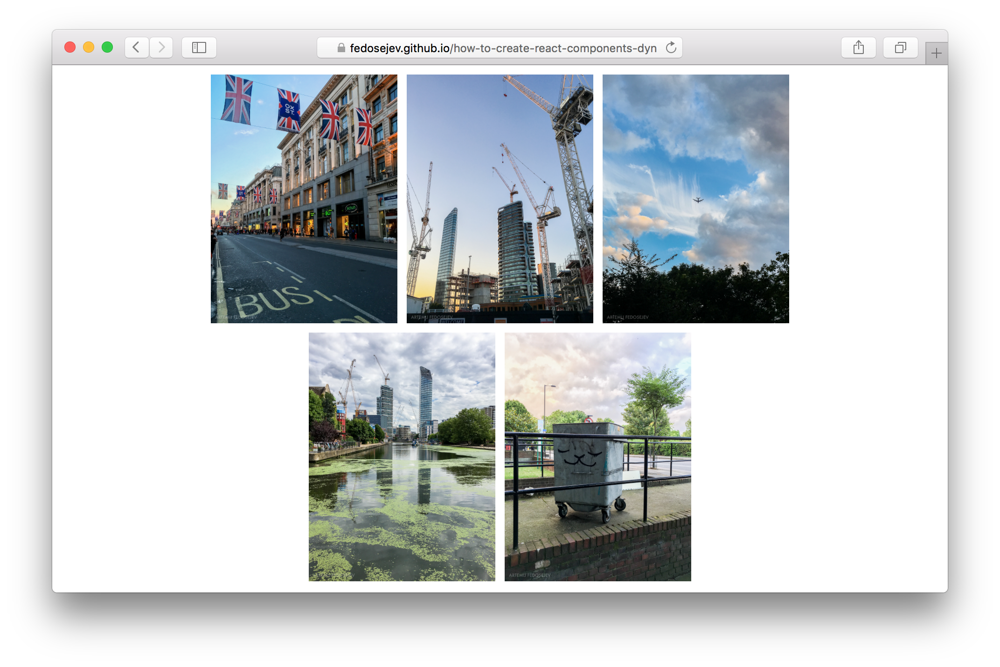

# How To Create React.js Components Dynamically

  <h4 class="alert-heading">Hold on!</h4>

  

    This tutorial covers React 15 and is now <strong>out of date</strong>.
  

  

    The good news is: <a href="/how-to-create-components-dynamically-in-react-16/">How To Create Components Dynamically in React 16</a> is available!
  

One of them most common tasks that we need to know how to do with React.js is to render a list of items _dynamically_ - meaning: we don't know how many items we're going to render at any given time. Zero or one hundred - it shouldn't matter.

Let's learn how to do it with a help of an intuitive example.

In this tutorial, we're going to build this application:

<figure class="figure">
  
  <figcaption class="figure-caption">Figure 1. Our application.</figcaption>
</figure>

You can find the full source code in <a href="https://github.com/fedosejev/how-to-create-react-components-dynamically">this GitHub repository</a>.

Our application is going to render 5 images _dynamically_. There is a catch: our application will work equally well for 50 or any other number of images. Let's see how.

Our application will be made of 2 React.js components:

1. `Application`
2. `Image`

`Application` component is a contrainer component - it encapsulates our entire React.js application. `Image` component on the hand - renders a single image.

Let's create the `Image` component first:

<figure class="figure">
<pre>
<code class="language-jsx">
import React from 'react';

let Image = function statelessFunctionComponentClass(props) {
  let source = './images/' + props.source;
  
  let style = {
    width: '200px',
    margin: '10px 5px 0px 5px'
  };

  return (
    
  );
};

export default Image;
</code>
</pre>
<figcaption class="figure-caption">Code snippet 1. Image.jsx</figcaption>
</figure>

If you're not sure why we're not calling `React.createClass` function to create a new React component class, then please [check this tutorial](http://react.tips/how-reactjs-components-communicate/) in which I explain what `statelessFunctionComponentClass` function does.

As you can see our `statelessFunctionComponentClass` function returns:

<figure class="figure">
<pre>
<code class="language-jsx">

</code>
</pre>
<figcaption class="figure-caption">Code snippet 2. Image.jsx</figcaption>
</figure>

`img` DOM element will be rendered when you create an instance of `Image` React component.

We get an image source from the parent React component as a property:

<figure class="figure">
<pre>
<code class="language-jsx">
let source = './images/' + props.source;
</code>
</pre>
<figcaption class="figure-caption">Code snippet 3. Image.jsx</figcaption>
</figure>

Then we also create some [inline styles](https://facebook.github.io/react/tips/inline-styles.html) for our `img` Node element:

<figure class="figure">
<pre>
<code class="language-jsx">
let style = {
  width: '200px',
  margin: '10px 5px 0px 5px'
};
</code>
</pre>
<figcaption class="figure-caption">Code snippet 4. Image.jsx</figcaption>
</figure>

Notice that creating inline styles here is optional. We use it purely for better look and feel.

Now that we have a way to render more than one image - how can we render more than one?

That's the job for `Application` component. Let's create it:

<figure class="figure">
<pre>
<code class="language-jsx">
import React from 'react';
import Image from './Image.jsx';
import data from '../../data.json';

let Application = React.createClass({
  createImage: function (image) {
    return <Image source={image} key={image} />;
  },

  createImages: function (images) {
    return images.map(this.createImage);
  },

  render: function () {
    return (
      

        

          

            
            {this.createImages(data.images)}
          
          

        

      

    );
  }
});

export default Application;
</code>
</pre>
<figcaption class="figure-caption">Code snippet 5. Application.jsx</figcaption>
</figure>

Our `Application` component renders some layout elements with [Bootstrap](http://getbootstrap.com/) class names and then calls `this.createImages` function that _actually_ creates the nessesary number of `Image` component instances:

<figure class="figure">
<pre>
<code class="language-jsx">
render: function () {
  return (
    

      

        

          
          {this.createImages(data.images)}
        
        

      

    

  );
}
</code>
</pre>
<figcaption class="figure-caption">Code snippet 6. Application.jsx</figcaption>
</figure>

`{this.createImages(data.images)}` function call does most of the work. We're passing `data.images` as an argument. What is `data.images`? The `data` object comes from importing a JSON file and converting it to a JavaScript object that we reference as `data`:

<figure class="figure">
<pre>
<code class="language-jsx">
import data from '../../data.json';
</code>
</pre>
<figcaption class="figure-caption">Code snippet 7. Application.jsx</figcaption>
</figure>

If we'll look into `data.json` file - we'll find this:

<figure class="figure">
<pre>
<code class="language-js">
{
  "images": [
    "IMG_5774.jpg", 
    "IMG_6305.jpg", 
    "IMG_6701.jpg", 
    "IMG_6732.jpg", 
    "IMG_6795.jpg"
  ]
}
</code>
</pre>
<figcaption class="figure-caption">Code snippet 8. data.json</figcaption>
</figure>

This JSON object has `images` property that points to an array of image file names.

So when we're importing `data.json` file content as a `data` variable and passing `data.images` as an argument to `this.createImages` function call - we're actually passing an array of image file names to `this.createImages` function call:

<figure class="figure">
<pre>
<code class="language-js">
[
  "IMG_5774.jpg", 
  "IMG_6305.jpg", 
  "IMG_6701.jpg", 
  "IMG_6732.jpg", 
  "IMG_6795.jpg"
]
</code>
</pre>
<figcaption class="figure-caption">Code snippet 9. data.json</figcaption>
</figure>

And what `createImages` function does with that array? Let's take a look:

<figure class="figure">
<pre>
<code class="language-jsx">
createImages: function (images) {
  return images.map(this.createImage);
},
</code>
</pre>
<figcaption class="figure-caption">Code snippet 10. Application.jsx</figcaption>
</figure>

`createImages` function iterates over `images` array and for each item in that array it calls `createImage` function passing that item as a argument.

Effectively `images.map(this.createImage)` is going to iterate over 5 image file names and call `createImage` 5 times.

We know that `map` function returns a new array that is made of items that `createImage` function returns. Our `createImages` function then returns that new array and since we're calling `createImages` in our component's `render` function - that new array will be rendered by React.

We want that array to be an array of React component instances - an instance per image.

Let's take a look at `createImage` function:

<figure class="figure">
<pre>
<code class="language-jsx">
createImage: function (image) {
  return <Image source={image} key={image} />;
},
</code>
</pre>
<figcaption class="figure-caption">Code snippet 11. Application.jsx</figcaption>
</figure>

It takes an image file name as a parameter. Then it creates a new instance of our `Image` component passing `image` as value for `source` and `key` properties.

Remember that our `Image` component needs to know what image file it should render and `source` property tells it exactly that. But what about that `key` property - we don't use it in our `Image` component - why are we passing it then?

The `key` property is [used by React to uniquely idenfity](https://facebook.github.io/react/docs/multiple-components.html#dynamic-children) our `Image` component instances.

Think about it this way: React needs a way to distinguish between multiple instances of a child component (our `Image` component is a child component of `Application` component) when they're created _dynamically_. These are also called ["Dynamic Children"](https://facebook.github.io/react/docs/multiple-components.html#dynamic-children) in React.

Naturally, the value for `key` property must be unique. It's up to us where this value is coming from. In this example, all file names are unique, so we're using them as unique keys for dynamic children.

## Let's review

Here is what's happening: in our `Application` component React calls `render` function that calls `createImages` function once that calls `createImage` as many times as we have image file names in our `data.images` array.

If we later decide to update `data.json` file and add another 10 image file names - our React application will work without any changes. It will import updated `data.json`, get array of image file names and pass it to `createImages` function call.

And that's how you create React.js components dynamically.

Thank you for your attention!

Please take a look at [the complete source code on GitHub](https://github.com/fedosejev/how-to-create-react-components-dynamically) and [the live version](https://fedosejev.github.io/how-to-create-react-components-dynamically/) of our app.

I hope you've enjoyed this tutorial and I would love to hear your feedback in the comments. You can get in touch with me via [Twitter](http://twitter.com/artemy) and [email](mailto:artemij@fedosejev.com).

[Artemij Fedosejev](http://artemij.com)

P.S. I've also written [React.js Essentials book](http://reactessentials.com) and [I teach people React.js and JavaScript](http://progressdots.com)!