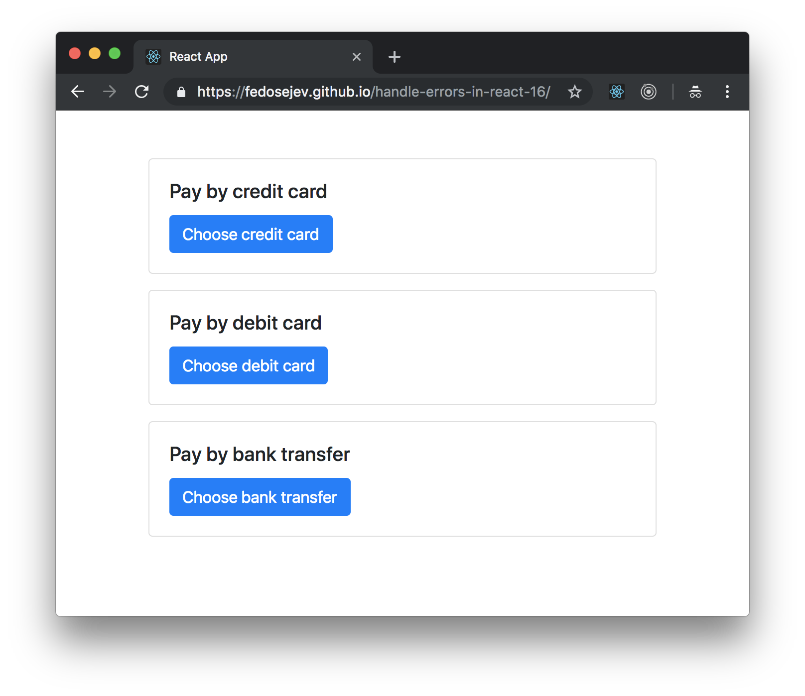
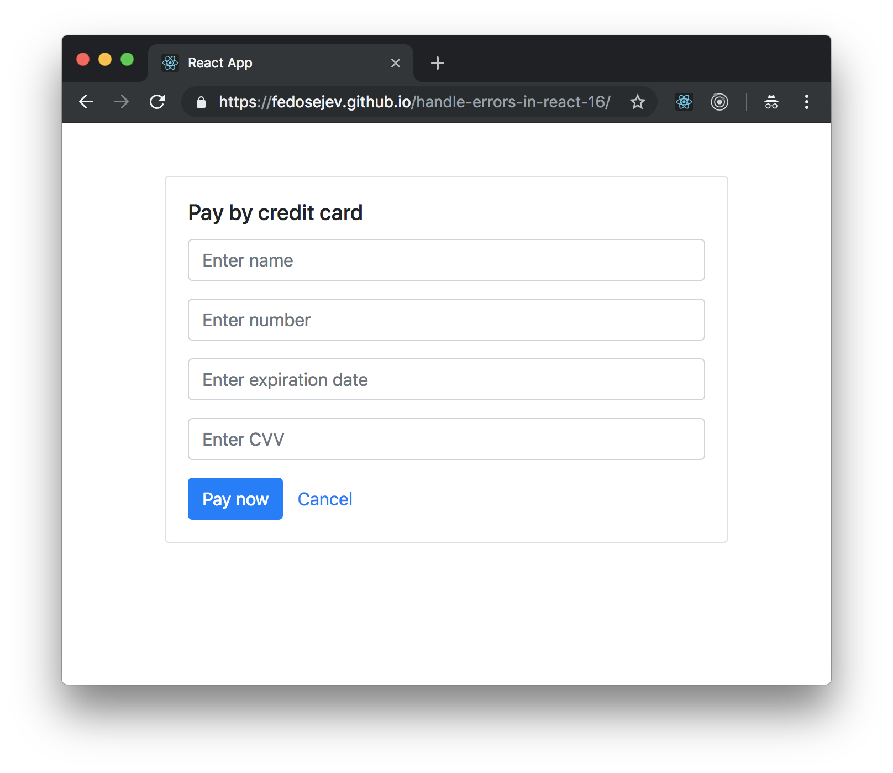
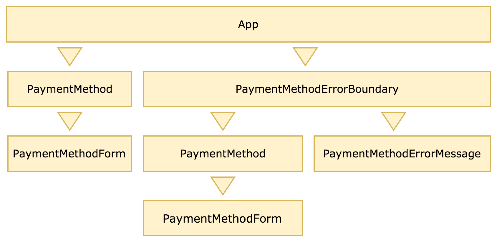

# How To Handle Errors In React 16

When your React component throws an error, it can make your React application unusable, and that can potentially cost your business money.

Let's learn by example why it's a good idea to handle errors in React and how you can do it in React 16.

In this tutorial, we'll build a React app that renders a payment page where users choose a payment method. Our React app will render three different payment methods, but only one of those payment methods will work as expected. The other two payment methods will throw errors. We'll handle one of those erros with Error Boudary feature introduced in React 16, while other error will be left unhandled. You'll see the difference that it makes for users and for a business.

First, let's take a look at the user interface that we want to build:

<figure class="figure">
  
  <figcaption class="figure-caption">Figure 1. Our application renders three payment methods.</figcaption>
</figure>

You can find the full source code in <a href="https://github.com/fedosejev/handle-errors-in-react-16">this GitHub repository</a>.

Our application will render three boxes where each box represents a payment method:
1. Credit card payment
2. Debit card payment
3. Bank transfer payment

When user clicks on `Choose ...` button for one of those payment methods we want our application to render a payment form. For example, when user clicks `Choose credit card` - a credit card payment form to be rendered while other payment methods will not be rendered:

<figure class="figure">
  
  <figcaption class="figure-caption">Figure 2. Our application renders credit card payment form.</figcaption>
</figure>

In our example application the `Choose credit card` button will work as expected. However, clicking on `Choose debit card` button will throw an error. This error won't be handled by our application and as a result - our application will crash, our users won't be able to make a payment and our business will lose a sale. Clicking on `Choose bank transfer` button will throw an error as well, however, in this case, our application will handle the error gracefully - it will inform our users about an unexpected error and give them an option to choose another payment method and complete their purchase:

<figure class="figure">
  
  <figcaption class="figure-caption">Figure 3. Our application renders payment method error message.</figcaption>
</figure>

This scenario will clerly demonstrate how a business can make more money by handling errors in React 16.

Let's take a look at how our application will be structured. The task of architecting a React application starts with three questions:
1. What components we need to build?
2. What components hierarchy we need to build?
3. What state our application needs to store and which components will be responsible for storing and managing that state?

Let's answer these questions one at a time.

## What components we need to build?

A good starting point in deciding on what components to create is to look at the UI mockups and break them into reusable elements. In our case, we have payment method box that is rendered three times. We can create a React component for the payment method. We also have a credit card payment method form that we render when user clicks `Pay by credit card` button. We'll create a React component for that payment form as well. We also want to render an error message when we handle an error that is thrown when user clicks on `Pay by bank transfer`. We'll create a React component for the payment method error message. And finally, we'll need to create a "special" React component that will implement the mechanism for handling an error thrown by another React component. This "special" React component will be an Error Boundary component - we'll discuss what it does and how it works shortly in this tutorial.

Excellent, now we have a list of React components that we want to create:
+ `App.js` component will the root component for our entire React application.
+ `PaymentMethod.js` component will render payment method box with a payment name and a button.
+ `PaymentMethodForm.js` component will render credit card payment method form.
+ `PaymentMethodErrorMessage.js` component will render payment method error message.
+ `PaymentMethodErrorBoundary.js` component will handle error thrown by `PaymentMethod.js` component.

Next step is to organise our components into a hierarchy.

## What components hierarchy we need to build?

When we organise components into a hierarchy we decide which componets will be parents, which component will be child components and which components will be both.

We'll start with a parent component that will encapsulate our entire React application - the `App` component. It will have no parent React component, and it will render three child components: two `PaymentMethod` components and one `PaymentMethodErrorBoundary` component.

The `PaymentMethod` component will render `PaymentMethodForm` component or a payment method name with a button.

The `PaymentMethodErrorBoundary` component will render `PaymentMethod` or `PaymentMethodErrorMessage` component.

Here's the visual diagram of our components hierarchy:

<figure class="figure">
  
  <figcaption class="figure-caption">Figure 2. Our application.</figcaption>
</figure>

Our application will need state. Let's decide on which components will be responsible for storing and maintaining that state.

## What state our application needs to store and which components will be responsible for storing and managing that state?

The general rule that we want to follow is: the less state our applications has the better. Less state means less state management which means less complexity in our application. However keeping our application as simple as possible is not a trivial task.

The next general rule that we ant to follow is: the fewer stateful components we have the better. We want most of our React component to be stateless, functional components that do only one thing - render user interface.

From the user interface point of view we need state that decides whether to render payment method box with a payment method name and the `Choose ...` button or a payment method form. Your first idea might be to make `PaymentMethod.js` component stateful and let it decide what to render based on that state: a payment name and a payment button or a payment form.

However, the challenge here is that we want to render three instances of `PaymentMethod.js` component and we know that what renders one component instance will have an effect on another two. Earlier we've mentioned that we want to render a payment method form when user clicks on `Choose ...` button and - we don't want to render the other two payment methods when a payment form is rendered. This requirement introduces a mental logical connection between all three instances - they're not completely independent in our application.

Our `App.js` component will render all three instances of `PaymentMethod.js` component. We can't access `PaymentMethod.js` component's state from a parent `App.js` component, so our if we store state in `PaymentMethod.js` component - our `App` component has no way to know when to render all instances of a `PaymentMethod.js` component and when to render only the one that user has selected. That means we can't store state in `PaymentMethod.js` component and we need to store it in a component that is a parent component for all three `PaymentMethod.js` component instances - in our `App.js` component.

Now we know that `App.js` component will be stateful component. We have one other piece of state that our application will need to manage. When user clicks on `Pay by bank transfer` button we want to render the `PaymentMethodErrorMessage` component with an error message. This logic will be handled by `PaymentMethodErrorBoundary.js` component which will be stateful. We'll look at it in more details shortly.

Perfect, we have answered all three questions about architecting our React components and it's time for us to start implementing them.

## Creating `App` component

We'll start with creating the `App.js` component:

<figure class="figure">
<pre>
<code class="language-jsx">
import React, { Component } from "react";
import PaymentMethod from "./PaymentMethod";
import PaymentMethodErrorBoundary from "./PaymentMethodErrorBoundary";
import { PAYMENT_METHODS, NO_PAYMENT_METHOD } from "../config";

class App extends Component {
  state = {
    selectedPaymentMethod: NO_PAYMENT_METHOD
  };

  shouldRenderPaymentMethod = paymentMethod =>
    this.state.selectedPaymentMethod === NO_PAYMENT_METHOD ||
    this.state.selectedPaymentMethod === paymentMethod;

  selectPaymentMethod = paymentMethod => {
    this.setState({
      selectedPaymentMethod: paymentMethod
    });
  };

  cancelPaymentMethod = () => this.selectPaymentMethod(NO_PAYMENT_METHOD);

  render() {
    const showPaymentMethodForm =
      this.state.selectedPaymentMethod !== NO_PAYMENT_METHOD;

    return (
      

        

          

            {this.shouldRenderPaymentMethod(PAYMENT_METHODS.CREDIT_CARD) && (
              <PaymentMethod
                name={PAYMENT_METHODS.CREDIT_CARD}
                onSelectPaymentMethod={this.selectPaymentMethod}
                onCancelPaymentMethod={this.cancelPaymentMethod}
                showPaymentMethodForm={showPaymentMethodForm}
              />
            )}

            {this.shouldRenderPaymentMethod(PAYMENT_METHODS.DEBIT_CARD) && (
              <PaymentMethod
                name={PAYMENT_METHODS.DEBIT_CARD}
                onSelectPaymentMethod={this.selectPaymentMethod}
                onCancelPaymentMethod={this.cancelPaymentMethod}
                showPaymentMethodForm={showPaymentMethodForm}
              />
            )}

            {this.shouldRenderPaymentMethod(PAYMENT_METHODS.BANK_TRANSFER) && (
              <PaymentMethodErrorBoundary onError={this.cancelPaymentMethod}>
                <PaymentMethod
                  name={PAYMENT_METHODS.BANK_TRANSFER}
                  onSelectPaymentMethod={this.selectPaymentMethod}
                  onCancelPaymentMethod={this.cancelPaymentMethod}
                  showPaymentMethodForm={showPaymentMethodForm}
                />
              </PaymentMethodErrorBoundary>
            )}
          

        

      

    );
  }
}

export default App;
</code>
</pre>
<figcaption class="figure-caption">Code snippet 1. App.js</figcaption>
</figure>

Let's focus on the `App` component's `render` method:

<figure class="figure">
<pre>
<code class="language-jsx">
render() {
  const showPaymentMethodForm =
    this.state.selectedPaymentMethod !== NO_PAYMENT_METHOD;

  return (
    

      

        

          {this.shouldRenderPaymentMethod(PAYMENT_METHODS.CREDIT_CARD) && (
            <PaymentMethod
              name={PAYMENT_METHODS.CREDIT_CARD}
              onSelectPaymentMethod={this.selectPaymentMethod}
              onCancelPaymentMethod={this.cancelPaymentMethod}
              showPaymentMethodForm={showPaymentMethodForm}
            />
          )}

          {this.shouldRenderPaymentMethod(PAYMENT_METHODS.DEBIT_CARD) && (
            <PaymentMethod
              name={PAYMENT_METHODS.DEBIT_CARD}
              onSelectPaymentMethod={this.selectPaymentMethod}
              onCancelPaymentMethod={this.cancelPaymentMethod}
              showPaymentMethodForm={showPaymentMethodForm}
            />
          )}

          {this.shouldRenderPaymentMethod(PAYMENT_METHODS.BANK_TRANSFER) && (
            <PaymentMethodErrorBoundary onError={this.cancelPaymentMethod}>
              <PaymentMethod
                name={PAYMENT_METHODS.BANK_TRANSFER}
                onSelectPaymentMethod={this.selectPaymentMethod}
                onCancelPaymentMethod={this.cancelPaymentMethod}
                showPaymentMethodForm={showPaymentMethodForm}
              />
            </PaymentMethodErrorBoundary>
          )}
        

      

    

  );
}
</code>
</pre>
<figcaption class="figure-caption">Code snippet 2. App.js</figcaption>
</figure>

The `App` component renders two instances of the `PaymentMethod` component and one instance of the `PaymentMethodErrorBoundary` component.

We render a credit card payment method:

<figure class="figure">
<pre>
<code class="language-jsx">
{this.shouldRenderPaymentMethod(PAYMENT_METHODS.CREDIT_CARD) && (
  <PaymentMethod
    name={PAYMENT_METHODS.CREDIT_CARD}
    onSelectPaymentMethod={this.selectPaymentMethod}
    onCancelPaymentMethod={this.cancelPaymentMethod}
    showPaymentMethodForm={showPaymentMethodForm}
  />
)}
</code>
</pre>
<figcaption class="figure-caption">Code snippet 3. App.js</figcaption>
</figure>

We render a debit card payment method:

<figure class="figure">
<pre>
<code class="language-jsx">
{this.shouldRenderPaymentMethod(PAYMENT_METHODS.DEBIT_CARD) && (
  <PaymentMethod
    name={PAYMENT_METHODS.DEBIT_CARD}
    onSelectPaymentMethod={this.selectPaymentMethod}
    onCancelPaymentMethod={this.cancelPaymentMethod}
    showPaymentMethodForm={showPaymentMethodForm}
  />
)}
</code>
</pre>
<figcaption class="figure-caption">Code snippet 4. App.js</figcaption>
</figure>

And we render a bank transfer payment method:

<figure class="figure">
<pre>
<code class="language-jsx">
{this.shouldRenderPaymentMethod(PAYMENT_METHODS.BANK_TRANSFER) && (
  <PaymentMethodErrorBoundary onError={this.cancelPaymentMethod}>
    <PaymentMethod
      name={PAYMENT_METHODS.BANK_TRANSFER}
      onSelectPaymentMethod={this.selectPaymentMethod}
      onCancelPaymentMethod={this.cancelPaymentMethod}
      showPaymentMethodForm={showPaymentMethodForm}
    />
  </PaymentMethodErrorBoundary>
)}
</code>
</pre>
<figcaption class="figure-caption">Code snippet 5. App.js</figcaption>
</figure>

Out of all three instances of `PaymentMethod` component only the bank transfer one is wrapped into a `PaymentMethodErrorBoundary` component. In other words, we're passing `PaymentMethod` component instance as a child to `PaymentMethodErrorBoundary` component. This tells React that if that `PaymentMethod` method component will throw an error - the `PaymentMethodErrorBoundary` will catch it and handle it. Conversely, the other two instances of `PaymentMethod` component are not wrapped in the `PaymentMethodErrorBoundary` component, so if they throw an error and we know that the debit card payment method will throw an error - it will crash our entire React app.

Earlier we've discussed that we want to render all three payment methods initially and when user select one by clicking the `Choose ...` button - we want to display the payment form for that method and nothing else. This is why we render each payment method conditionally - using the `{this.shouldRenderPaymentMethod(PAYMENT_METHODS.BANK_TRANSFER) && ...` pattern. In this pattern we're calling `this.shouldRenderPaymentMethod` method on our component class and we're passing payment method name to that method. Let's take a look at what this method does:

<figure class="figure">
<pre>
<code class="language-jsx">
shouldRenderPaymentMethod = paymentMethod =>
  this.state.selectedPaymentMethod === NO_PAYMENT_METHOD ||
  this.state.selectedPaymentMethod === paymentMethod;
</code>
</pre>
<figcaption class="figure-caption">Code snippet 6. App.js</figcaption>
</figure>

The `shouldRenderPaymentMethod` method takes `paymentMethod` name as a parameter and checks if the `paymentMethod` in the `App` component's state matches the value of `NO_PAYMENT_METHOD` or the value of `paymentMethod` parameter. The idea here is for `shouldRenderPaymentMethod` method to tell us whether any given payment method should be rendered or not. And the logic here checks if the selected payment method equals to no payment method which is the case initially and in that case we want to render all payment methods. Or if the selected payment method equals to a specific payment method provided by the `paymentMethod` parameter then we want to render only that payment method. In other words, we want to render all three payment methods or only one of the three.

Notice that we import `NO_PAYMENT_METHOD` and `PAYMENT_METHODS` constants from the `config.js` file:

<figure class="figure">
<pre>
<code class="language-jsx">
import { PAYMENT_METHODS, NO_PAYMENT_METHOD } from "../config";
</code>
</pre>
<figcaption class="figure-caption">Code snippet 7. App.js</figcaption>
</figure>

And this is our `config.js` file:

<figure class="figure">
<pre>
<code class="language-jsx">
export const PAYMENT_METHODS = {
  CREDIT_CARD: "credit card",
  DEBIT_CARD: "debit card",
  BANK_TRANSFER: "bank transfer"
};

export const NO_PAYMENT_METHOD = "";
</code>
</pre>
<figcaption class="figure-caption">Code snippet 8. config.js</figcaption>
</figure>

It declares all three payment method names and an empty payment method name in `config.js` file.

We pass payment method names from the `config.js` file to `PaymentMethod` components, for example:

<figure class="figure">
<pre>
<code class="language-jsx">
<PaymentMethod
  name={PAYMENT_METHODS.CREDIT_CARD}
  onSelectPaymentMethod={this.selectPaymentMethod}
  onCancelPaymentMethod={this.cancelPaymentMethod}
  showPaymentMethodForm={showPaymentMethodForm}
/>
</code>
</pre>
<figcaption class="figure-caption">Code snippet 9. App.js</figcaption>
</figure>

The `name` prop passes the payment method name. Let's take a look at other props that we pass to the `PaymentMethod` component:

+ `onSelectPaymentMethod` prop gets a callback function `this.selectPaymentMethod` which is called when user clicks on `Choose ...` button to select a payment method.
+ `onCancelPaymentMethod` prop gets a callback function `this.cancelPaymentMethod` which is called when user clicks `Cancel` button on payment method form. You can see it in action when you click on `Choose credit card` button and then on the `Cancel` button.
+ `showPaymentMethodForm` prop gets a boolean value `showPaymentMethodForm` which tells `PaymentMethod` component whether it should render a payment method form or a payment method name with a button.

We declare `showPaymentMethodForm` variable in the component's `render` method before the `return` statement:

<figure class="figure">
<pre>
<code class="language-jsx">
const showPaymentMethodForm =
  this.state.selectedPaymentMethod !== NO_PAYMENT_METHOD;
</code>
</pre>
<figcaption class="figure-caption">Code snippet 10. App.js</figcaption>
</figure>

You can see that the value of `showPaymentMethodForm` depends on whether `this.state.selectedPaymentMethod` is anything other than `NO_PAYMENT_METHOD`. The idea here is to show payment method name with a `Choose ...` button initially when user hasn't selected any payment method yet. This fact is represented with `NO_PAYMENT_METHOD` value in the `App` component's state:

<figure class="figure">
<pre>
<code class="language-jsx">
state = {
  selectedPaymentMethod: NO_PAYMENT_METHOD
};
</code>
</pre>
<figcaption class="figure-caption">Code snippet 11. App.js</figcaption>
</figure>

When user chooses a payment method we update our component's state to another value that is not `NO_PAYMENT_METHOD`. When user selects a payment method - we want to render a payment method form. This is why `showPaymentMethodForm` variable will have `true` value when one of the payment methods is selected.

What exactly happens when user selects one of the payment methods? The `PaymentMethod` component will call the `App` component's `this.selectPaymentMethod` method and pass payment method name to it as a parameter:

<figure class="figure">
<pre>
<code class="language-jsx">
selectPaymentMethod = paymentMethod => {
  this.setState({
    selectedPaymentMethod: paymentMethod
  });
};
</code>
</pre>
<figcaption class="figure-caption">Code snippet 12. App.js</figcaption>
</figure>

In turn, the `selectPaymentMethod` method will update `App` component's state - it will set `selectedPaymentMethod`'s value to the one that the `PaymentMethod` component passed as a `paymentMethod` parameter.

Now you understand the big picture of how the `App` component manages it's state. It has `selectedPaymentMethod` property that is initially set to `NO_PAYMENT_METHOD` value. Then it updates that property in `selectPaymentMethod` method. And who calls `selectPaymentMethod` method? It's child `PaymentMethod` component.

The `App` component has the `cancelPaymentMethod` method that is a helper method:

<figure class="figure">
<pre>
<code class="language-jsx">
cancelPaymentMethod = () => this.selectPaymentMethod(NO_PAYMENT_METHOD);
</code>
</pre>
<figcaption class="figure-caption">Code snippet 13. App.js</figcaption>
</figure>

What `cancelPaymentMethod` does is it calls `selectPaymentMethod` method passing `NO_PAYMENT_METHOD` as a payment method name - effectively resetting selected payment method name to it's initial value. This will tell React to render all three payment methods once again when the user clicks `Cancel` button on one of the payment method forms.

Now you understand what our `App` component renders and how it works.

## Creating `PaymentMethod` component

Next let's take a look at one of it's child components that it renders - the `PaymentMethod` component:

<figure class="figure">
<pre>
<code class="language-jsx">
import React from "react";
import PaymentMethodForm from "./PaymentMethodForm";
import { PAYMENT_METHODS } from "../config";

const PaymentMethod = props => {
  if (
    props.showPaymentMethodForm &&
    props.name === PAYMENT_METHODS.CREDIT_CARD
  ) {
    return (
      <PaymentMethodForm
        onSubmit={event => {
          event.preventDefault();

          console.log("Payment submitted.");
        }}
        onCancel={props.onCancelPaymentMethod}
      />
    );
  }

  if (
    props.showPaymentMethodForm &&
    (props.name === PAYMENT_METHODS.BANK_TRANSFER ||
      props.name === PAYMENT_METHODS.DEBIT_CARD)
  ) {
    throw new Error("Failed to render payment form.");
  }

  return (
    

      

        <h5 className="card-title">Pay by {props.name}</h5>

        <button
          className="btn btn-primary"
          onClick={() => props.onSelectPaymentMethod(props.name)}
        >
          Choose {props.name}
        </button>
      

    

  );
};

export default PaymentMethod;
</code>
</pre>
<figcaption class="figure-caption">Code snippet 14. PaymentMethod.js</figcaption>
</figure>

As you can see, the `PaymentMethod` component is a functional React component. It has no state. All it does is renders a user interface. Let's take a closer look at what user interface it renders:

<figure class="figure">
<pre>
<code class="language-jsx">
return (
  

    

      <h5 className="card-title">Pay by {props.name}</h5>

      <button
        className="btn btn-primary"
        onClick={() => props.onSelectPaymentMethod(props.name)}
      >
        Choose {props.name}
      </button>
    

  

);
</code>
</pre>
<figcaption class="figure-caption">Code snippet 15. PaymentMethod.js</figcaption>
</figure>

It renders a header and a button. The header has a payment method name that comes with the `name` prop. And the `Choose ...` button calls `onSelectPaymentMethod` function that is passed to `PaymentMethod` component as a prop as well. The `onSelectPaymentMethod` is a callback function that `PaymentMethod` component calls to communicate back to it's parent `App` component that user has selected payment method with a name `name`.

When you run our React app, you see three payment methods rendered by `PaymentMethod` component. That's what we want the `PaymentMethod` component to render by default. However, remember that we also want our `PaymentMethod` component to render a payment method form when user selects that payment method. This is why before returning a header and a button, we check if one of the payment methods is selected:

<figure class="figure">
<pre>
<code class="language-jsx">
if (
  props.showPaymentMethodForm &&
  props.name === PAYMENT_METHODS.CREDIT_CARD
) {
  return (
    <PaymentMethodForm
      onSubmit={event => {
        event.preventDefault();

        console.log("Payment submitted.");
      }}
      onCancel={props.onCancelPaymentMethod}
    />
  );
}

if (
  props.showPaymentMethodForm &&
  (props.name === PAYMENT_METHODS.BANK_TRANSFER ||
    props.name === PAYMENT_METHODS.DEBIT_CARD)
) {
  throw new Error("Failed to render payment form.");
}
</code>
</pre>
<figcaption class="figure-caption">Code snippet 16. PaymentMethod.js</figcaption>
</figure>

In this tutorial we want to demonstrate three different scenarios:
1. User clicks on a credit card payment method and it works as expected.
2. User clicks on a debit card payment method and it throws an error that our app doesn't handle.
3. User clicks on a bank transfer payment method and it throws an error that our app handles with an Error Boundary component.

We use two `if` statements to describe all three scenarios. Both `if` statements check if the `PaymentMethod` component should render a payment method form. If not, it the `PaymentMethod` component will render payment method name and a `Choose ...` button. If `props.showPaymentMethodForm` is `true`, which means that the `App` component wants `PaymentMethod` component render to render a payment method form, then the next question is: what payment method this `PaymentMethod` component instance represents? We answer this question by checking if the payment method name equals to one of three options: `props.name === PAYMENT_METHODS.CREDIT_CARD`, `props.name === PAYMENT_METHODS.BANK_TRANSFER` and `props.name === PAYMENT_METHODS.DEBIT_CARD`.

In the first scenario we have a credit card payment method and in that scenario - we want to render a payment method form:

<figure class="figure">
<pre>
<code class="language-jsx">
if (
  props.showPaymentMethodForm &&
  props.name === PAYMENT_METHODS.CREDIT_CARD
) {
  return (
    <PaymentMethodForm
      onSubmit={event => {
        event.preventDefault();

        console.log("Payment submitted.");
      }}
      onCancel={props.onCancelPaymentMethod}
    />
  );
}
</code>
</pre>
<figcaption class="figure-caption">Code snippet 17. PaymentMethod.js</figcaption>
</figure>

This is what the first `if` statement checks for. If `props.showPaymentMethodForm && props.name === PAYMENT_METHODS.CREDIT_CARD` is `true` then the `PaymentMethod` component renders `PaymentMethodForm` component:

<figure class="figure">
<pre>
<code class="language-jsx">
<PaymentMethodForm
  onSubmit={event => {
    event.preventDefault();

    console.log("Payment submitted.");
  }}
  onCancel={props.onCancelPaymentMethod}
/>
</code>
</pre>
<figcaption class="figure-caption">Code snippet 18. PaymentMethod.js</figcaption>
</figure>

The `PaymentMethodForm` component gets `onSubmit` and `onCancel` props. We pass a function that logs `Payment submitted.` message in JavaScript console to `onSubmit` prop. And we pass `prop.onCancelPaymentMethod` value to `onCancel` prop. The `PaymentMethod` component gets that `onCancelPaymentMethod` as a prop from it's parent `App` component. This is an example of a prop that `PaymentMethod` component doesn't use itself, but it needs to pass it to it's child `PaymentMethodForm` component.

In the second and the third scenarios we have a debit card and a bank transfer payment methods and in those scenarios we want to throw an error, instead of returning a payment method form:

<figure class="figure">
<pre>
<code class="language-jsx">
if (
  props.showPaymentMethodForm &&
  (props.name === PAYMENT_METHODS.BANK_TRANSFER ||
    props.name === PAYMENT_METHODS.DEBIT_CARD)
) {
  throw new Error("Failed to render payment form.");
}
</code>
</pre>
<figcaption class="figure-caption">Code snippet 19. PaymentMethod.js</figcaption>
</figure>

## Creating `PaymentMethodForm` component

Now that you understand what our `PaymentMethod` component does and how it works, let's take a look at the `PaymentMethodForm` component next.

<figure class="figure">
<pre>
<code class="language-jsx">
import React from "react";

const PaymentMethodForm = props => (
  

    

      <h5 className="card-title">Pay by credit card</h5>
      <form onSubmit={props.onSubmit}>
        

          <input
            type="text"
            className="form-control"
            aria-describedby="name"
            placeholder="Enter name"
          />
        

        

          <input
            type="text"
            className="form-control"
            aria-describedby="number"
            placeholder="Enter number"
          />
        

        

          <input
            type="text"
            className="form-control"
            aria-describedby="expirationDate"
            placeholder="Enter expiration date"
          />
        

        

          <input
            type="text"
            className="form-control"
            aria-describedby="CVV"
            placeholder="Enter CVV"
          />
        

        <button type="submit" className="btn btn-primary">
          Pay now
        </button>
        <button type="button" className="btn btn-link" onClick={props.onCancel}>
          Cancel
        </button>
      </form>
    

  

);

export default PaymentMethodForm;
</code>
</pre>
<figcaption class="figure-caption">Code snippet 20. PaymentMethodForm.js</figcaption>
</figure>

The `PaymentMethodForm` component is a functional component that renders a credit card payment form. It gets `onSubmit` and on `onCancel` props from a parent `PaymentMethod` component. When user clicks `Pay now` button, the `onSubmit` prop is called. When user clicks on `Cancel` button, the `onCancel` prop is called. As simple as that.

Now you understand how our `App`, `PaymentMethod` and `PaymentMethodForm` components work. Remember that in two different scenarios the `PaymentMethod` component throws an error. However, only in one scenario we handle that error in our `App` component with an Error Boundary. Let's take a closer look at how we do it:

<figure class="figure">
<pre>
<code class="language-jsx">
{this.shouldRenderPaymentMethod(PAYMENT_METHODS.BANK_TRANSFER) && (
  <PaymentMethodErrorBoundary onError={this.cancelPaymentMethod}>
    <PaymentMethod
      name={PAYMENT_METHODS.BANK_TRANSFER}
      onSelectPaymentMethod={this.selectPaymentMethod}
      onCancelPaymentMethod={this.cancelPaymentMethod}
      showPaymentMethodForm={showPaymentMethodForm}
    />
  </PaymentMethodErrorBoundary>
)}
</code>
</pre>
<figcaption class="figure-caption">Code snippet 21. App.js</figcaption>
</figure>

When user clicks on the bank transfer payment method the `PaymentMethod` component throws an error. We want to catch that error to prevent our entire React app from crashing. To do that we create the `PaymentMethodErrorBoundary` component and wrap the `PaymentMethod` component into it.

## Creating `PaymentMethodErrorBoundary` component

Let's take a look at our `PaymentMethodErrorBoundary` component:

<figure class="figure">
<pre>
<code class="language-jsx">
import React, { Component } from "react";
import PaymentMethodErrorMessage from "./PaymentMethodErrorMessage";

class PaymentMethodErrorBoundary extends Component {
  state = { hasError: false };

  static getDerivedStateFromError() {
    return { hasError: true };
  }

  componentDidCatch() {
    this.props.onError();
  }

  render() {
    if (this.state.hasError) {
      return <PaymentMethodErrorMessage />;
    }

    return this.props.children;
  }
}

export default PaymentMethodErrorBoundary;
</code>
</pre>
<figcaption class="figure-caption">Code snippet 22. PaymentMethodErrorBoundary.js</figcaption>
</figure>

Let's take a closer look at what our `PaymentMethodErrorBoundary` component renders:

<figure class="figure">
<pre>
<code class="language-jsx">
render() {
  if (this.state.hasError) {
    return <PaymentMethodErrorMessage />;
  }

  return this.props.children;
}
</code>
</pre>
<figcaption class="figure-caption">Code snippet 23. PaymentMethodErrorBoundary.js</figcaption>
</figure>

It renders two different things depending on it's state. Our `PaymentMethodErrorBoundary` is a stateful component. It's initial state looks like this:

<figure class="figure">
<pre>
<code class="language-jsx">
state = { hasError: false };
</code>
</pre>
<figcaption class="figure-caption">Code snippet 24. PaymentMethodErrorBoundary.js</figcaption>
</figure>

The idea is to render two different things depending on whether our `PaymentMethodErrorBoundary` component caught an error or not. We create `hasError` state property and set it initially to `false`. Later you'll see that we update `hasError`'s value to `true` when our `PaymentMethodErrorBoundary` component catches an error.

If we didn't catch an error, we want our `PaymentMethodErrorBoundary` component to render it's `children` prop: `return this.props.children;`. This allows us to nest `PaymentMethod` component inside of the `PaymentMethodErrorBoundary` component:

<figure class="figure">
<pre>
<code class="language-jsx">
<PaymentMethodErrorBoundary onError={this.cancelPaymentMethod}>
  <PaymentMethod
    name={PAYMENT_METHODS.BANK_TRANSFER}
    onSelectPaymentMethod={this.selectPaymentMethod}
    onCancelPaymentMethod={this.cancelPaymentMethod}
    showPaymentMethodForm={showPaymentMethodForm}
  />
</PaymentMethodErrorBoundary>
</code>
</pre>
<figcaption class="figure-caption">Code snippet 25. App.js</figcaption>
</figure>

If we did catch an error, then we want our `PaymentMethodErrorBoundary` component to render something other than the `PaymentMethod` component that throws an error. In our app we render `PaymentMethodErrorMessage` component instead:

<figure class="figure">
<pre>
<code class="language-jsx">
if (this.state.hasError) {
  return <PaymentMethodErrorMessage />;
}
</code>
</pre>
<figcaption class="figure-caption">Code snippet 26. PaymentMethodErrorBoundary.js</figcaption>
</figure>

## Creating `PaymentMethodErrorMessage` component

Let's take a quick look at what `PaymentMethodErrorMessage` renders:

<figure class="figure">
<pre>
<code class="language-jsx">
import React from "react";

const PaymentMethodError = () => (
  

    

      <h5 className="card-title">We're sorry</h5>
      

        Unfortunately, this payment method is not available at the moment.
      

    

  

);

export default PaymentMethodError;
</code>
</pre>
<figcaption class="figure-caption">Code snippet 27. PaymentMethodErrorBoundary.js</figcaption>
</figure>

The `PaymentMethodErrorMessage` component is a functional component that renders an informative user-friendly error message.

Now we know what `PaymentMethodErrorBoundary` component renders. It's time to for us to understand how it works.

You already know that it's a stateful component and it's initial state is: `state = { hasError: false };`. What makes `PaymentMethodErrorBoundary` component an error boundary component rather than just another presentational component is the fact that it has one of those two component lifecycle methods: `getDerivedStateFromError` and `componentDidCatch`.

Let's take a closer look at `getDerivedStateFromError` method first:

<figure class="figure">
<pre>
<code class="language-jsx">
static getDerivedStateFromError() {
  return { hasError: true };
}
</code>
</pre>
<figcaption class="figure-caption">Code snippet 28. PaymentMethodErrorBoundary.js</figcaption>
</figure>

`getDerivedStateFromError` is a lifecycle method that React calls after it's child `PaymentMethod` component throws an error. This is a lifecycle component method that we use to update `PaymentMethodErrorBoundary` component's state - we want to set `hasError` to `true`. Updating component's state will force React to re-render `PaymentMethodErrorBoundary` component and with a new state it will render `PaymentMethodErrorMessage` component instead of `this.props.children`. As you can see we use `getDerivedStateFromError` lifecycle method as part of our fallback mechanism: if no error, then render `this.props.children` prop, if error, then render `PaymentMethodErrorMessage` component.

 After rendering an error message instead of a payment method form, we want our users to have a chance to choose a different payment method - the one that doesn't throw an error. This logic helps us to gracefully degrade our service and enables our users to still make a payment. Good for users, good for business.

How do we make sure that our `App` component will render three payment methods once again after user has select one of the payment methods that threw an error? That's what we use the `componentDidCatch` lifecycle method for:

<figure class="figure">
<pre>
<code class="language-jsx">
componentDidCatch() {
  this.props.onError();
}
</code>
</pre>
<figcaption class="figure-caption">Code snippet 29. PaymentMethodErrorBoundary.js</figcaption>
</figure>

React will call `componentDidCatch` method after catching an error and re-rendering our `PaymentMethodErrorBoundary` component with a fallback user interface - with `PaymentMethodErrorMessage` component in our case.

What we want to do in `componentDidCatch` is to call `onError` callback prop that `App` component passes to `PaymentMethodErrorBoundary` component. `onError` will call `App` component's `cancelPaymentMethod` method that will in turn reset `App` component's state to `{ selectedPaymentMethod: NO_PAYMENT_METHOD };`. Without having a payment method selected our `App` component will render all three payment methods and our users can choose another payment method. Winning.

Now you know how to handle errors in React 16 with Error Boundary components. <a href="https://reactjs.org/docs/error-boundaries.html" target="_blank">Here you can learn more about Error Boundaries in React</a>.

I hope you've enjoyed this tutorial. If you have any questions or suggestions for the next tutorial, then please leave a comment.

Thank you for your attention!

Please take a look at [the complete source code on GitHub](https://github.com/fedosejev/how-to-handle-errors-in-react-16/) and [the live version](https://fedosejev.github.io/how-to-handle-errors-in-react-16/) of our app.

I hope you've enjoyed this tutorial and I would love to hear your feedback in the comments. You can get in touch with me via [Twitter](http://twitter.com/artemy) and [email](mailto:artemij@fedosejev.com).

[Artemij Fedosejev](http://artemij.com)
