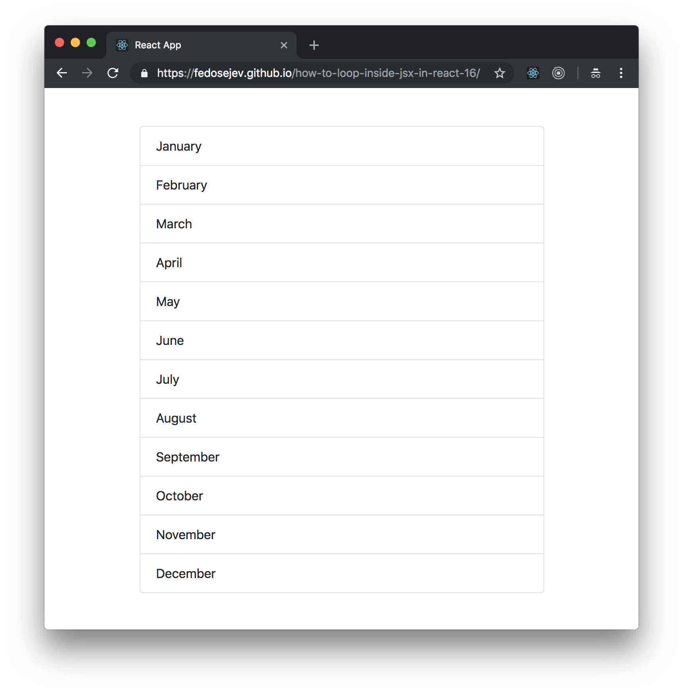

# How To Loop Inside JSX Syntax In React 16?

How do we generate React components by looping through an array of items inside JSX syntax?

Let's build a simple React application:

<figure class="figure">
  
  <figcaption class="figure-caption">Figure 1. Our application.</figcaption>
</figure>

You can find the full source code in <a href="https://github.com/fedosejev/how-to-loop-inside-jsx-in-react-16">this GitHub repository</a>.

Our application is going to render a list of months. It will be made of two components: `App` and `Month`.

Let's create the `App` component first:

<figure class="figure">
<pre>
<code class="language-jsx">
import React, { Component } from "react";
import Month from "./Month";

const MONTHS = [
  {
    name: "January",
    number: 1
  },
  {
    name: "February",
    number: 2
  },
  {
    name: "March",
    number: 3
  },
  {
    name: "April",
    number: 4
  },
  {
    name: "May",
    number: 5
  },
  {
    name: "June",
    number: 6
  },
  {
    name: "July",
    number: 7
  },
  {
    name: "August",
    number: 8
  },
  {
    name: "September",
    number: 9
  },
  {
    name: "October",
    number: 10
  },
  {
    name: "November",
    number: 11
  },
  {
    name: "December",
    number: 12
  }
];

class App extends Component {
  createMonthElement = month => <Month month={month} key={month.number} />;

  render() {
    return (
      

        

          

            <ul className="list-group">
              {MONTHS.map(this.createMonthElement)}
            </ul>
          

        

      

    );
  }
}

export default App;
</code>
</pre>
<figcaption class="figure-caption">Code snippet 1. App.js</figcaption>
</figure>

First, let's focus on its `render` method:

<figure class="figure">
<pre>
<code class="language-jsx">
render() {
  return (
    

      

        

          <ul className="list-group">
            {MONTHS.map(this.createMonthElement)}
          </ul>
        

      

    

  );
}
</code>
</pre>
<figcaption class="figure-caption">Code snippet 2. App.js</figcaption>
</figure>

We see three `div` elements with class names that you might recognize if you're familiar with [Bootstrap](http://getbootstrap.com). Bootstrap helps us create layout for our page.

Inside of the `div` elements we have a `ul` element that has a JavaScript expression wrapped in `{` and `}`:

<figure class="figure">
<pre>
<code class="language-jsx">
{MONTHS.map(this.createMonthElement)}
</code>
</pre>
<figcaption class="figure-caption">Code snippet 3. App.js</figcaption>
</figure>

We can add JavaScript expressions inside of JSX syntax. JSX syntax itself is an expression too. In that JavaScript expression we're looping through an array called `MONTHS` and for each item in that array we call `this.createMonthElement` method and pass an array item as an argument to it.

As you have guessed, the `this.createMonthElement` method returns another JSX expression that renders a month name. Let's take a look at it:

<figure class="figure">
<pre>
<code class="language-jsx">
createMonthElement = month => <Month month={month} key={month.number} />;
</code>
</pre>
<figcaption class="figure-caption">Code snippet 4. App.js</figcaption>
</figure>

The `createMonthElement` method gets `month` as a parameter and returns an instance of `Month` component with `month` and `key` props.

The `month` is an object with month `name` and `number` for example:

<figure class="figure">
<pre>
<code class="language-jsx">
{
  name: "January",
  number: 1
}
</code>
</pre>
<figcaption class="figure-caption">Code snippet 5. App.js</figcaption>
</figure>

It makes sense why we pass `month` object to `Month` component as a prop, but why do we need to pass the `key` prop? When we <a href="/how-to-create-components-dynamically-in-react-16/">create React elements dynamically</a> we need to help React to uniquely identify those elements, so that React could figure out how to update the DOM efficiently.

Now let's take a look at the `Month` component:

<figure class="figure">
<pre>
<code class="language-jsx">
import React from "react";

const Month = props => <li className="list-group-item">{props.month.name}</li>;

export default Month;
</code>
</pre>
<figcaption class="figure-caption">Code snippet 6. Month.js</figcaption>
</figure>

As you can see, the `Month` component renders `li` element with month name:

<figure class="figure">
<pre>
<code class="language-jsx">
<li className="list-group-item">{props.month.name}</li>
</code>
</pre>
<figcaption class="figure-caption">Code snippet 7. Month.js</figcaption>
</figure>

Now you know how to loop through array of elements inside of JSX in React.

Thank you for reading this React tutorial!

Please take a look at [the complete source code on GitHub](https://github.com/fedosejev/how-to-loop-inside-jsx-in-react-16) and [the live version](https://fedosejev.github.io/how-to-loop-inside-jsx-in-react-16/) of our app.

I hope you've enjoyed this tutorial and I would love to hear your feedback in the comments. You can get in touch with me via [Twitter](http://twitter.com/artemy) and [email](mailto:artemij@fedosejev.com).

[Artemij Fedosejev](http://artemij.com)
