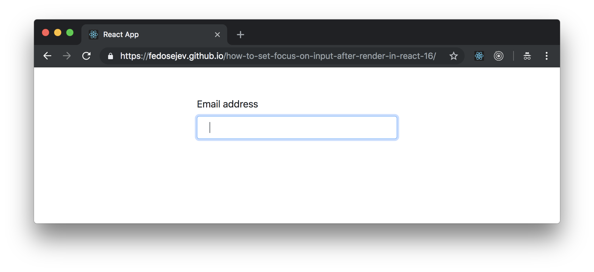

# How To Set Focus On Input After Render In React 16?

When you create a form with React, you might want to set focus on an input element after it is rendered. How do you that?

Let's build a simple React application:

<figure class="figure">
  
  <figcaption class="figure-caption">Figure 1. Our application.</figcaption>
</figure>

You can find the full source code in <a href="https://github.com/fedosejev/how-to-set-focus-on-input-after-render-in-react-16">this GitHub repository</a>.

Our application is going to render a form with an input field for entering an email address. That's it, nothing else. Once this input element is rendered, we will set focus on it, so that our users could start typing their email address immediately.

Our application will be made of a single component called `App`, let's create it:

<figure class="figure">
<pre>
<code class="language-jsx">
import React, { Component } from "react";

class App extends Component {
  constructor() {
    super();

    this.emailInput = React.createRef();
  }

  componentDidMount() {
    this.emailInput.current.focus();
  }

  render() {
    return (
      

        

          

            <form>
              

                <label for="email">Email address</label>
                <input
                  type="email"
                  className="form-control"
                  aria-describedby="emailHelp"
                  placeholder="Enter email"
                  ref={this.emailInput}
                />
              

            </form>
          

        

      

    );
  }
}

export default App;
</code>
</pre>
<figcaption class="figure-caption">Code snippet 1. App.js</figcaption>
</figure>

First, let's focus on its `render` function:

<figure class="figure">
<pre>
<code class="language-jsx">
render() {
  return (
    

      

        

          <form>
            

              <label for="email">Email address</label>
              <input
                type="email"
                className="form-control"
                aria-describedby="emailHelp"
                placeholder="Enter email"
                ref={this.emailInput}
              />
            

          </form>
        

      

    

  );
}
</code>
</pre>
<figcaption class="figure-caption">Code snippet 2. App.js</figcaption>
</figure>

We see three `div` elements with class names that you might recognize if you're familiar with [Bootstrap](http://getbootstrap.com). Bootstrap helps us create layout for our page.

Inside of the `div` elements we have a `form` element that has `label` and `input` child elements.

Let's focus on the `input` element:

<figure class="figure">
<pre>
<code class="language-jsx">
<input
  type="email"
  className="form-control"
  aria-describedby="emailHelp"
  placeholder="Enter email"
  ref={this.emailInput}
/>
</code>
</pre>
<figcaption class="figure-caption">Code snippet 3. App.js</figcaption>
</figure>

Now let's think about how setting focus on an `input` element will work. The first thing to understand is that our `input` element doesn't exist in the DOM until our `App` component renders it. And we know that we can't focus on something that doesn't exist!

The first step is to render our `input` element. React will do this by calling the `render` method in our `App` component. Now our `input` element exists in the DOM, but to focus on it, we need to have a reference to it, don't we? That's where React offers us a prop called `ref`. We can use this prop on our `input` element to associate it with a _reference_ that we'll name `emailInput`:

<figure class="figure">
<pre>
<code class="language-jsx">
ref={this.emailInput}
</code>
</pre>
<figcaption class="figure-caption">Code snippet 4. App.js</figcaption>
</figure>

Now when React renders our `input` element in the DOM it creates a reference to that element and stores it in the `this.emailInput` reference object. Where does this object come from? We need to create it!

Let's create `this.emailInput` reference object in our `App` component's `constructor` method:

<figure class="figure">
<pre>
<code class="language-jsx">
constructor() {
  super();

  this.emailInput = React.createRef();
}
</code>
</pre>
<figcaption class="figure-caption">Code snippet 5. App.js</figcaption>
</figure>

We're calling `React.createRef()` function to create a new reference object and we're assigning it to our `this.emailInput` property.

Now you know that to create a reference to an element in the DOM, you need to 1) create a new reference object in component's `constructor` method using `React.createRef()` function call and then 2) add a `ref` prop to the element that we want to reference - passing our reference object to that prop, for example: `ref={this.emailInput}`.

That's all we need to do to create a reference to an element in the DOM that is rendered by our `render` method. The next question we should ask ourselves is: where do we access it, how do we access it and how do set focus on it?

Let's answer these questions!

What's the next component's lifecycle method that React calls right after the `render` method is called? It's `componentDidMount` method and it's a perfect place for us to access our reference and set a focus on the `input` element:

<figure class="figure">
<pre>
<code class="language-jsx">
componentDidMount() {
  this.emailInput.current.focus();
}
</code>
</pre>
<figcaption class="figure-caption">Code snippet 6. App.js</figcaption>
</figure>

Inside of our `componentDidMount` method we're calling `focus()` method on the `current` property of our `this.emailInput` reference object:

<figure class="figure">
<pre>
<code class="language-jsx">
this.emailInput.current.focus();
</code>
</pre>
<figcaption class="figure-caption">Code snippet 7. App.js</figcaption>
</figure>

The `current` property is a property that React creates on our `this.emailInput` reference object - this property stores a reference to our `input` element in the DOM. Calling `.focus()` method on the `current` property will set the focus on our `input` element.

And now you know how to set focus on input after render in React 16.

Thank you for reading this React tutorial!

Please take a look at [the complete source code on GitHub](https://github.com/fedosejev/how-to-set-focus-on-input-after-render-in-react-16) and [the live version](https://fedosejev.github.io/how-to-set-focus-on-input-after-render-in-react-16/) of our app.

I hope you've enjoyed this tutorial and I would love to hear your feedback in the comments. You can get in touch with me via [Twitter](http://twitter.com/artemy) and [email](mailto:artemij@fedosejev.com).

[Artemij Fedosejev](http://artemij.com)
