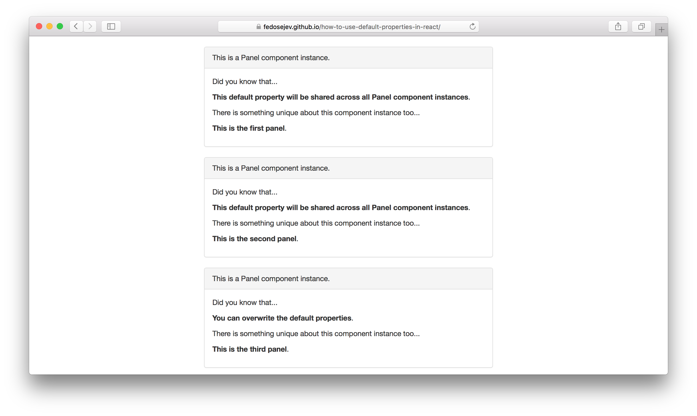

# How To Use Default Properties In React.js

You already know how to pass properties from a parent React component to a child React component. If you need to refresh your memory - please check [this tutorial](http://localhost:8080/how-reactjs-components-communicate/).

But did you know that in React you can define the default properties?

The default properties can be very helpful if we absolutely need to make sure that our child component gets all the nessesary properties and we can't rely on the fact that it's parent component will pass those properties at all times.

Think of this situation: I've created useful React.js component and you've decided to reuse it in your React.js application. You'll be using my component as a child component for one of your components. My component depends on the fact that you pass all the properties, but you simply might not have them - what do you do?

The answer is: I should design my React component with that scenario in mind. And if you don't have your custom properties - I can use the default properties.

Let's take a look at an intuitive example.

In this tutorial, we're going to build this application:

<figure class="figure">
  
  <figcaption class="figure-caption">Figure 1. Our application.</figcaption>
</figure>

You can find the full source code in <a href="https://github.com/fedosejev/how-to-use-default-properties-in-react">this GitHub repository</a>.

Our application is going to render 3 panels with some text in each of them. The text will be different for each panel.

Our application will be made of 2 React.js components:

1. `Application`
2. `Panel`

`Application` component is a contrainer component - it encapsulates our entire React.js application. `Panel` component on the hand - renders a single panel with some text in it.

Let's create the `Panel` component first:

<figure class="figure">
<pre>
<code class="language-jsx">
import React from 'react';

let Panel = React.createClass({
  getDefaultProps: function () {
    return {
      didYouKnowThat: "This default property will be shared across all Panel component instances"
    };
  },

  render: function () {
    let style = {
      marginTop: "20px"
    };

    return (
      

        
This is a Panel component instance.

        

          
Did you know that...

          
<strong>{this.props.didYouKnowThat}</strong>.
 
          
There is something unique about this component instance too...

          
<strong>{this.props.whatIsUniqueAboutThisPanel}</strong>.

        

      

    );
  }
});

export default Panel;
</code>
</pre>
<figcaption class="figure-caption">Code snippet 1. Panel.jsx</figcaption>
</figure>

Notice how in `render` function we're referencing to `this.props.didYouKnowThat` and `this.props.whatIsUniqueAboutThisPanel` properties:

<figure class="figure">
<pre>
<code class="language-jsx">
return (
  

    
This is a Panel component instance.

    

      
Did you know that...

      
<strong>{this.props.didYouKnowThat}</strong>.
 
      
There is something unique about this component instance too...

      
<strong>{this.props.whatIsUniqueAboutThisPanel}</strong>.

    

  

);
</code>
</pre>
<figcaption class="figure-caption">Code snippet 2. Panel.jsx</figcaption>
</figure>

`didYouKnowThat` and `whatIsUniqueAboutThisPanel` are both propeties that we expect to get from a parent component. However, here we're making a design decision to not rely on the fact that `didYouKnowThat` will always be provided by a parent component. So we need to provide a default value for `didYouKnowThat` property in case a parent component forgets to do so. To do this React has [a special function](https://facebook.github.io/react/docs/component-specs.html#getdefaultprops): - `getDefaultProps`:

<figure class="figure">
<pre>
<code class="language-js">
getDefaultProps: function () {
  return {
    didYouKnowThat: "This default property will be shared across all Panel component instances"
  };
}
</code>
</pre>
<figcaption class="figure-caption">Code snippet 3. Panel.jsx</figcaption>
</figure>

`getDefaultProps` returns on object with the default properties that we can access via `this.props` object.

You can see how our first and second panels render `This default property will be shared across all Panel component instances` text. However the third panel has a different text: `You can overwrite the default properties.` - this is because a parent component can overwrite the default property of a child component.

Let's take a look at our `Application` component:

<figure class="figure">
<pre>
<code class="language-jsx">
import React from 'react';
import Panel from './Panel.jsx';

let Application = React.createClass({
  render: function () {
    return (
      

        

          

            
            <Panel whatIsUniqueAboutThisPanel="This is the first panel" />
            <Panel whatIsUniqueAboutThisPanel="This is the second panel" />
            <Panel whatIsUniqueAboutThisPanel="This is the third panel"
                    didYouKnowThat="You can overwrite the default properties" />

          

        

      

    );
  }
});

export default Application;
</code>
</pre>
<figcaption class="figure-caption">Code snippet 4. Panel.jsx</figcaption>
</figure>

Our `Application` component renders 3 instances of `Panel` component. The first two instaces get only one property each - `whatIsUniqueAboutThisPanel`. Because we didn't provide `didYouKnowThat` property for them - the default value defined in `Panel` component class is used.

This is convinient, because imagine a scenario in which our `Application` component simply has no values for `didYouKnowThat` property - what would we render without a default property?

On the other hand our third instance of the `Panel` component has two properties: `whatIsUniqueAboutThisPanel` and `didYouKnowThat`. Because `Application` component provides it's own value for `didYouKnowThat` property: `You can overwrite the default properties` - that value overwrites the default value provided by `Panel` component class - `This default property will be shared across all Panel component instances`.

And that's how you use the default properties in React.js.

Thank you for your attention!

Please take a look at [the complete source code on GitHub](https://github.com/fedosejev/how-to-use-default-properties-in-react) and [the live version](https://fedosejev.github.io/how-to-use-default-properties-in-react/) of our app.

I hope you've enjoyed this tutorial and I would love to hear your feedback in the comments. You can get in touch with me via [Twitter](http://twitter.com/artemy) and [email](mailto:artemij@fedosejev.com).

[Artemij Fedosejev](http://artemij.com)

P.S. I've also written [React.js Essentials book](http://reactessentials.com) and [I teach people React.js and JavaScript](http://progressdots.com)!