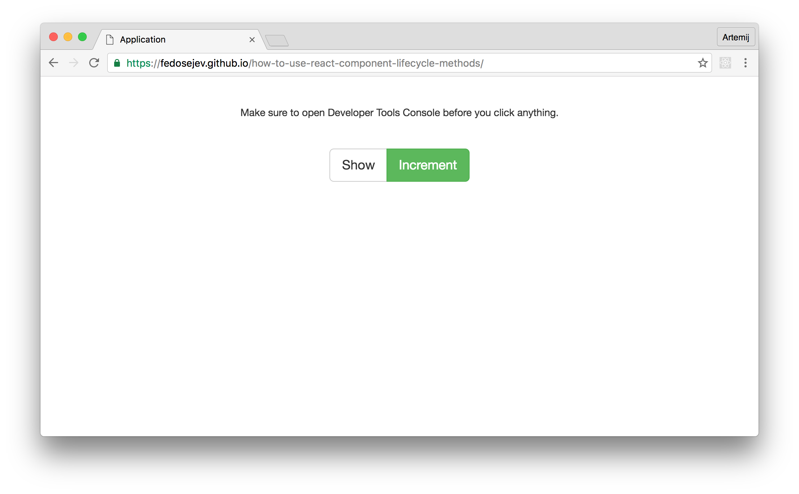
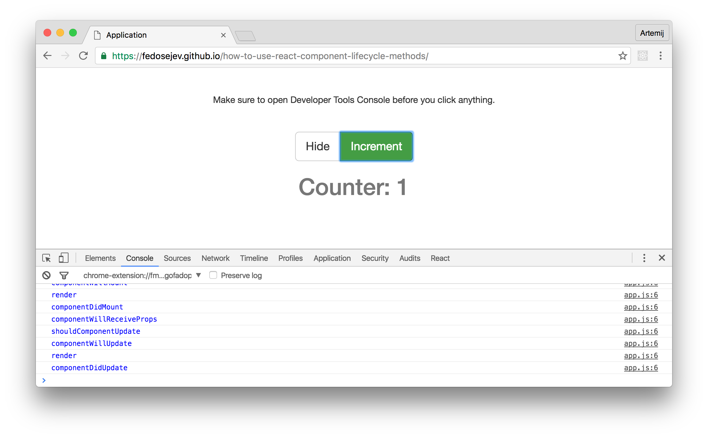
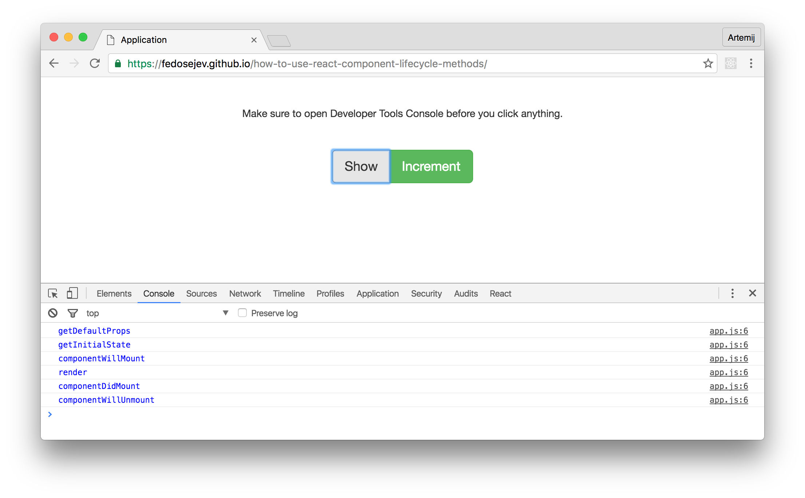

# How To Use React.js Component Lifecycle Methods

Everything in this universe has a lifecycle. It means everything is constantly changing over time. From the moment you born - you start changing - you're getting older. We divide our life into parts that we call - [The Stages of Life](http://www.ralphrowbottom.info/the-stages-of-life-a-new-look/).

Your React.js components are not exception - they do too have a lifecycle. They go through stages that are called _phases_ in React terminology. Those phases are:

1. Mounting
2. Updating
3. Unmounting

From the moment your component is born - when it's initially being rendered - it enters the __Mounting Phase__. Once your component is living a happy life and is being updated - it enters the __Updating Phase__. Finally when it's time to end it's life - it enters the __Unmounting Phase__.

The lifecycle of your React components can vary from quite short to all-time long. All depends on your web application needs and how your users use it.

When your user opens your React application - the nessesary components go through Mounting Phase. Once your user starts interacting with your React application - some components go through Updating Phase, others - immediately face Unmounting Phase.

As a developer you would like to tap into component's lifecycle and get notified when component is going through various lifecycle phases. This will allow you to control how your application looks and behaves at any given point of time.

How can we get notified when component is going through various lifecycle phases? React provides us with a collection of lifecycle _methods_ that we can declare. When we declare them - React will call them when component is going from one phase to another!

In this tutorial we're going to build a simple React application that demonstrates how to use React component lifecycle methods.

Here is our application:

<figure class="figure">
  
  <figcaption class="figure-caption">Figure 1. Our application.</figcaption>
</figure>

<figure class="figure">
  
  <figcaption class="figure-caption">Figure 2. Our application.</figcaption>
</figure>

You can find the full source code in <a href="https://github.com/fedosejev/how-to-use-react-component-lifecycle-methods">this GitHub repository</a>.

Our application is going to render a text paragraph, `Show/Hide` button, `Increment` button and a counter value. A text paragraph will remind user to open Developer Tools Console - there we're going to log which component lifecycle methods is being executed by React. `Show/Hide` button will toggle our counter. `Increment` button will increase counter's value by 1.

Our application will be made of 2 React components:

1. `Application`
2. `Counter`

`Application` component is a contrainer component - it encapsulates our entire React.js application. `Counter` component renders a counter text __and__ _logs into Developer Tools Console which React component lifecycle methods are being executed_.

Let's create our `Application` component first:

<figure class="figure">
<pre>
<code class="language-jsx">
import React from 'react';
import Counter from './Counter.jsx';

let Application = React.createClass({
  
  getInitialState: function () {
    return {
      counter: 0,
      isCounterHidden: true
    };
  },

  toggleCounter: function () {
    this.setState({
      isCounterHidden: ! this.state.isCounterHidden
    });
  },

  incrementCounter: function () {
    this.setState({
      counter: this.state.counter + 1
    });
  },

  render: function () {
    
    let style = {
      marginTop: '40px',
      marginBottom: '10px'
    };

    return (
      

        

          

            
Make sure to open Developer Tools Console before you click anything.

            

              <button type="button" className="btn btn-default" onClick={this.toggleCounter}>{this.state.isCounterHidden ? 'Show' : 'Hide'}</button>
              <button type="button" className="btn btn-success" onClick={this.incrementCounter}>Increment</button>
            

            {this.state.isCounterHidden ? null : <Counter value={this.state.counter} />}

          

        

      

    );
  }
});

export default Application;
</code>
</pre>
<figcaption class="figure-caption">Code snippet 1. Application.jsx</figcaption>
</figure>

The first thing to notice about our `Application` component - it's a stateful component:

<figure class="figure">
<pre>
<code class="language-jsx">
getInitialState: function () {
  return {
    counter: 0,
    isCounterHidden: true
  };
}
</code>
</pre>
<figcaption class="figure-caption">Code snippet 2. Application.jsx</figcaption>
</figure>

It has `getInitialState` function that returns on object with `counter` and `isCounterHidden` properties. `counter` property tracks the current value of our counter. `isCounterHidden` tracks whether our counter is hidden or not.

Initially, when our `Application` component is rendered for the first time we want our counter to be hidden and it's value to be `0`.

Let's talk about how are we going to change our `Application` component's state. How are we going to change those values - `0` and `true`. Otherwise, if those values will never change - we shouldn't declare them as componet's state at all.

To change those values our `Application` component declares 2 functions: `toggleCounter` and `incrementCounter`.

`toggleCounter` function sets `isCounterHidden`'s value to the opposite of it's current value:

<figure class="figure">
<pre>
<code class="language-jsx">
toggleCounter: function () {
  this.setState({
    isCounterHidden: ! this.state.isCounterHidden
  });
}
</code>
</pre>
<figcaption class="figure-caption">Code snippet 3. Application.jsx</figcaption>
</figure>

`incrementCounter` function adds 1 to the current value of the `counter` property:

<figure class="figure">
<pre>
<code class="language-jsx">
incrementCounter: function () {
  this.setState({
    counter: this.state.counter + 1
  });
}
</code>
</pre>
<figcaption class="figure-caption">Code snippet 4. Application.jsx</figcaption>
</figure>

You might be wondering: who's calling `toggleCounter` and `incrementCounter` and when?

To answer these questions - let's take a look at the `render` function of our `Application` component:

<figure class="figure">
<pre>
<code class="language-jsx">
render: function () {
  
  let style = {
    marginTop: '40px',
    marginBottom: '10px'
  };

  return (
    

      

        

          
Make sure to open Developer Tools Console before you click anything.

          

            <button type="button" className="btn btn-default" onClick={this.toggleCounter}>{this.state.isCounterHidden ? 'Show' : 'Hide'}</button>
            <button type="button" className="btn btn-success" onClick={this.incrementCounter}>Increment</button>
          

          {this.state.isCounterHidden ? null : <Counter value={this.state.counter} />}

        

      

    

  );
}
</code>
</pre>
<figcaption class="figure-caption">Code snippet 5. Application.jsx</figcaption>
</figure>

In `render` function we declare `style` variable with some properties for our inline styling purposes. We also declare 3 `
` elements with various class names - these are [Bootstrap class names](http://getbootstrap.com/css/#grid) that we use to create layout for our page.

We then create `p` element with a static text and inline styling:

<figure class="figure">
<pre>
<code class="language-jsx">

Make sure to open Developer Tools Console before you click anything.

</code>
</pre>
<figcaption class="figure-caption">Code snippet 6. Application.jsx</figcaption>
</figure>

The important part of the `render` function that we need to focus on is this:

<figure class="figure">
<pre>
<code class="language-jsx">

  <button type="button" className="btn btn-default" onClick={this.toggleCounter}>{this.state.isCounterHidden ? 'Show' : 'Hide'}</button>
  <button type="button" className="btn btn-success" onClick={this.incrementCounter}>Increment</button>

{this.state.isCounterHidden ? null : <Counter value={this.state.counter} />}
</code>
</pre>
<figcaption class="figure-caption">Code snippet 7. Application.jsx</figcaption>
</figure>

Here we're rendering 2 buttons. The first one is `Show/Hide` button:

<figure class="figure">
<pre>
<code class="language-jsx">
<button type="button" className="btn btn-default" onClick={this.toggleCounter}>{this.state.isCounterHidden ? 'Show' : 'Hide'}</button>
</code>
</pre>
<figcaption class="figure-caption">Code snippet 8. Application.jsx</figcaption>
</figure>

This button's text can either be `Show` or `Hide` and we decide with one to render based on the current state of our `Application` component, or to be more specific - based on the value of `this.state.isCounterHidden` property:

<figure class="figure">
<pre>
<code class="language-js">
{this.state.isCounterHidden ? 'Show' : 'Hide'}
</code>
</pre>
<figcaption class="figure-caption">Code snippet 9. Application.jsx</figcaption>
</figure>

If the value of `this.state.isCounterHidden` is `true` - we render `Show` text and if it's `false` - we render `Hide` text. Meaning: when our counter is hidden we want our button to say `Show`, otherwise - `Hide`.

So what happens when user clicks that button? React will call our `toggleCounter` function, because our button has `onClick` property with the value of `this.toggleCounter`:

<figure class="figure">
<pre>
<code class="language-jsx">
<button ... onClick={this.toggleCounter}>...</button>
</code>
</pre>
<figcaption class="figure-caption">Code snippet 10. Application.jsx</figcaption>
</figure>

As we know `toggelCounter` function will call `setState` function that changes component's state and when component's state changes - by default React rerenders that component and all child components.

Effectively: when user clicks `Show` button, `Application` component's state changes and `Hide` button is being rendered instead of `Show`.

The second button that our `Application` component renders is `Increment` button:

<figure class="figure">
<pre>
<code class="language-jsx">
<button type="button" className="btn btn-success" onClick={this.incrementCounter}>Increment</button>
</code>
</pre>
<figcaption class="figure-caption">Code snippet 11. Application.jsx</figcaption>
</figure>

As you can see it also has `onClick` property with the value of `this.incrementCounter`. When user clicks that button React will call our `incrementCounter` function that will change `Application` component's state and rerender `Application` component.

Now we know how we render our buttons and how they work.

What about our `Counter` component? Where do we render it and what does it do? Let's answer these questions.

If we look carefully at the `render` function in our `Application` component - we'll see this statement:

<figure class="figure">
<pre>
<code class="language-jsx">
{this.state.isCounterHidden ? null : <Counter value={this.state.counter} />}
</code>
</pre>
<figcaption class="figure-caption">Code snippet 12. Application.jsx</figcaption>
</figure>

That's where we decide whether to render an instance of the `Counter` component or not. We make that decision based on the current state of our `Application` component: if `this.state.isCounterHidden` is set to `true` - we'll render `null`, otherwise if it's set to `false` - we'll render `<Counter value={this.state.counter} />`.

As you can see, when we're rendering an instance of `Counter` component we're passing a property `value` with `this.state.counter` assigned to it. Meaning: the `Counter` component instance will always get the latest `counter` value that we store in `Application` component's state.

And that's our `Application` component.

In this tutorial we want to learn about how to use React component lifecycle methods. That's the goal for our `Counter` component - to render a counter value and _demonstrate when and which lifecycle methods are being called by React_.

Let's take a look at our `Counter` component:

<figure class="figure">
<pre>
<code class="language-jsx">
import React from 'react';

let Counter = React.createClass({

  getDefaultProps: function () {
    console.debug('getDefaultProps');

    return {};
  },

  getInitialState: function () {
    console.debug('getInitialState');

    return {};
  },

  componentWillMount: function () {
    console.debug('componentWillMount');
  },

  componentDidMount: function () {
    console.debug('componentDidMount');
  },

  componentWillReceiveProps: function () {
    console.debug('componentWillReceiveProps');
  },

  shouldComponentUpdate: function () {
    console.debug('shouldComponentUpdate');

    return true;
  },

  componentWillUpdate: function () {
    console.debug('componentWillUpdate');
  },

  componentDidUpdate: function () {
    console.debug('componentDidUpdate');
  },

  componentWillUnmount: function () {
    console.debug('componentWillUnmount');
  },

  render: function () {
    console.debug('render');

    return (
      <h1 className="text-muted">Counter: {this.props.value}</h1>
    );
  }
});

export default Counter;
</code>
</pre>
<figcaption class="figure-caption">Code snippet 13. Counter.jsx</figcaption>
</figure>

As you can see it has a lot of component lifecycle methods. They are:
+ `getDefaultProps`
+ `getInitialState`
+ `componentWillMount`
+ `componentDidMount`
+ `componentWillReceiveProps`
+ `shouldComponentUpdate`
+ `componentWillUpdate`
+ `componentDidUpdate`
+ `componentWillUnmount`
+ `render`

All these methods are being called by React. We don't call them explicitly ourselves. We _make_ React to call them. For example, you already know that when we call `setState` function to update component's state - React will call `render` method. In fact as you will learn in a moment - React will call other component lifecycle methods as well.

To make sure that we understand at what point of time these component lifecycle methods are being called - each of these methods call `console.debug` function. This will print a log message in Developer Tools Console. What we want is to log the fact that a certain component lifecycle method is being called in a certain order. You will learn that component lifecycle methods are called in a specific order.

Notice that our `Counter` component renders `<h1>` element with a `this.props.value` property that a parent `Application` component passed to it:

<figure class="figure">
<pre>
<code class="language-jsx">
render: function () {
  console.debug('render');

  return (
    <h1 className="text-muted">Counter: {this.props.value}</h1>
  );
}
</code>
</pre>
<figcaption class="figure-caption">Code snippet 14. Counter.jsx</figcaption>
</figure>

Other lifecycle methods in our `Counter` component don't do anything useful apart from logging the fact that React called them.

__It's time to run an experiment!__

### Step 1: Open our application in Google Chrome web browser

[Click here](https://github.com/fedosejev/how-to-use-react-component-lifecycle-methods) to open fully working application hosted on GitHub Pages.

<figure class="figure">
  
  <figcaption class="figure-caption">Figure 3. Our application.</figcaption>
</figure>

### Step 2: Open Developer Tools JavaScript Console

In Google Chrome go to: `View` > `Developer` > `JavaScript Console` or use keyboard shortcut: `Cmd` + `Alt` + `J` on Mac and `Ctr` + `Shift` + `J` on Windows.

<figure class="figure">
  
  <figcaption class="figure-caption">Figure 4. Our application with JavaScript Console opened</figcaption>
</figure>

Notice that immediately we see `getDefaultProps` in blue in JavaScript Console. This is interesting: we can clearly tell that our `Counter` component instance was not rendered, but `getDefaultProps` method from our `Counter` component class was called by React (and that's where we're calling `console.debug` function that prints that blue message). This is because `getDefaultProps` is being called once when we create `Counter` class - _not_ when we render `Counter` component class instance. If you would like to learn more about `getDefaultProps` method - please read [this tutorial](http://react.tips/how-to-use-default-properties-in-react/).

Remember at the beginning of this tutorial I've mentioned that React component lifecycle methods grouped by 3 phases: `Mounting`, `Updating` and `Unmounting`. Can you tell which phase our `Counter` component instance is going through?

Neither one. Our `Counter` component class instance wasn't created yet. It wasn't born yet, so no lifecycle was started yet. And no lifecycle methods were called by React yet.

In React's terminology, `Counter` component was not mounted yet.

Yet.

### Step 3: Click on `Show` button

<figure class="figure">
  
  <figcaption class="figure-caption">Figure 5. Our application with JavaScript Console opened</figcaption>
</figure>

It's alive!

We've just created and rendered our `Counter` component class instance! That instance has started it's lifecycle. React has called it's lifecycle methods: 1) `getInitialState`, 2) `componentWillMount`, 3) `render` and 4) `componentDidMount`. The order in which lifecycle methods are being called is important:

1. __`getInitialState`__ - set's the initial state for our `Counter` component class instance. This state will then be available to us via `this.state` object.

2. __`componentWillMount`__ - is called _right before_ React mounts (or renders) `Counter` component class instance into the DOM.

3. __`render`__ - renders `Counter` component class instance into the DOM - __that's when we can see our counter on the screen__ and in our DOM.

4. __`componentDidMount`__ - is called _right after_ React has finished mounting (or rendering) `Counter` component class instance into the DOM.

As you might have guessed - what we've just witnessed and described is called - __`Mounting Phase`__. All those 4 lifecycle methods belong to the Mounting Phase.

So at the moment our `Counter` component instance is mounted into the DOM and we're waiting until some other event will trigger for that to change.

Our counter is showing `0` - let's change that!

### Step 4: Click on `Increment` button

<figure class="figure">
  
  <figcaption class="figure-caption">Figure 6. Our application with JavaScript Console opened</figcaption>
</figure>

Wow! What just happened? We see new blue messages in our JavaScript Console.

Well, we've just updated the state of our `Application` component by clicking `Increment` button. After updating `Application` component's state, React decided to rerender `Application` component instance including rerendering `Counter` component instance and passing new properties to it - our `Counter` component instance now gets `1` instead of `0`.

So effectively - we've updated our `Counter` component instance. We've changed it's life. It now entered it's __`Updating Phase`__, in which React calls the following lifecycle methods:

+ __`componentWillReceiveProps`__ - this methods is called when our component instance receives new properties. [Learn more about this methods](https://facebook.github.io/react/docs/component-specs.html#updating-componentwillreceiveprops).

+ __`shouldComponentUpdate`__ - this method decides whether or not our `Counter` component instance needs to be rerendered. This is an opportunity for us to save time and skip rerendering if we know that it's not nessesary. By default - React will rerender our component. We return `true` to signal that React should rerender it. Returning `false` will prevent React from rerendering it. [Learn more about this methods](https://facebook.github.io/react/docs/component-specs.html#updating-shouldcomponentupdate).

+ __`componentWillUpdate`__ - is called _right before_ React will rerender `Counter` component class instance into the DOM. [Learn more about this methods](https://facebook.github.io/react/docs/component-specs.html#updating-componentwillupdate).

+ __`render`__ - rerenders `Counter` component class instance into the DOM - __that's when we see our counter displaying 1 instead of 0__.

+ __`componentDidUpdate`__ - is called _right after_ React has rerendered `Counter` component class instance into the DOM. [Learn more about this methods](https://facebook.github.io/react/docs/component-specs.html#updating-componentdidupdate).

We can keep clicking `Increment` button - every click will trigger `Counter` component to go through another `Updating Phase`. Every click will trigger the same lifecycle methods.

But let's do something else instead.

### Step 5: Click on `Hide` button

<figure class="figure">
  
  <figcaption class="figure-caption">Figure 7. Our application with JavaScript Console opened</figcaption>
</figure>

That's how the life of our `Counter` component class instance ends. We've just unmounted our `Counter` component. In other words: we've just removed it from the DOM.

This lifecycle phase is called `Unmounting Phase` and there only one lifecycle methods is being called by React during that phase:

+ __`componentWillUnmount`__ - is called _right before_ React unmounts (or removes) `Counter` component instance from the DOM.

Then it simply dissapears from our screen and our DOM.

Now you've seen all 3 React component lifecycle phases:
1. `Mounting Phase`
2. `Updateing Phase`
3. `Unmounting Phase`

__During `Mounting Phase` React calls__:

1. `getInitialState`.
2. `componentWillMount`.
3. `render`.
4. `componentDidMount`.

In that specific order. Every time.

__During `Updating Phase` React calls__:

1. `componentWillReceiveProps`.
2. `shouldComponentUpdate`.
3. `componentWillUpdate`.
4. `render`.
5. `componentDidUpdate`.

In that specific order. Every time. But not every time all 5 methods are being called. If `shouldComponentUpdate` returns `false` then React wont' call `componentWillUpdate`, `render` and `componentDidUpdate` methods.

__During `Unmounting Phase` React calls__:

1. `componentWillUnmount`

Just one method. Every time.

Notice that we might never update our `Counter` component. If you click `Show` and then `Hide` - our `Counter` component goes through `Mounting Phase` and `Unmounting Phase` - there is no `Updating Phase`:

<figure class="figure">
  
  <figcaption class="figure-caption">Figure 8. Our application with JavaScript Console opened</figcaption>
</figure>

As you can see `Updating Phase` might never happen. As well as `Unmounting Phase` might never happen if user simply closes it's web browser afer initially loading your React web application.

And that's how to use React component lifecycle methods.

Thank you for your attention!

Please take a look at [the complete source code on GitHub](https://github.com/fedosejev/how-to-use-react-component-lifecycle-methods) and [the live version](https://fedosejev.github.io/how-to-use-react-component-lifecycle-methods/) of our app.

I hope you've enjoyed this tutorial and I would love to hear your feedback in the comments. You can get in touch with me via [Twitter](http://twitter.com/artemy) and [email](mailto:artemij@fedosejev.com).

[Artemij Fedosejev](http://artemij.com)

P.S. I've also written [React.js Essentials book](http://reactessentials.com) and [I teach people React.js and JavaScript](http://progressdots.com)!