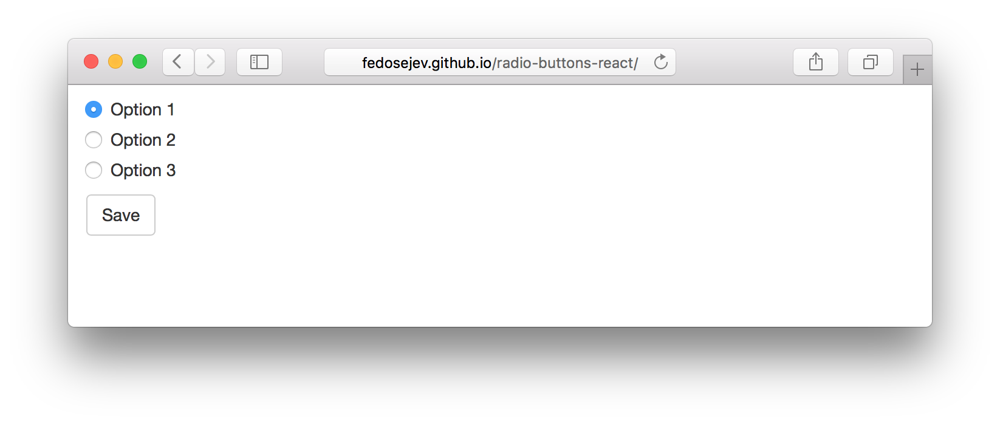
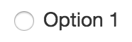

# Radio Buttons in React.js

  <h4 class="alert-heading">Hold on!</h4>

  

    This tutorial covers React 15 and is now out of date.
  

  

    The good news is: <a href="/radio-buttons-in-react-16/">Radio Buttons in React 16</a> is available!
  

How do you use radio buttons in React.js?

I agree, it can be confusing at first. Let me explain it to you with a help of a simple example.

Here is the application that we're going to build:

<figure class="figure">
  
  <figcaption class="figure-caption">Figure 1. Our application.</figcaption>
</figure>

You can find the full source code in <a href="https://github.com/fedosejev/radio-buttons-react">this GitHub repository</a>.

We'll start by creating new React.js component called `Application`:

<figure class="figure">
<pre>
<code class="language-jsx">
var React = require('react');

var Application = React.createClass({
  render: function () {
    return ({/* JSX code */});
  }
});

module.exports = Application;
</code>
</pre>
<figcaption class="figure-caption">Code snippet 1.</figcaption>
</figure>

Our component doesn't render anything, yet.

What should it render? From Figure 1 you can clearly see the following 2 user interface elements:

1. Radio buttons
2. Save button

Let's start with creating radio button elements. In `render()` function we'll write JSX code that creates `<form>` element with 3 `<input>` elements nested inside:

<figure class="figure">
<pre>
<code class="language-jsx">

  

    

      <form>
        

          <label>
            <input type="radio" value="option1" checked={true} />
            Option 1
          </label>
        

        

          <label>
            <input type="radio" value="option2" />
            Option 2
          </label>
        

        

          <label>
            <input type="radio" value="option3" />
            Option 3
          </label>
        

      </form>

    

  

</code>
</pre>
<figcaption class="figure-caption">Code snippet 2.</figcaption>
</figure>

Whoa, that's alot of `
` elements! Do we really need them?

Not really. Their purpose is to create a layout using <a href="http://getbootstrap.com/css/">Bootstrap grid system</a>. If you're not familiar with Bootstrap - don't worry, just focus on `<form>` element:

<figure class="figure">
<pre>
<code class="language-jsx">
{/* ... */}

  <form>
    

      <label>
        <input type="radio" value="option1" checked={true} />
        Option 1
      </label>
    

    

      <label>
        <input type="radio" value="option2" />
        Option 2
      </label>
    

    

      <label>
        <input type="radio" value="option3" />
        Option 3
      </label>
    

  </form>

{/* ... */}
</code>
</pre>
<figcaption class="figure-caption">Code snippet 3.</figcaption>
</figure>

Now let's take a closer look at the first input element:

<figure class="figure">
<pre>
<code class="language-jsx">
<input type="radio" value="option1" checked={true} />
</code>
</pre>
<figcaption class="figure-caption">Code snippet 4.</figcaption>
</figure>

Apart from `checked={true}` it looks exactly as your usual [HTML `<input>` element](https://developer.mozilla.org/en-US/docs/Web/HTML/Element/input). However it only _looks_ like one (on purpose I guess). But it works differently, because in this case `<input>` is a React component, not an HTML element!

Just like with any other React component `type`, `value` and `checked` are component properties. However, `checked` is [an interactive property](https://facebook.github.io/react/docs/forms.html#interactive-props), because it's affected via user interactions: user can select it and unselect it by selecting another radio button.

If you pass `checked={true}` then React will render:

<figure class="figure">
  
  <figcaption class="figure-caption">Figure 2. Selected radio button.</figcaption>
</figure>

If you pass `checked={false}` then React will render:

<figure class="figure">
  
  <figcaption class="figure-caption">Figure 3. Unselected radio button.</figcaption>
</figure>

We know that if React component can render different things, then it has to maintain state that tells it which thing to render. It's clear that our `<input>` component has 2 states to render: selected radio button and unselected radio button.

Let's make our Application component stateful:

<figure class="figure">
<pre>
<code class="language-jsx">
var React = require('react');

var Application = React.createClass({
  
  getInitialState: function () {
    return {
      selectedOption: 'option1'
    };
  },

  render: function () {
    return ({/* JSX code */});
  }
});

module.exports = Application;
</code>
</pre>
<figcaption class="figure-caption">Code snippet 5.</figcaption>
</figure> 

In our state object we have `selectedOption` property with the initial value of `option1`. This tells our `Application` component which radio button should be selected. Naturally all other radio buttons should be unselected.

In our application we have 3 radio buttons where each of them has 2 states: `selected` and `unselected`. By explicitly specifying which radio button is _selected_, we're also implicitly specifying which should be _unselected_. When you create radio buttons using HTML, the same result is achieved by grouping radio buttons together using `name` HTML attribute.

Now we need to pass `true` or `false` value to `checked` property for all 3 `<input>` components. Only this time the value for `checked` is calculated by comparing component's state with input's name:

<figure class="figure">
<pre>
<code class="language-jsx">
{/* ... */}

  <form>
    

      <label>
        <input type="radio" value="option1" checked={this.state.selectedOption === 'option1'} />
        Option 1
      </label>
    

    

      <label>
        <input type="radio" value="option2" checked={this.state.selectedOption === 'option2'} />
        Option 2
      </label>
    

    

      <label>
        <input type="radio" value="option3" checked={this.state.selectedOption === 'option3'} />
        Option 3
      </label>
    

  </form>

{/* ... */}
</code>
</pre>
<figcaption class="figure-caption">Code snippet 6.</figcaption>
</figure> 

Expressions `this.state.selectedOption === 'option1'`, `this.state.selectedOption === 'option2'` and `this.state.selectedOption === 'option3'` will be evaluated into `true` or `false` based on what is component's state and they will tell React how to render our `<input>` elements: selected or unselected.

Notice that we're in control of which `<input>` component should be rendered selected and which - unselected. And by providing `value` property we're taking all of the control over our `<input>` components and turning them into [controlled components](https://facebook.github.io/react/docs/forms.html#controlled-components).

<blockquote>
  
A Controlled component does not maintain its own internal state; the component renders purely based on props.

  <footer>From <cite title="React.js documentation"><a href="https://facebook.github.io/react/docs/forms.html#controlled-components">React.js documentation</a></cite></footer>
</blockquote>

However, notice that at the moment, we're rending 3 radio buttons where the first one is selected. If I click on any other 2 - nothing happens. They're not selected. Or to be more specific: they're not rendered any differently.

And that should make sense to you, because when user intracts with our radio buttons we don't update our component's state and hence - don't render them differently. As a result, from the user's point of view: our radio buttons "dont't work".

How do we make sure that our component's state changes when use clicks on our radio buttons?

React offers `onChange` property that we can pass to our `<input>` components to handle changes:

<figure class="figure">
<pre>
<code class="language-jsx">
{/* ... */}

  <form>
    

      <label>
        <input type="radio" value="option1" 
                      checked={this.state.selectedOption === 'option1'} 
                      onChange={this.handleOptionChange} />
        Option 1
      </label>
    

    

      <label>
        <input type="radio" value="option2" 
                      checked={this.state.selectedOption === 'option2'} 
                      onChange={this.handleOptionChange} />
        Option 2
      </label>
    

    

      <label>
        <input type="radio" value="option3" 
                      checked={this.state.selectedOption === 'option3'} 
                      onChange={this.handleOptionChange} />
        Option 3
      </label>
    

  </form>

{/* ... */}
</code>
</pre>
<figcaption class="figure-caption">Code snippet 7.</figcaption>
</figure> 

Now whenever user clicks on our radio buttons, React will call `handleOptionChange` function.

Let's create that function on our component specification object:

<figure class="figure">
<pre>
<code class="language-js">
handleOptionChange: function (changeEvent) {
  this.setState({
    selectedOption: changeEvent.target.value
  });
},
</code>
</pre>
<figcaption class="figure-caption">Code snippet 8.</figcaption>
</figure>

`handleOptionChange` will get `changeEvent` object that we can use to reference the value of `<input>` element that user clicked on: `changeEvent.target.value`. We're assigning that value to `selectedOption` property of our state object and calling `setState()` function to update component's state.

Now React will render our radio buttons differently. Now they're "working" from the user's point of view.

And it's all it takes to implement radio buttons in React.

Our `<input>` components are controlled by us. Or more specifically - by our component's state and user's ability to change that state by interacting with rendered radio buttons.

On the other hand we could have made our `<input>` component [uncontrolled](https://facebook.github.io/react/docs/forms.html#uncontrolled-components) - all we need to do is to remove `value` and `checked` properties from `<input>` components.

<blockquote>
  
An uncontrolled component maintains its own internal state.

  <footer>From <cite title="React.js documentation"><a href="https://facebook.github.io/react/docs/forms.html#uncontrolled-components">React.js documentation</a></cite></footer>
</blockquote>

According to React documentation: [uncontroled components](https://facebook.github.io/react/docs/forms.html#uncontrolled-components) maintain their own state - that's why they're called "uncontrolled", because _we_, developers, don't have the control. It's incapsulated inside of the component itself.

However, if we give up the control, we need to pass `name` property to our `<input>` components in order to group them together (like with HTML `<input type="radio">` elements) so that when user selects one radio button - the other ones are then unselected.

Wouldn't it be easier? After all our component would be stateless and we would write less code!

True, but consider this: how would you tell React which radio button should be selected intially? You don't have control, so it wouldn't be straightforward.

Now let's implement the second UI element in our application: the "Save" button. Insert this JSX code right before closing `</body>` tag:

<figure class="figure">
<pre>
<code class="language-jsx">
<button className="btn btn-default" type="submit">Save</button>
</code>
</pre>
<figcaption class="figure-caption">Code snippet 9.</figcaption>
</figure>

And then add `onSubmit` property to our `<form>` component:

<figure class="figure">
<pre>
<code class="language-jsx">
<form onSubmit={this.handleFormSubmit}>
{/* ... */}
</form>
</code>
</pre>
<figcaption class="figure-caption">Code snippet 10.</figcaption>
</figure>

When user submits our form we want React to call `handleFormSubmit` function. Let's declare it on our component specification object:

<figure class="figure">
<pre>
<code class="language-js">
handleFormSubmit: function (formSubmitEvent) {
  formSubmitEvent.preventDefault();

  console.log('You have selected:', this.state.selectedOption);
},
</code>
</pre>
<figcaption class="figure-caption">Code snippet 11.</figcaption>
</figure>

It gets `formSubmitEvent` object as a parameter. We then `preventDefault()` on it, to prevent the default form submit behaviour.

Finally we log selected option's name in a web browser's console. We get selected option's name from our component's state: `this.state.selectedOption`.

And that's the convinience and the power of being in control of your inputs with React!

Thank you for your attention!

Please take a look at [the complete source code on GitHub](https://github.com/fedosejev/radio-buttons-react) and [the live version](http://fedosejev.github.io/radio-buttons-react/) of our app.

I hope you've enjoyed this tutorial and I would love to hear your feedback in the comments. You can get in touch with me via [Twitter](http://twitter.com/artemy) and [email](mailto:artemij@fedosejev.com).

[Artemij Fedosejev](http://artemij.com)

P.S. I've also written [React.js Essentials book](http://reactessentials.com) and [I teach people React.js and JavaScript](http://progressdots.com)!