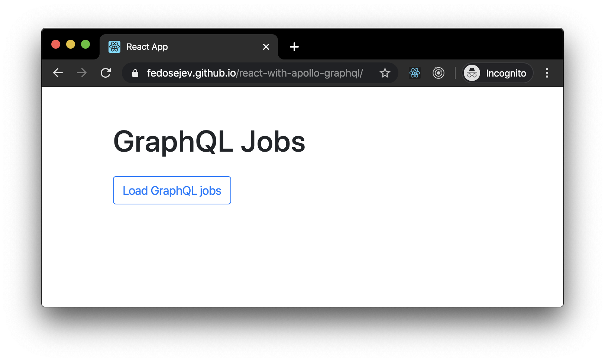
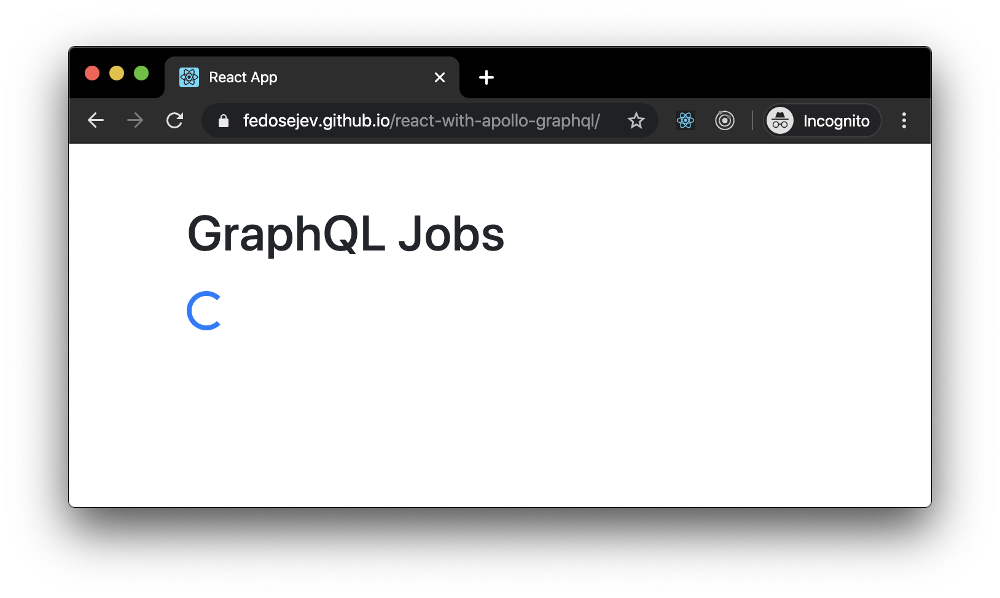
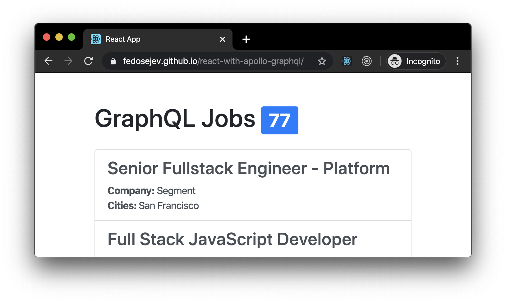

# How To Use React With Apollo GraphQL

In this tutorial I'll teach you how to use React with Apollo GraphQL client. You'll learn how to query GraphQL server and render query results, by building a simple React application.

As a bonus, I'll explain to you an important software development principle which will help you to write higher quality code.

We'll be building a simple React application that renders a list of jobs that require GraphQL knowledge. We'll get this list of jobs by querying a GraphQL server.

Let's take a look at how our app will work. The first screen will display a title and a button:

<figure class="figure">
  
  <figcaption class="figure-caption">Figure 1. Our application.</figcaption>
</figure>

User will click the `Load GraphQL jobs` button and then the loading spinner will be rendered instead of the button:

<figure class="figure">
  
  <figcaption class="figure-caption">Figure 2. Our application.</figcaption>
</figure>

Finally, we'll render the number of jobs and the list of jobs, displaying job title, company name and locations for each job:

<figure class="figure">
  
  <figcaption class="figure-caption">Figure 3. Our application.</figcaption>
</figure>

<a href="https://fedosejev.github.io/react-with-apollo-graphql/">Here you can play with the app</a> and you can find the full source code in <a href="https://github.com/fedosejev/react-with-apollo-graphql">this GitHub repository</a>.

Our application will be made of [two React components](https://github.com/fedosejev/react-with-apollo-graphql/tree/master/src/components):

1. `Jobs`
2. `Job`

`Jobs` component will render the app title, the button and the loading indicator, as well as a list of jobs. Each job will be rendered by the `Job` component.

Let's create our `Job` component first:

<figure class="figure">
<pre>
<code class="language-jsx">
import React from "react";

function getCitiesLabel(cities) {
  return cities.length > 1 ? "Cities" : "City";
}

function getCitiesList(cities) {
  return cities.map((city) => city.name).join(", ");
}

function Job(props) {
  return (
    <a
      href={props.job.applyUrl}
      className="list-group-item list-group-item-action"
    >
      <h3>{props.job.title}</h3>
      

        <strong>Company:</strong> {props.job.company.name}
      

      {props.job.cities.length > 0 && (
        

          <strong>{getCitiesLabel(props.job.cities)}: </strong>
          {getCitiesList(props.job.cities)}
        

      )}
    </a>
  );
}

export default Job;
</code>
</pre>
<figcaption class="figure-caption">Code snippet 1. Job.component.js</figcaption>
</figure>

_To be continued..._
