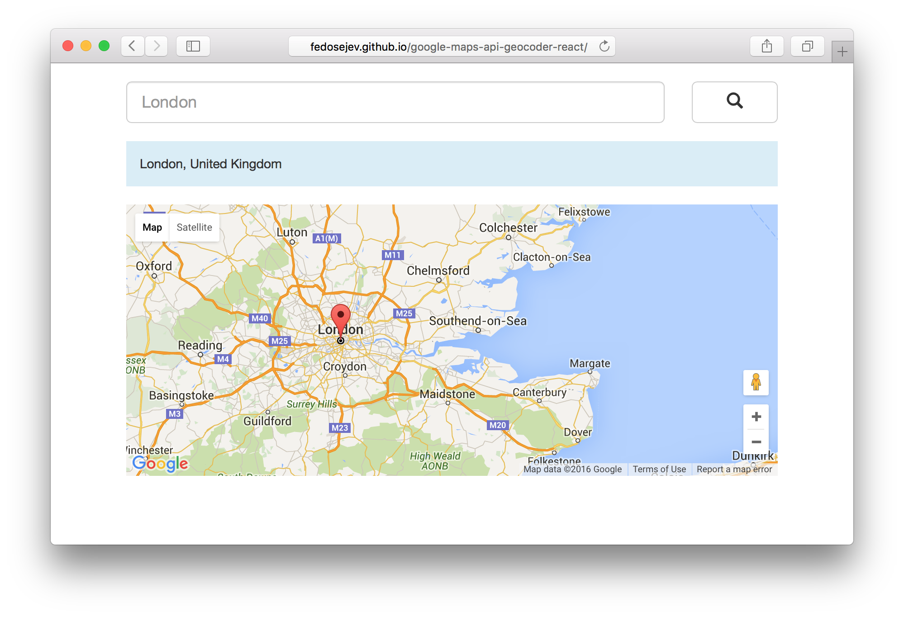

# React.js and Geocoding

If you ever wondered how to do geocoding with React.js, then this tutorial is for you.

<blockquote>
  
Geocoding is the process of converting addresses (like "1600 Amphitheatre Parkway, Mountain View, CA") into geographic coordinates.

  <footer>From <cite title="Google Maps JavaScript API documentation"><a href="https://developers.google.com/maps/documentation/javascript/geocoding">Google Maps JavaScript API documentation</a></cite></footer>
</blockquote>

In this tutorial we're going to build React.js component that implements this application:

<figure class="figure">
  
  <figcaption class="figure-caption">Figure 1. Our application.</figcaption>
</figure>

You can find the full source code in <a href="https://github.com/fedosejev/google-maps-api-geocoder-react">this GitHub repository</a>.

<h2 id="rendering-a-map-and-a-marker">
  <a href="#rendering-a-map-and-a-marker">Rendering a map and a marker</a>
</h2>

We'll start by creating new React.js component called `Application`:

<figure class="figure">
<pre>
<code class="language-jsx">
var React = require('react');

var Application = React.createClass({
  render: function () {
    return ({/* JSX code */});
  }
});

module.exports = Application;
</code>
</pre>
<figcaption class="figure-caption">Code snippet 1.</figcaption>
</figure>

Our component doesn't render anything, yet.

What should it render? From Figure 1 you can clearly see the following 3 user interface elements:
1. Search - renders search form.
2. Status - renders current address that is displayed on the map.
3. Map - renders map.

Let's start with the search. We'll write JSX code that creates `<form>` element:

<figure class="figure">
<pre>
<code class="language-jsx">

  

    

      <form className="form-inline">
        

          

            

              <label className="sr-only" htmlFor="address">Address</label>
              <input type="text" 
                                                className="form-control input-lg" 
                                                id="address" 
                                                placeholder="London" 
                                                required />
            

          

          

            <button type="submit" className="btn btn-default btn-lg">
              
            </button>

          

        

      </form>

    

  

</code>
</pre>
<figcaption class="figure-caption">Code snippet 2.</figcaption>
</figure>

Whoa, that's alot of `
` elements! Do we really need them?

Not really. Their purpose is to create a layout using <a href="http://getbootstrap.com/css/">Bootstrap grid system</a>. If you're not familiar with Bootstrap - don't worry, just focus on `<form>` element:

<figure class="figure">
<pre>
<code class="language-jsx">

{/* ... */}

<form className="form-inline">

  {/* ... */}
  
  <label className="sr-only" htmlFor="address">Address</label>
  <input type="text" 
                    className="form-control input-lg" 
                    id="address" 
                    placeholder="London" 
                    required />

  {/* ... */}

  <button type="submit" className="btn btn-default btn-lg">
    
  </button>

  {/* ... */}

</form>

{/* ... */}

</code>
</pre>
<figcaption class="figure-caption">Code snippet 3.</figcaption>
</figure>

Now it's clear that we have a `<form>` with nested `<label>`, `<input>` and `<button>` elements.

We're done with creating our `<form>` for the moment. The next UI element is status message box - it tells you which address was found:

<figure class="figure">
<pre>
<code class="language-jsx">

  {/* form */}

  

    

      
London, United Kingdom

      
    

  

</code>
</pre>
<figcaption class="figure-caption">Code snippet 4.</figcaption>
</figure>

As you can see it's a simple `
` element with address in it. Nothing fancy at the moment.

Finally, let's create the map element:

<figure class="figure">
<pre>
<code class="language-jsx">

  {/* form */}

  

    

      
London, United Kingdom

      
      

    

  

</code>
</pre>
<figcaption class="figure-caption">Code snippet 5.</figcaption>
</figure>

Our map is an empty `
` element.

For now that's all we want our `Application` React component to render initially. But then who's going to create the actual map?

Google Maps JavaScript API.

It's their job to render the rest of the DOM that it needs for display the map. The next question you should ask yourself is: when should Google Maps JavaScript API start rendering the map?

Right after our `Application` component has finished mounting. React provides a lifecycle function that we can use to tell React what to do right after component finished mounting - `componentDidMount()`:

<figure class="figure">
<pre>
<code class="language-js">
componentDidMount: function () {
  // tell Google Maps JavaScript API to create a map
},
</code>
</pre>
<figcaption class="figure-caption">Code snippet 6.</figcaption>
</figure>

How do we create a map using Google Maps JavaScript API?

First we need to select the DOM element that will act as a container for our map. I am sure you're already familiar with `document.getElementById()` or `document.querySelector()` or other DOM API functions that allow you to select elements from the DOM.

However React offers another way to access DOM elements by using [`refs`](https://facebook.github.io/react/docs/more-about-refs.html) and we're going to use [the `ref` Callback Attribute](https://facebook.github.io/react/docs/more-about-refs.html#the-ref-callback-attribute).

Let's create `setMapElementReference` property on our component specification object and assign a function to it:

<figure class="figure">
<pre>
<code class="language-js">
var Application = React.createClass({
  componentDidMount: function () { /* ... */ },
  setMapElementReference: function (mapElementReference) {
    this.mapElement = mapElementReference;
  },
  render: function () { /* ... */ }
});
</code>
</pre>
<figcaption class="figure-caption">Code snippet 7.</figcaption>
</figure>

`setMapElementReference()` function will assign `mapElementReference` to `mapElement` property on our component specification object. Now we need to add `ref` attribute to our `
` element inside of `render()` function:

<figure class="figure">
<pre>
<code class="language-jsx">

</code>
</pre>
<figcaption class="figure-caption">Code snippet 8.</figcaption>
</figure>

We're assigning `this.setMapElementReference` to `ref` attribute. In this case our `ref` attribute is [the Callback Attribute](https://facebook.github.io/react/docs/more-about-refs.html#the-ref-callback-attribute). Now React will call `setMapElementReference()` function immediately after the `Application` component is mounted. As a result the reference to `
` DOM element will be stored in `mapElement` property and now we can use it in our component whenever we need to reference our map element.

Where do we want to reference out map element? In `componentDidMount()`, because we want to render the map right after `Application` component is mounted:

<figure class="figure">
<pre>
<code class="language-js">
componentDidMount: function () {
  this.map = new google.maps.Map(this.mapElement, {
    zoom: 8,
    center: {
      lat: 51.5085300,
      lng: -0.1257400
    }
  });
},
</code>
</pre>
<figcaption class="figure-caption">Code snippet 9.</figcaption>
</figure>

Here we're calling `new google.maps.Map()` function to render the map. This function takes two parameters: 1) `mapElement` which references our map DOM element and 2) options object that sets `zoom` and `center` properties of the map. Latitude of `51.5085300` and longitude of `-0.1257400` is a central point in London, United Kingdom.

Providing literal values like we did in the previous code snippet is a bad practice, so instead let's create a couple of new variables before we declare our React component:

<figure class="figure">
<pre>
<code class="language-js">
var React = require('react');

var INITIAL_LOCATION = {
  address: 'London, United Kingdom',
  position: {
    latitude: 51.5085300,
    longitude: -0.1257400
  }
};

var INITIAL_MAP_ZOOM_LEVEL = 8;

var ATLANTIC_OCEAN = {
  latitude: 29.532804,
  longitude: -55.491477
};

var Application = React.createClass({ /* ... * / });
</code>
</pre>
<figcaption class="figure-caption">Code snippet 10.</figcaption>
</figure>

`INITIAL_LOCATION` stores the initial location that we want to show on the map when user runs our application. `INITIAL_MAP_ZOOM_LEVEL` is the initial zoom level of our map. And finally we've created `ATLANTIC_OCEAN` variable that stores coordinates of Atlantic Ocean - this is what we want to show on our map when user searches for a non-existing address.

Now let's go back to `componentDidMount()` function and replace literal values with references:

<figure class="figure">
<pre>
<code class="language-js">
componentDidMount: function () {  
  this.map = new google.maps.Map(this.mapElement, {
    zoom: INITIAL_MAP_ZOOM_LEVEL,
    center: {
      lat: INITIAL_LOCATION.position.latitude,
      lng: INITIAL_LOCATION.position.longitude
    }
  });
},
</code>
</pre>
<figcaption class="figure-caption">Code snippet 11.</figcaption>
</figure>

Notice that we're assigning our new map object to `this.map`. We're going to store the reference to the map object in our component specification object.

Let's review what's happening in our application at the moment:
1. React component mounts.
2. We render map using Google Maps JavaScript API.

The next step is to create a marker:

<figure class="figure">
<pre>
<code class="language-js">
componentDidMount: function () {  
  this.map = new google.maps.Map(this.mapElement, {
    zoom: INITIAL_MAP_ZOOM_LEVEL,
    center: {
      lat: INITIAL_LOCATION.position.latitude,
      lng: INITIAL_LOCATION.position.longitude
    }
  });

  this.marker = new google.maps.Marker({
    map: this.map,
    position: {
      lat: INITIAL_LOCATION.position.latitude,
      lng: INITIAL_LOCATION.position.longitude
    }
  });
},
</code>
</pre>
<figcaption class="figure-caption">Code snippet 12.</figcaption>
</figure>

Just like with the `map` object, we're assigning the reference to our new marker object to our component specification object.

Next we need to create a new `geocoder` object:

<figure class="figure">
<pre>
<code class="language-js">
componentDidMount: function () {  
  this.map = new google.maps.Map(this.mapElement, {
    zoom: INITIAL_MAP_ZOOM_LEVEL,
    center: {
      lat: INITIAL_LOCATION.position.latitude,
      lng: INITIAL_LOCATION.position.longitude
    }
  });

  this.marker = new google.maps.Marker({
    map: this.map,
    position: {
      lat: INITIAL_LOCATION.position.latitude,
      lng: INITIAL_LOCATION.position.longitude
    }
  });

  this.geocoder = new google.maps.Geocoder();
},
</code>
</pre>
<figcaption class="figure-caption">Code snippet 13.</figcaption>
</figure>

Once again, we're assigning the reference to our new geocoder object to our component specification object.

Now right after component is mounted we do 3 things:
1. Create new map.
2. Create new marker.
3. Create new geocoder.

At this point, our application will display a map with a marker pinned in a center of London, United Kindom.

The next step is to make our search form work.

<h2 id="reacting-to-user-input">
  <a href="#reacting-to-user-input">Reacting to user input</a>
</h2>

What happens when user submits the search form? We need to do a couple of things, but first let's create a new `handleFormSubmit()` function and assign it as a property to our component specification object:

<figure class="figure">
<pre>
<code class="language-js">
handleFormSubmit: function (submitEvent) {/* ... */},
</code>
</pre>
<figcaption class="figure-caption">Code snippet 14.</figcaption>
</figure>

When should `handleFormSubmit` function be called? When user submits our search form. Let's go back to our `<form>` element and add `onSubmit` attribute:

<figure class="figure">
<pre>
<code class="language-jsx">
 <form className="form-inline" onSubmit={this.handleFormSubmit}>{/* ... */}</form>
</code>
</pre>
<figcaption class="figure-caption">Code snippet 15.</figcaption>
</figure>

What should `handleFormSubmit` function do?

3 things:

1. Prevent the default submit behaviour.
2. Get address string that user typed into our search input element.
3. Geocode the address string.

Let's start with preventing the default submit behaviour:

<figure class="figure">
<pre>
<code class="language-js">
handleFormSubmit: function (submitEvent) {
  submitEvent.preventDefault();
},
</code>
</pre>
<figcaption class="figure-caption">Code snippet 16.</figcaption>
</figure>

Next, we need to get the value that user typed into search input. How can we reference that input element? The same way we referenced our map element: using [`ref` callback attribute](https://facebook.github.io/react/docs/more-about-refs.html#the-ref-callback-attribute).

Let's go back to our `<input>` element inside of `render` function and add a new `ref` attribute:

<figure class="figure">
<pre>
<code class="language-jsx">
<input type="text" 
                className="form-control input-lg" 
                id="address" 
                placeholder="London, United Kingdom"
                ref={this.setSearchInputElementReference}
                required />
</code>
</pre>
<figcaption class="figure-caption">Code snippet 17.</figcaption>
</figure>

We're assigning `this.setSearchInputElementReference` to `ref` attribute. Let's create `this.setSearchInputElementReference` property on our component specification object and assign a new function to it:

<figure class="figure">
<pre>
<code class="language-js">
setSearchInputElementReference: function (inputReference) {
  this.searchInputElement = inputReference;
},
</code>
</pre>
<figcaption class="figure-caption">Code snippet 18.</figcaption>
</figure>

Just like with the reference to a map element, we're assigning a reference to our input element to a property called `searchInputElement` on our component specification object, so that we could reference it from anywhere in our component.

Now when we have a way to reference our search input element, let's get it's `value` in `handleFormSubmit` function:

<figure class="figure">
<pre>
<code class="language-js">
handleFormSubmit: function (submitEvent) {
  submitEvent.preventDefault();

  var address = this.searchInputElement.value;
},
</code>
</pre>
<figcaption class="figure-caption">Code snippet 19.</figcaption>
</figure>

We're assigning that value to a new `address` variable, because it will be an address string that user has typed into the search box.

Finally, we want to geocode that address string:

<figure class="figure">
<pre>
<code class="language-js">
handleFormSubmit: function (submitEvent) {
  submitEvent.preventDefault();

  var address = this.searchInputElement.value;

  this.geocodeAddress(address);
},
</code>
</pre>
<figcaption class="figure-caption">Code snippet 20.</figcaption>
</figure>

Here we're calling `geocodeAddress` function and passing `address` as an argument.

Now let's create `geocodeAddress` function as a property of our component specification object:

<figure class="figure">
<pre>
<code class="language-js">
geocodeAddress: function (address) {
  this.geocoder.geocode({ 'address': address }, function handleResults(results, status) {

    if (status === google.maps.GeocoderStatus.OK) {

      this.map.setCenter(results[0].geometry.location);
      this.marker.setPosition(results[0].geometry.location);

      return;
    }

    this.map.setCenter({
      lat: ATLANTIC_OCEAN.latitude,
      lng: ATLANTIC_OCEAN.longitude
    });

    this.marker.setPosition({
      lat: ATLANTIC_OCEAN.latitude,
      lng: ATLANTIC_OCEAN.longitude
    });

  }.bind(this));
},
</code>
</pre>
<figcaption class="figure-caption">Code snippet 21.</figcaption>
</figure>

Here we're calling `geocode` function on `geocoder` object that we've created earlier. `geocode` function takes two arguments: 1) [request object](https://developers.google.com/maps/documentation/javascript/3.exp/reference#GeocoderRequest) and 2) callback function.

Our request object is very simple: `{ 'address': address }` - it only has one property: the `address` that we want to geocode.

Our callback function is `handleResults` - it takes two parameters: 1) array of [geocoder result](https://developers.google.com/maps/documentation/javascript/3.exp/reference#GeocoderResult) objects and a [geocoder status](https://developers.google.com/maps/documentation/javascript/3.exp/reference#GeocoderStatus) object.

Let's discuss the logic behind our `handleResults` function.

It needs to handle 2 cases:
1. When response contains a valid geocoder result object.
2. Everything else.

We first handle our first case by writing this `if` statement:

<figure class="figure">
<pre>
<code class="language-js">
if (status === google.maps.GeocoderStatus.OK) {
  // response contains a valid geocoder result object
}
</code>
</pre>
<figcaption class="figure-caption">Code snippet 22.</figcaption>
</figure>

Inside of that `if` statement, we want to do 2 things: 
1. Change center of our map to position of the geocoder result object.
2. Change position of our marker to position of the geocoder result object.

<figure class="figure">
<pre>
<code class="language-js">
if (status === google.maps.GeocoderStatus.OK) {
  this.map.setCenter(results[0].geometry.location);
  this.marker.setPosition(results[0].geometry.location);

  return;
}
</code>
</pre>
<figcaption class="figure-caption">Code snippet 23.</figcaption>
</figure>

`results[0].geometry.location` is the location object of the first geocoder result object. It has coordinates that match best the address provided by our user. We pass it as an argument to `map.setCenter` and `marker.setPosition` function calls in order to change center of the map and position of the marker.

That's all we want to do in that case, so we add `return` statement to terminate our `handleResults` function.

This will cover our first case or _success_ case when response contains a valid geocoder result object.

How should we handle our second case or a _failure_ case when we didn't get a valid geocoder result object?

Remember we've created `ATLANTIC_OCEAN` variable that references object with the coordinates of Atlantic Ocean? This is the case when we need that object - we want to show Atlantic Ocean when user provides invalid address:

<figure class="figure">
<pre>
<code class="language-js">
geocodeAddress: function (address) {
  this.geocoder.geocode({ 'address': address }, function handleResults(results, status) {

    if (status === google.maps.GeocoderStatus.OK) {
      this.map.setCenter(results[0].geometry.location);
      this.marker.setPosition(results[0].geometry.location);

      return;
    }

    this.map.setCenter({
      lat: ATLANTIC_OCEAN.latitude,
      lng: ATLANTIC_OCEAN.longitude
    });

    this.marker.setPosition({
      lat: ATLANTIC_OCEAN.latitude,
      lng: ATLANTIC_OCEAN.longitude
    });

  }.bind(this));
},
</code>
</pre>
<figcaption class="figure-caption">Code snippet 24.</figcaption>
</figure>

After `if` statement, we set center of the map and position of the marker to Atlantic Ocean. These two function calls will be executed only if there is no valid geocoder result object.

Now our map and marker will update when user submits a valid address. Our search interacts with our map.

But what about the other UI element in our app - status? It's purpose is to render address text that is displayed on the map.

Let's build it!

Right now it renders static string `London, United Kingdom`:

<figure class="figure">
<pre>
<code class="language-jsx">

London, United Kingdom

</code>
</pre>
<figcaption class="figure-caption">Code snippet 25.</figcaption>
</figure>

That string needs to be dynamic. And so it's time for our React component to become stateful.

Let's create `getInitialState` property on our component specification object and assign a function to it:

<figure class="figure">
<pre>
<code class="language-js">
var Application = React.createClass({  
  getInitialState: function () {
    return {
      isGeocodingError: false,
      foundAddress: INITIAL_LOCATION.address
    };
  },
  geocodeAddress: function (address) { /* ... */ },
  handleFormSubmit: function (submitEvent) { /* ... */ },
  componentDidMount: function () { /* ... */ },
  setSearchInputElementReference: function (inputReference) { /* ... */ },
  setMapElementReference: function (mapElementReference) { /* ... */ },
  render: function () { /* ... */ }
});
</code>
</pre>
<figcaption class="figure-caption">Code snippet 26.</figcaption>
</figure>

The initial state object for our component will have two properties:
1. `isGeocodingError` set to `false`.
2. `foundAddress` set to `INITIAL_LOCATION.address`

`isGeocodingError` flags if we didn't get a valid geocoder result object. If that's the case, then we need to render an error message.

`foundAddress` stores the address string that was returned by our geocoder.

Next, inside of our `render` function, let's replace this:

<figure class="figure">
<pre>
<code class="language-jsx">

London, United Kingdom

</code>
</pre>
<figcaption class="figure-caption">Code snippet 27.</figcaption>
</figure>

With that:

<figure class="figure">
<pre>
<code class="language-jsx">
{
  this.state.isGeocodingError 
  ? 
  
Address not found.

  :
  
{this.state.foundAddress}

}
</code>
</pre>
<figcaption class="figure-caption">Code snippet 28.</figcaption>
</figure>

Here we're checking if `this.state.isGeocodingError` is [truthy](https://developer.mozilla.org/en-US/docs/Glossary/Truthy), and in that case we're rendering an error message, otherwise we're rendering address string from `this.state.foundAddress`.

When should we change our component's state?

Let's review our `geocodeAddress` function:

<figure class="figure">
<pre>
<code class="language-js">
geocodeAddress: function (address) {
  this.geocoder.geocode({ 'address': address }, function handleResults(results, status) {

    if (status === google.maps.GeocoderStatus.OK) {

      this.setState({
        foundAddress: results[0].formatted_address,
        isGeocodingError: false
      });

      this.map.setCenter(results[0].geometry.location);
      this.marker.setPosition(results[0].geometry.location);

      return;
    }

    this.setState({
      foundAddress: null,
      isGeocodingError: true
    });

    this.map.setCenter({
      lat: ATLANTIC_OCEAN.latitude,
      lng: ATLANTIC_OCEAN.longitude
    });

    this.marker.setPosition({
      lat: ATLANTIC_OCEAN.latitude,
      lng: ATLANTIC_OCEAN.longitude
    });

  }.bind(this));
},
</code>
</pre>
<figcaption class="figure-caption">Code snippet 29.</figcaption>
</figure>

Here in both cases we're now changing component's state.

When response contains a valid geocoder result object, we're assigning new address string from `results[0].formatted_address` property and changing `isGeocodingError` to `false`:

<figure class="figure">
<pre>
<code class="language-js">
this.setState({
  foundAddress: results[0].formatted_address,
  isGeocodingError: false
});
</code>
</pre>
<figcaption class="figure-caption">Code snippet 30.</figcaption>
</figure>

This allows us to display the exact address string that geocoder found and remove any error messages that we could potentially display previously.

On the other hand, when we the response doesn't contain a valid geocoder result object, we're assigning `null` to `foundAddress` and `true` to `isGeocodingError`:

<figure class="figure">
<pre>
<code class="language-js">
this.setState({
  foundAddress: null,
  isGeocodingError: true
});
</code>
</pre>
<figcaption class="figure-caption">Code snippet 31.</figcaption>
</figure>

This state communicates the fact that no address found and there is no address string.

Now our application can gracefully handle both cases: success and failure.

And that's all folks!

Please take a look at the [complete source code on GitHub](https://github.com/fedosejev/google-maps-api-geocoder-react) and the [live version](http://fedosejev.github.io/google-maps-api-geocoder-react) of our app.

I hope you've enjoyed this tutorial and I would love to hear your feedback in the comments. You can get in touch with me via [Twitter](http://twitter.com/artemy) and [email](mailto:artemij@fedosejev.com).

[Artemij Fedosejev](http://artemij.com)

P.S. I've also written [React.js Essentials book](http://reactessentials.com) and [I teach people React.js and JavaScript](http://progressdots.com)!
