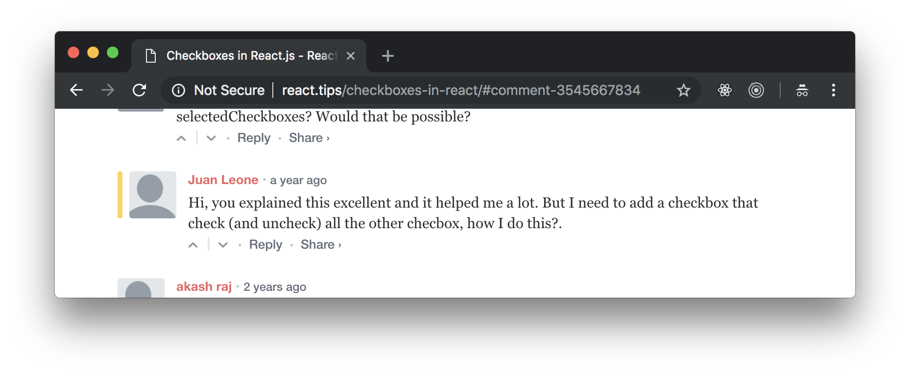

# Handle Errors In React 16

How do you use checkboxes in React.js? We've learnt about radio buttons in [this tutorial](http://react.tips/radio-buttons-in-react-16/), but what about checkboxes - do you use them differently in React?

The short answer is: yes.

Let me demonstrate how to use checkboxes with the help of a simple React application:

<figure class="figure">
  
  <figcaption class="figure-caption">Figure 1. Our application.</figcaption>
</figure>

You can find the full source code in <a href="https://github.com/fedosejev/checkboxes-in-react-16">this GitHub repository</a>.

Our application is going to render a list of checkboxes with labels and a `Save` button. We can toggle checkboxes and click `Save` button. We will then see in the Developer Tools Console log messages that tell us which checkboxes were checked:

<figure class="figure">
  
  <figcaption class="figure-caption">Figure 2. Our application.</figcaption>
</figure>

Our application will be made of [five React components](https://github.com/fedosejev/handle-errors-in-react-16/tree/master/src/components):

1. `App`
2. `PaymentMethod`
3. `PaymentMethodForm`
4. `PaymentMethodError`
5. `PaymentMethodErrorBoundary`

First, let's create `App` component that is a root component for our entire React application:

<figure class="figure">
<pre>
<code class="language-jsx">
import React, { Component } from "react";
import PaymentMethod from "./PaymentMethod";
import PaymentMethodErrorBoundary from "./PaymentMethodErrorBoundary";
import { PAYMENT_METHODS, NO_PAYMENT_METHOD } from "../index";

class App extends Component {
  state = {
    isProcessingPayment: false,
    paymentMethod: NO_PAYMENT_METHOD
  };

  shouldRenderPaymentMethod = paymentMethod =>
    this.state.paymentMethod === NO_PAYMENT_METHOD ||
    this.state.paymentMethod === paymentMethod;

  processPayment = paymentMethod => {
    this.setState({
      isProcessingPayment: true,
      paymentMethod
    });
  };

  cancelPayment = () => {
    this.setState({
      isProcessingPayment: false,
      paymentMethod: NO_PAYMENT_METHOD
    });
  };

  render() {
    return (
      

        

          

            {this.shouldRenderPaymentMethod(PAYMENT_METHODS.CREDIT_CARD) && (
              <PaymentMethod
                name={PAYMENT_METHODS.CREDIT_CARD}
                onProcessPayment={() =>
                  this.processPayment(PAYMENT_METHODS.CREDIT_CARD)
                }
                onCancel={this.cancelPayment}
                isProcessingPayment={this.state.isProcessingPayment}
              />
            )}

            {this.shouldRenderPaymentMethod(PAYMENT_METHODS.DEBIT_CARD) && (
              <PaymentMethod
                name={PAYMENT_METHODS.DEBIT_CARD}
                onProcessPayment={() =>
                  this.processPayment(PAYMENT_METHODS.DEBIT_CARD)
                }
                isProcessingPayment={this.state.isProcessingPayment}
              />
            )}

            {this.shouldRenderPaymentMethod(PAYMENT_METHODS.BANK_TRANSFER) && (
              <PaymentMethodErrorBoundary onError={this.cancelPayment}>
                <PaymentMethod
                  name={PAYMENT_METHODS.BANK_TRANSFER}
                  onProcessPayment={() =>
                    this.processPayment(PAYMENT_METHODS.BANK_TRANSFER)
                  }
                  isProcessingPayment={this.state.isProcessingPayment}
                />
              </PaymentMethodErrorBoundary>
            )}
          

        

      

    );
  }
}

export default App;
</code>
</pre>
<figcaption class="figure-caption">Code snippet 1. App.js</figcaption>
</figure>

Let's focus on `App` component's `render` function:

<figure class="figure">
<pre>
<code class="language-jsx">
render() {
  return (
    

      

        

          {this.shouldRenderPaymentMethod(PAYMENT_METHODS.CREDIT_CARD) && (
            <PaymentMethod
              name={PAYMENT_METHODS.CREDIT_CARD}
              onProcessPayment={() =>
                this.processPayment(PAYMENT_METHODS.CREDIT_CARD)
              }
              onCancel={this.cancelPayment}
              isProcessingPayment={this.state.isProcessingPayment}
            />
          )}

          {this.shouldRenderPaymentMethod(PAYMENT_METHODS.DEBIT_CARD) && (
            <PaymentMethod
              name={PAYMENT_METHODS.DEBIT_CARD}
              onProcessPayment={() =>
                this.processPayment(PAYMENT_METHODS.DEBIT_CARD)
              }
              isProcessingPayment={this.state.isProcessingPayment}
            />
          )}

          {this.shouldRenderPaymentMethod(PAYMENT_METHODS.BANK_TRANSFER) && (
            <PaymentMethodErrorBoundary onError={this.cancelPayment}>
              <PaymentMethod
                name={PAYMENT_METHODS.BANK_TRANSFER}
                onProcessPayment={() =>
                  this.processPayment(PAYMENT_METHODS.BANK_TRANSFER)
                }
                isProcessingPayment={this.state.isProcessingPayment}
              />
            </PaymentMethodErrorBoundary>
          )}
        

      

    

  );
}
</code>
</pre>
<figcaption class="figure-caption">Code snippet 2. App.js</figcaption>
</figure>

We see three `div` elements with class names that you might recognize if you're familiar with [Bootstrap](http://getbootstrap.com). Bootstrap helps us create layout for our page.

Now let's focus on the `form` element:

<figure class="figure">
<pre>
<code class="language-jsx">
<form onSubmit={this.handleFormSubmit}>
  {this.createCheckboxes()}

  

    <button
      type="button"
      className="btn btn-outline-primary mr-2"
      onClick={this.selectAll}
    >
      Select All
    </button>
    <button
      type="button"
      className="btn btn-outline-primary mr-2"
      onClick={this.deselectAll}
    >
      Deselect All
    </button>
    <button type="submit" className="btn btn-primary">
      Save
    </button>
  

</form>
</code>
</pre>
<figcaption class="figure-caption">Code snippet 3. App.js</figcaption>
</figure>

Inside of our `form` element we call `this.createCheckboxes` function that creates three instances of a `Checkbox` component. We'll see how this function works in a moment. It's important to recognise that here we're creating our instances of a `Checkbox` component __dynamically__. If you're not familiar with this approach, then please read [this tutorial](http://react.tips/how-to-create-reactjs-components-dynamically/) first.

We then create three instances of `button` element.

The first `Select All` button will select all checkboxes:

<figure class="figure">
<pre>
<code class="language-jsx">
<button
  type="button"
  className="btn btn-outline-primary mr-2"
  onClick={this.selectAll}
>
  Select All
</button>
</code>
</pre>
<figcaption class="figure-caption">Code snippet 4. App.js</figcaption>
</figure>

When it's clicked it calls `this.selectAll` function. Later we'll see what that function does.

The second `Deselect All` button will deselect all checkboxes:

<figure class="figure">
<pre>
<code class="language-jsx">
<button
  type="button"
  className="btn btn-outline-primary mr-2"
  onClick={this.deselectAll}
>
  Deselect All
</button>
</code>
</pre>
<figcaption class="figure-caption">Code snippet 5. App.js</figcaption>
</figure>

When it's clicked it calls `this.deselectAll` function. Later we'll see what that function does.

The third `Save` button is of type `submit` which will submit our form when user clicks on it:

<figure class="figure">
<pre>
<code class="language-jsx">
<button type="submit" className="btn btn-primary">
  Save
</button>
</code>
</pre>
<figcaption class="figure-caption">Code snippet 6. App.js</figcaption>
</figure>

In our `form` element we're telling React to call `this.handleFormSubmit` function when user submits the form:

<figure class="figure">
<pre>
<code class="language-jsx">
<form onSubmit={this.handleFormSubmit}>
{/* ... */}
</form>
</code>
</pre>
<figcaption class="figure-caption">Code snippet 7. App.js</figcaption>
</figure>

Next let's take a look at how exactly we're creating our instances of `Checkbox` component dynamically. Here is our `createCheckboxes` function:

<figure class="figure">
<pre>
<code class="language-jsx">
createCheckboxes = () => OPTIONS.map(this.createCheckbox);
</code>
</pre>
<figcaption class="figure-caption">Code snippet 8. App.js</figcaption>
</figure>

It iterates over `OPTIONS` array and calls `this.createCheckbox` function for each item in that array. Where is `OPTIONS` array coming from and what is it for?

In our `App.js` file before declaring our `App` component, we've create `OPTIONS` constant that references an array of three items:

<figure class="figure">
<pre>
<code class="language-js">
const OPTIONS = ["One", "Two", "Three"];
</code>
</pre>
<figcaption class="figure-caption">Code snippet 9. App.js</figcaption>
</figure>

`['One', 'Two', 'Three']` - these are labels for our checkboxes. This array represents data that will dictate how many checkboxes we need to render and what their labels will be. For the purpose of this tutorial, we declare this data in our React component file, but in a real world web application this data can be received from a server or imported from another file.

Now we know that `createCheckboxes` function calls `this.createCheckbox` function for each label in `OPTIONS` array. `createCheckboxes` function also returns an array of three instances of `Checkbox` component. That's because we call `this.createCheckbox` three times and each time it creates and returns an individual `Checkbox` component instance:

<figure class="figure">
<pre>
<code class="language-js">
createCheckbox = option => (
  <Checkbox
    label={option}
    isSelected={this.state.checkboxes[option]}
    onCheckboxChange={this.handleCheckboxChange}
    key={option}
  />
);
</code>
</pre>
<figcaption class="figure-caption">Code snippet 10. App.js</figcaption>
</figure>

Each `Checkbox` component instance gets four properties:
1. `label` - the text that you see rendered next to a checkbox. This value is coming from our `OPTIONS` array.
2. `isSelected` - `true` or `false` value that tells `Checkbox` component whether it should render selected or deselected checkbox.
3. `onCheckboxChange` - a reference to `this.handleCheckboxChange` function. Every time user selects/deselects a checkbox React calls `this.handleCheckboxChange` function passing `change` event to it. We'll see how it works in a moment.
4. `key` - as you already know, each dynamically created React component instance needs a `key` property that React uses to uniquely identify that instance.

Now we understand how we create and render three checkboxes in our application. What happens when user selects/deselects our checkboxes? As you will see later - every time user changes checkbox's state - our `this.handleCheckboxChange` is called.

It's a good time to zoom out for a minute and talk about how our application works. There are a couple of questions we need to ask:

1. Each checkbox has two states: selected and deselected. Which React component is responsible for managing that state?
2. How do we know which checkboxes are selected at any given moment in time?

We want to keep our application as simple as possible, so our `App` component will be responsible for maintaining the state of each checkbox. Meaning: each `Checkbox` component will be a controlled component that is not responsible for managing it's own state. Instead `Checkbox` component will receive `isSelected` prop, render `input` element based on that prop and call `onCheckboxChange` callback prop when user interacts with it.

Have you noticed that we need to maintain the state of each checkbox for _two different_ purposes? Let's take a closer look, this is important. In React, a form element that users can interact with has to have a state in order be rendered differently in response to user actions. That what makes a React component interactive: it's rendered one way, then user interacts with it and now it's rendered in another way. We know that changes in component's props or state will force React to re-render that component. Without that state, form elements will be useless, because they will always render the same way, regardless of what user does. They will feel unresponsive to a user. You can see that the purpose of that state is _mechanical_ - it's purpose is to make an interactive UI component simply _work_. That's it.

Most often than not, you wouldn't render a UI component without a business reason. Why do we want to render a checkbox as part of our form? Well, we want to know user's preference for whatever choice options that checkbox represents and then submit it as part of the form. But where do we store that user preference before submitting the form? Notice that this user preference is our business state or our application state that lives in our React application. Does it mean that it should live in a component's state? No, as it's not React's responsibility to manage application's state. We can use Redux library, or plain JavaScript for that.

However, in this tutorial, we'll recognize that the two states: our _UI state_ that we need for our checkboxes to work and our _application state_ that we need for our application to make business sense - those two states with two different purposes can be represented with a single state. This state will live in the `App` component.

Why do we want to store state of the each checkbox in the parent `App` component instead of letting each checkbox to maintain it's own state? In <a href="/checkboxes-in-react/">the previous version of this tutorial</a> I've made a case that the parent `App` component doesn't need to know the state of each checkbox. It needs to know which checkboxes are selected in order to log them in a console when user clicks the `Save` button. However, in one of the comments **Juan Leone** asked how to select or deselect _all_ checkboxes at once:

<figure class="figure">
  
  <figcaption class="figure-caption">Figure 3. Juan's comment.</figcaption>
</figure>

The question is how the `App` component can control the state of it's child `Checkbox` components, without managing their state? The short answer is: it can't. When you make a React component stateful, the state becomes private to that component only. Parent components can't access it directly. Child components can only get access to it via props. That's one of the core ideas in React and your architectural challenge is to decide which components own what state.

In this tutorial I've added a new business requirement for our application: we need to have a button that selects all checkboxes and a button that deselects all checkboxes. This requirement will address Juan's comment and give you an example of how to manage application state in a parent component.

Let's declare our application state in the `App` component:

<figure class="figure">
<pre>
<code class="language-js">
state = {
  checkboxes: OPTIONS.reduce(
    (options, option) => ({
      ...options,
      [option]: false
    }),
    {}
  )
};
</code>
</pre>
<figcaption class="figure-caption">Code snippet 12. App.js</figcaption>
</figure>

We use [class property](https://babeljs.io/docs/plugins/transform-class-properties/) `state` to set the initial state of the `App` component.

Don't get scared by that `reduce` function:

<figure class="figure">
<pre>
<code class="language-js">
OPTIONS.reduce(
  (options, option) => ({
    ...options,
    [option]: false
  }),
  {}
)
</code>
</pre>
<figcaption class="figure-caption">Code snippet 11. App.js</figcaption>
</figure>

All it does is transforms `["One", "Two", "Three"]` array to `{ "One": false, "Two": false, "Three": false }` object. This object is the shape of our state that represents two states: UI state for each `Checkbox` component and an application state for our entire application. In our state `false` means that user hasn't selected the checkbox and we want every checkbox to be initially rendered as unchecked. Option name represents the name of a checkbox, i.e. `"One"`, `"Two"`, `"Three"`.

+ The UI state answers the question: _which checkbox should I render selected and which - deselected?_
+ The application state answers the question: _which checkboxes user selected?_

As you can see those two states are tightly coupled and related - you can't render selected checkbox and at the same time assume that user's intention is to have it unselected. If you can think of a business case where your UI state will differ from your application state - you need to maintain them separately as two different states.

Now we know the shape of the `App` component's state:

<figure class="figure">
<pre>
<code class="language-js">
{
  One: false,
  Two: false,
  Three: false,
}
</code>
</pre>
<figcaption class="figure-caption">Code snippet 12. App.js</figcaption>
</figure>

Let's look at the `this.handleCheckboxChange` function and understand how to change this state when user interacts with our checkboxes:

<figure class="figure">
<pre>
<code class="language-js">
handleCheckboxChange = changeEvent => {
  const { name } = changeEvent.target;

  this.setState(prevState => ({
    checkboxes: {
      ...prevState.checkboxes,
      [name]: !prevState.checkboxes[name]
    }
  }));
};
</code>
</pre>
<figcaption class="figure-caption">Code snippet 13. App.js</figcaption>
</figure>

It gets a _changeEvent_ object and accesses _name_ property that represents which checkbox is being toggled. Now what exactly _handleCheckboxChange_ function does? It calls `this.setState` to request an update of the state and passes a function that gets a previous state and returns a new state that is created based on the previous state. The `name` property that comes with the `changeEvent` object becomes the key in our new state object and the value for that key becomes the opposite value of the value in the previous state:

<figure class="figure">
<pre>
<code class="language-js">
checkboxes: {
  ...prevState.checkboxes,
  [name]: !prevState.checkboxes[name]
}
</code>
</pre>
<figcaption class="figure-caption">Code snippet 14. App.js</figcaption>
</figure>

This is how we toggle a checkbox in our application state. The `handleCheckboxChange` function toggles state of an individual checkbox. How do we change state for all checkboxes at once?

Let's look at our `this.selectAll` and `this.deselectAll` functions.

The `this.selectAll` function calls `this.selectAllCheckboxes` and passes `true` as an argument:

<figure class="figure">
<pre>
<code class="language-js">
selectAll = () => this.selectAllCheckboxes(true);
</code>
</pre>
<figcaption class="figure-caption">Code snippet 15. App.js</figcaption>
</figure>

While `this.deselectAll` function calls `this.selectAllCheckboxes` and passes `false` as an argument:

<figure class="figure">
<pre>
<code class="language-js">
selectAll = () => this.selectAllCheckboxes(false);
</code>
</pre>
<figcaption class="figure-caption">Code snippet 16. App.js</figcaption>
</figure>

Let's take a look at what `this.selectAllCheckboxes` does:

<figure class="figure">
<pre>
<code class="language-js">
selectAllCheckboxes = isSelected => {
  Object.keys(this.state.checkboxes).forEach(checkbox => {
    // BONUS: Can you explain why we pass updater function to setState instead of an object?
    this.setState(prevState => ({
      checkboxes: {
        ...prevState.checkboxes,
        [checkbox]: isSelected
      }
    }));
  });
};
</code>
</pre>
<figcaption class="figure-caption">Code snippet 17. App.js</figcaption>
</figure>

It iterates over the `checkboxes` that we have in our application state and for each checkbox it updates it's state to the value of the `isSelected` parameter. Can you explain why we must pass an updater function to `this.setState` here, instead of an object?

Now we have a React application that renders a form with three checkboxes and three buttons. What happens when a user clicks the `Save` button? Our form is submitted and our `handleFormSubmit` function is called by React:

<figure class="figure">
<pre>
<code class="language-jsx">
<form onSubmit={this.handleFormSubmit}>...</form>
</code>
</pre>
<figcaption class="figure-caption">Code snippet 18. App.js</figcaption>
</figure>

Let's take a look at `handleFormSubmit` function:

<figure class="figure">
<pre>
<code class="language-jsx">
handleFormSubmit = formSubmitEvent => {
  formSubmitEvent.preventDefault();

  Object.keys(this.state.checkboxes)
    .filter(checkbox => this.state.checkboxes[checkbox])
    .forEach(checkbox => {
      console.log(checkbox, "is selected.");
    });
};
</code>
</pre>
<figcaption class="figure-caption">Code snippet 19. App.js</figcaption>
</figure>

First it prevents the default behavior of a form's submit event:

<figure class="figure">
<pre>
<code class="language-js">
formSubmitEvent.preventDefault();
</code>
</pre>
<figcaption class="figure-caption">Code snippet 20. App.js</figcaption>
</figure>

And then it iterates over all checkboxes in our application state, filters the ones that are selected and logs their name in a console:

<figure class="figure">
<pre>
<code class="language-js">
Object.keys(this.state.checkboxes)
  .filter(checkbox => this.state.checkboxes[checkbox])
  .forEach(checkbox => {
    console.log(checkbox, "is selected.");
  });
</code>
</pre>
<figcaption class="figure-caption">Code snippet 21. App.js</figcaption>
</figure>

Now you know what our `App` component does and how it works.

Next let's take a look at our `Checkbox` component:

<figure class="figure">
<pre>
<code class="language-jsx">
import React from "react";

const Checkbox = ({ label, isSelected, onCheckboxChange }) => (
  

    <label>
      <input
        type="checkbox"
        name={label}
        checked={isSelected}
        onChange={onCheckboxChange}
        className="form-check-input"
      />
      {label}
    </label>
  

);

export default Checkbox;
</code>
</pre>
<figcaption class="figure-caption">Code snippet 22. Checkbox.js</figcaption>
</figure>

Our `Checkbox` component is a stateless functional component that receives three props:
1. `label` is a text that represents the name of the checkbox and it also rendered next to that checkbox.
2. `isSelected` is a boolean value that tells React whether that checkbox should be rendered selected or deselected.
3. `onCheckboxChange` is a callback function that React will call when a user selects or deselects the checkbox.

The `Checkbox` component renders `div` element with a Bootstrap class name that we use for styling. Inside of it we have `label` element with two children:

1. `input` element
2. `label` text

The `input` element renders the checkbox. It has 4 properties:
1. `type` - the type of the input: `checkbox` in our case.
2. `name` - the name of the input: an option name passed as a prop from a parent `App` component. It will be either `One`, `Two` or `Three`.
3. `checked` - whether the checkbox is selected or not. The value comes from the prop from a parent `App` component.
4. `onChange` - the `change` event handler: `onCheckboxChange` function will be called when user selects or deselects the checkbox.

If you read [this tutorial](http://react.tips/radio-buttons-in-react-16/), you will recognize that our `input` element is a [controlled component](https://facebook.github.io/react/docs/forms.html#controlled-components) because we "control" the `checked` property by providing our own value that comes from `isSelected` prop. If you're not sure about the difference between controlled components and uncontrolled components, then I recommend you read [this tutorial](http://react.tips/radio-buttons-in-react-16/).

What happens when a user toggles our checkbox? React calls our `onCheckboxChange` callback function that references `handleCheckboxChange` function in a parent `App` component. `handleCheckboxChange` will update `App` component's state and the `App` component will re-render all `Checkbox` components.

That's how our `App` component will always know which checkboxes are selected at any given moment in time.

And now you know how to use checkboxes in React.js!

Notice that this solution works great for _our specific_ requirements. If you have different requirements you might need to think of a different way of creating checkboxes.

Thank you for reading this React tutorial!

Please take a look at [the complete source code on GitHub](https://github.com/fedosejev/checkboxes-in-react-16) and [the live version](https://fedosejev.github.io/checkboxes-in-react-16/) of our app.

I hope you've enjoyed this tutorial and I would love to hear your feedback in the comments. You can get in touch with me via [Twitter](http://twitter.com/artemy) and [email](mailto:artemij@fedosejev.com).

[Artemij Fedosejev](http://artemij.com)
