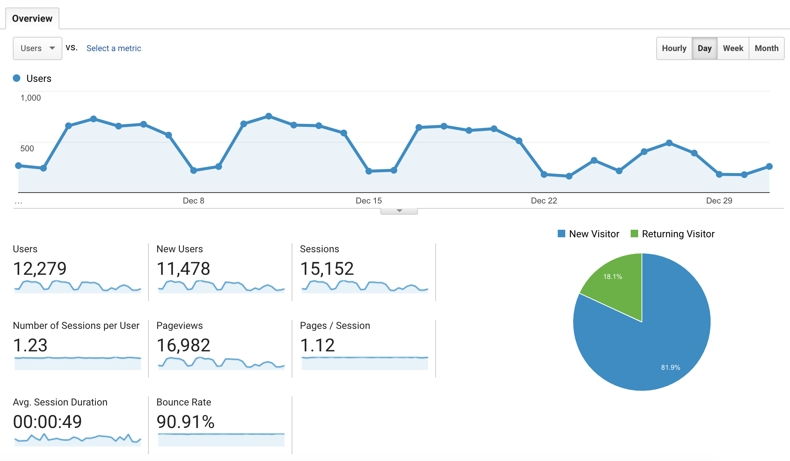
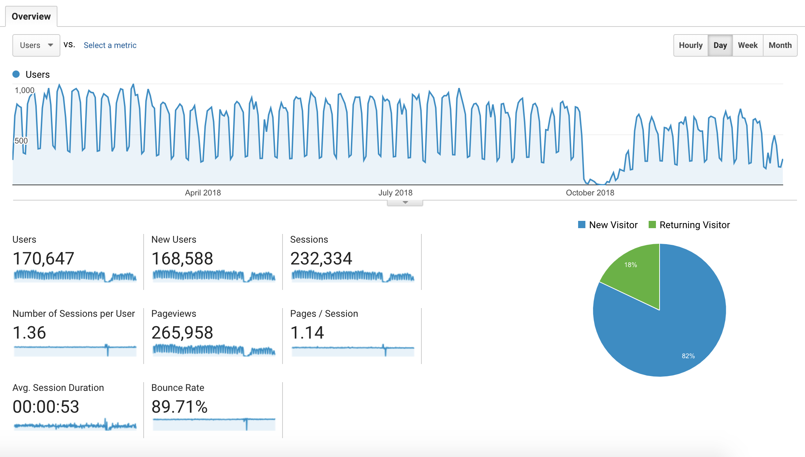

# Write your React tutorial for React.Tips website

Your experience of building React applications and your unique way of explaining it to others is what I am fascinated about. Let's document your experience and bring value to other people by teaching them your skills.

<h2>How many people will read your tutorial?</h2>

Thousands a month.

Over <strong>11,000 people</strong> in December 2018. Take a look at this screenshot from our Google Analytics:

<figure class="figure">
  
  <figcaption class="figure-caption">Figure 1. Analytics for React.Tips: audience overview for December 2018.</figcaption>
</figure>

<a href="./files/Analytics React.Tips Audience Overview 20181201-20181231.pdf">Download this in PDF</a> to see more.

And over <strong>168,000 people</strong> in 2018. Take a look at this screenshot from our Google Analytics:

<figure class="figure">
  
  <figcaption class="figure-caption">Figure 2. Analytics for React.Tips: audience overview for year 2018.</figcaption>
</figure>

<a href="./files/Analytics React.Tips Audience Overview 20180101-20181231.pdf">Download this in PDF</a> to see more.

If you would like to write a React tutorial and publish it on React.Tips website, then <a href="mailto:writeforreacttips@gmail.com?subject=I%20want%20to%20write%20for%20React.Tips">get in touch!</a>

[Artemij Fedosejev](http://artemij.com)